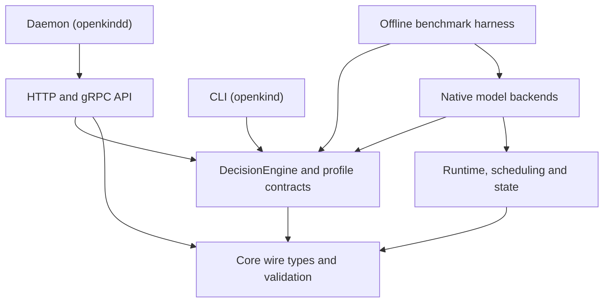
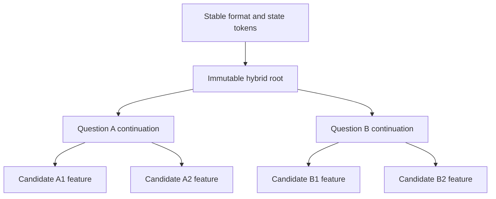

# openkind — Architecture

> An open-source decision-inference engine in Rust targeting the Jev wire contract, with independently designed model and runtime internals.
>
> **Document revision 0.8.5 · 30 September 2026 · Current Rust implementation through named-machine CPU service gates and separately qualified pinned-base MLX FP32 parity. Local joint-option diagnostics add an offline scoring comparison; the 2026-09-29 proposal runs add a catalogue-context renderer, position/code separation and locked post-hoc calibration as experimental probe paths — the fitted scoring profile and service defaults remain unchanged. Reviewed model quality, complete-request MLX performance, broader accelerated-service evidence and product-release promotion remain open.**
>
> Wire spec: https://docs.typesafe.ai/api
> Reference client SDK target: https://docs.typesafe.ai/sdk/python/api

## Overview

`openkind` accepts structured decision questions (Noul, Choice, Score) over a shared state and returns typed answers and probability distributions rather than generated answer prose. The surrounding service provides the tracing, metrics, authentication, admission, and lifecycle surface required by a public SDK.

The repository separates the **wire contract**, **decision/model execution**, and **transport/runtime** layers so that a model backend can change without changing the public request/response schema. The project targets Jev-compatible wire behavior where explicitly supported; it does **not** claim to reproduce Jev's private neural architecture or RLCD training procedure.

The current model-integration reference is profile `a047d6802c3f06f085b8`: `Qwen/Qwen3.5-4B-Base`, frozen backbone, **state-first rendering**, and **score-summary rejection**. The exploratory `2ij.2.0` study selected and exported this profile before final evaluation, and the exported bundle passed a clean Python reload/head-algebra parity check. Phase 3A kept that profile immutable and validated the Python reference mechanics for full-hybrid-state branching, batched question/candidate execution, high-K systems stress, and same-process repeatability. Phase 3B kept the same profile, bundle, and base revision and exported exact segmented tokens, a 34-stage embedding-to-final-norm trace, 10 candidate features, and 3 continuation vectors. Rust Phase 3.3 now reproduces the correctness-first CPU backbone and Qwen-specific cached continuation on the named M4 Max. That makes the profile the fixed Phase 3 implementation target. It remains a **provisional integration profile**, not a release-quality model: independent review, natural-data confirmation, explicit promotion limits, complete-request accelerated performance, and broader MLX service qualification remain open.

Rust now reproduces the selected head/probability algebra and all four exported token records. It loads and validates the Phase 3B architecture and 47-vector reference bundle, verifies both immutable checkpoint shards, and executes the complete 32-layer Qwen text backbone plus final RMSNorm through Candle's CPU backend in FP32. All 34 stage diagnostics are localized, all 10 candidate sequences pass the declared probability/argmax/policy gate, and Qwen-specific cached continuation carries attention KV, DeltaNet recurrent state, convolution state, and absolute position without mutating its root. These backbone numbers are correctness-first CPU evidence. The later named-machine CPU service campaign and separate MLX parity gates are recorded below; neither establishes release-quality model behavior.

A public OpenKind reference repository for this integration line is published at <https://huggingface.co/cowWhySo/OpenKind-Qwen3.5-4B-StateFirst>. Publication improves inspectability and handoff; it does **not** change the release-quality or Rust/Metal parity boundary.

The implemented path now spans native head/token/backbone parity, complete
hybrid continuation, backend-neutral branching, nested execution, measured
CPU scheduling, full fresh-process state-to-decision replay, direct engine
registration and the named-machine CPU service campaign. The optional MLX
path has separate FP32 parity and bounded daemon evidence. Remaining work is
useful model quality and measured accelerated service performance, not a
repeat of already completed CPU milestones.

Model promotion and implementation equivalence remain separate decisions.

---

## Current status boundary

The architecture document distinguishes implemented/reported repository behavior from research artifacts and planned work:

- **Phase 0 / Phase 1:** wire types, schemas, mock engine, HTTP/gRPC surfaces, CLI and SDK-compatibility fixtures are implemented and covered by the repository verification battery.
- **Phase 2H:** required criteria/rejection-transfer study is complete through the preserved `2h.1.2` continuation. The old failed attempt remains historical evidence.
- **Phase 2I:** bounded state-first multi-question mechanics and Q=1/Q=4 semantic sharing are measured; independently reviewed/natural-data confirmation remains open.
- **Phase 2J:** the exploratory model-selection screen is complete; the Qwen4B state-first/score-summary profile is the provisional integration target. Release promotion remains open.
- **Track S:** the native CPU service gates pass for direct `Qwen35DecisionEngine` registration through `EngineRegistry`, including queue-inclusive deadline, cancellation recovery, load, memory, and soak evidence on the named M4 Max. The Python implementation remains a differential-test oracle, not a deployment bridge. Model-quality and product-release promotion remain separate.
- **Phase 3A (Python reference):** run `20260920T024056Z` completed notebook scope with the selected profile unchanged; semantic batched parity passed, high-K parity passed, and the recorded same-process repeatability delta was zero. The run is systems/reference evidence, not Rust/Metal parity or release certification.
- **Phase 3B (Python reference):** run `20260920T152206Z` completed notebook scope with no training, model selection, model modification, or bundle change. It exports 4 token records and 47 FP32 vectors for layer, candidate, and continuation localization. Its hidden-vector deltas are diagnostics, not Rust acceptance tolerances.
- **Phase 3 (Rust/native):** head/probability, exact tokenizer/state-first token, full CPU decoder/final-normalization, Qwen-specific cached-continuation, backend-neutral branch-state, sequential nested execution, batched Q/K, and the measured adaptive scheduler pass against the frozen fixtures. State/scheduler high-K stress, bounded model-backed K=32/64/128/255 execution, process-peak admission, tenant-isolated cache semantics, full fresh-process restore replay, direct service registration, explicit semantic-none mapping, and native CPU service load/soak are recorded. Practical high-K latency, broader accelerated-service qualification, reviewed model quality, and release promotion remain open. [Service report](verification/native-service-gate/2026-09-22-rerun2/README.md)
- **Phase 3M (MLX parity backend):** the pinned real-checkpoint FP32 path passes on the named Mac, including runtime qualification, streamed digest-verified loading, bit-exact embedding, the 34-stage trace, frozen full-sequence parity, sequential-nested continuation parity, and variable-length vectorized batch parity. Execution is serialized on one explicit cross-thread GPU stream. Generic masked/vector-gate and packed `Dk = Dv = 128` Metal reduction-tree kernels exist and the FP32 packed path passes the frozen gates, but remains opt-in because the same-host smoke sweep was 14–28% slower than `ReferenceOps`. The explicit adapter for `mlx-community/Qwen3.5-4B-MLX-bf16` loads and executes, but its full FP32 run fails pinned-base parity with probability error `0.9999983`, four argmax changes, and three policy changes. The native BF16 reference path also fails frozen probability tolerance (`0.00610` full and `0.02658` nested); runtime primitives and nested state/isolation checks pass, but BF16 is not promoted. A forced FP32 vectorized daemon request passes its bounded HTTP smoke; Q/K admission fallback and release recovery measurements are recorded. Paired native compute diagnostics reject cross-question candidate pooling and flat shared-root field batching on their tested shapes. Automatic batch selection, complete request-path performance, broader service load, and production promotion remain open. See [`MLX.md`](MLX.md), the [flat-field record](benchmarks/2026-09-27-python-flat-field/), and the [Phase 3M follow-up](verification/phase3m-2026-09-22/README.md); the 20/21 September records are historical first-pass evidence.

The roadmap is the task/status authority; the whitepaper is the detailed evidence authority and the working paper is its confirmed-results digest. This file records the current working implementation and explicitly labels proposed extensions.

---

## Research findings and the current implementation

This document describes the working Rust codebase and its scoped verification
records, including the offline joint-option probe. Updating this document does
not qualify another backend or promote a model.
[WHITEPAPER.md](whitepaper/WHITEPAPER.md) owns detailed evidence;
[WORKING_PAPER.md](whitepaper/WORKING_PAPER.md) is the confirmed-findings digest.

| Path | Current implementation boundary | Evidence and remaining limit |
|---|---|---|
| Selected Base + candidate-feature/score-summary profile | Existing Rust `Qwen35DecisionEngine`; fixed profile `a047d6802c3f06f085b8` | Named CPU parity, persistence and service checks; model-quality/release promotion remains separate |
| Pinned Base on MLX FP32 | Existing optional parity backend; `ReferenceOps` default, vectorized path explicitly forced | Full/nested/vectorized fixture parity; complete-request performance and broader accelerated-service qualification remain open |
| Joint-option letter readout | Rust `Qwen35ScoringProbe` and offline `compare-choice`; no daemon registration | Same-checkpoint rule and reference-card diagnostics; order sensitivity, calibration and semantic-none failures prevent promotion |
| Flat-field and candidate-pooling MLX diagnostics | Measured research code, excluded from automatic scheduler | Slower on tested shapes despite fewer forwards; existing nested path retained |
| Modern Qwen3.5 dense/MoE indexed-token reader | Separate Colab/vLLM study | MoE improves bounded accuracy at about 2× dense latency; not a new Rust engine/profile default |
| Qwen3.5-4B Q4_K_M token-tree reader | Separate pinned C++/CUDA fork and Colab study | Faster than generated JSON but lower accuracy; passing prefix-cache fixtures do not qualify the whole reader |
| J2–J7 decision adapters and replay variants | Model research artifacts | Failed full retention gates; no replacement of the selected Rust integration profile |

The latest CUDA results therefore change validation priorities, not the current
checkpoint, score-summary head, wire semantics, scheduler or backend registration.
The CPU/MLX reference qualifications remain scoped to their original identities.

### Scoring tests and why the fitted profile remains the default

The native Qwen default is still the frozen state-first, score-summary profile
`a047d6802c3f06f085b8`. The original selection kept eligible models within a
declared development-NLL band, then chose the lower measured Q<=4 request p95.
Score-summary rejection was close to the best development NLL and won that
latency tie-breaker. Selection was locked before final evaluation. The
[selection study](whitepaper/WHITEPAPER.md#152-comparison-design-and-pre-final-selection)
owns the comparison and its provisional quality boundary.

The [`Qwen35ScoringProbe`](../crates/openkind-backends/src/qwen35/experimental.rs)
loads the same pinned Base checkpoint for several offline paths. Its independent
control replays the frozen renderer, fitted head and temperature. Its joint path
puts all options into one question prompt and projects the final normalized hidden
vector onto selected tied vocabulary rows for single-token answer letters,
including none, in four layouts: canonical order, the recorded reversal, a text
rotation with codes bound to their options, and a letter-code permutation at
fixed positions. Its catalogue path inserts a canonical all-option block into
each candidate prompt's question branch under the separate
`catalogue_state_first/v1` identity while keeping the fitted head and frozen
temperature. Raw joint logits are exposed for post-hoc calibration. The probe
performs no autoregressive generation. The
[`compare-choice` harness](BENCHMARKS.md#experimental-joint-option-comparison)
maps letters back to caller option IDs, evaluates all nine methods including
fixed ensembles, and the
[`calibrate-choice` harness](BENCHMARKS.md#experimental-joint-distribution-calibration)
fits and locks post-hoc parameters on one partition before scoring a disjoint
gate.

The [local test record](benchmarks/2026-09-29-joint-choice/README.md) owns the
fixtures, scores, host and artifact identities. Balanced rule cases test facts,
negation, thresholds and evidence inside options. A separate reference-card
intervention changes a rival option while leaving the action descriptions
unchanged. Unit checks cover prompt/token boundaries, length limits, probability
averaging, workload validation and metric arithmetic. The probe's independent
control exactly matches the existing engine on a small positive-only subset;
CPU/MLX FP32 comparisons pass on that subset. These checks establish a faithful
control and bounded numerical agreement, separately from task quality. The
record also documents the MLX test failure and passing reruns, and the missing
formal runtime receipt for the measured dirty checkout.

Joint scoring improves accuracy and proper scores on these authored panels,
but that does not establish a better deployment default:

- Option reversal changes decisions; averaging does not resolve reference-card
  rejection and still selects the forbidden reference option.
- Averaged joint scoring misses every reference-card none case. On the simpler
  panel, forward and averaged scoring worsen ECE despite improving NLL/Brier.
- The comparison changes prompt, head and temperature together. It has no
  independent natural-task quality gate, and its warmed full-forward timings
  do not compare against production prefix reuse. Averaging requires two passes.

The fitted profile remains the reproducible integration reference, not a proven
quality winner. A replacement needs a separately identified profile and its own
quality, rejection, calibration and request-performance gates. See the
[next local research comparisons](RESEARCH.md#next-local-scoring-comparisons-proposed).

#### Outcomes of the 2026-09-29 proposal runs

The [proposal-run record](benchmarks/2026-09-29-joint-choice-proposals/README.md)
owns the three follow-up comparisons. On the authored panels, all nine
comparison methods agree across CPU and MLX FP32 within 1.07e-5 with zero
selection changes.

- **Catalogue context improves the fitted head.** With a canonical all-option
  catalogue in the question branch and the fitted head and temperature
  unchanged, the 96-case panel reaches 93/96 with NLL 0.144 and ECE 0.080
  (control: 71/96, 0.636, 0.157), and the reference-card panel rises from
  0/24 to 18/24 while never selecting the forbidden reference option
  (control: 23/24). It is the first probe path that improves rejection,
  proper scores and ECE together without replacing the head. Cost: about
  1.9x the scored input tokens and 2.3x the warm full-forward seconds of the
  control on these panels; production prefix reuse would amortize the
  catalogue once per question branch, which is unmeasured.
- **Text position dominates letter-code bias in the joint readout.** With
  codes fixed, rotating position flips 7/96 selections; with positions fixed,
  permuting codes flips 0/96 (the card panel splits 7/9). Fixed ensembles
  never beat the single forward render, so none is adopted and `joint_forward`
  remains the representative joint path.
- **A locked temperature passes its gate; the none offset does not.** Fitted
  on a disjoint 64-case calibration partition and locked, T = 0.3985 improves
  the 64-case gate from NLL 0.178 to 0.035 and ECE 0.143 to 0.025 with zero
  selection changes, and extends zero-error accepted coverage at threshold
  0.9 from 27/64 to 47/64. The none offset loses one none case and is not
  adopted. The same locked temperature degrades on the gate's reversed render
  (NLL 0.381 versus raw 0.332), so the fitted value is render-specific
  evidence, not a portable constant.

The catalogue arm is the surviving candidate. It stays an experimental probe
path: the rejection head was fitted without catalogue context and its none
behavior is inconsistent across panels (24/24 none recall on the rule panel,
0/6 on the card panel), so a catalogue-specific profile would need its own
fitted rejection head, natural-task quality gates, and complete request-path
timing before any replacement of the fitted profile.

### Execution requirements reinforced by the latest tests

These are requirements for evaluating a future integration. Their addition to
this document is not a claim that new code or tests already exist.

| Concern | Existing contract to preserve | Additional qualification before adopting a research path |
|---|---|---|
| Cached state | Full hybrid state, immutable root, exact profile/token/position identity | Distinguish static instructions/catalogue reuse, state reuse, and per-request question/candidate reuse; verify actual hits and cold baselines |
| State-first isolation | Root is independent of the submitted question set | A schema-first catalogue changes conditioning; use a separate profile and key the exact catalogue/order rather than treating it as the same root |
| Readout | Profile-owned decision/rejection/probability semantics | Explicitly distinguish learned candidate scores, indexed-token distributions, constrained-tree path probabilities, and greedy outputs without a full vector |
| Tokenization | Exact finalized tokens | For answer indexes, prove single-token extension at the actual answer boundary; for multi-token values, test shared prefixes and terminal paths |
| Batching | Capability- and memory-bounded strategies | Compare probability, argmax and policy independently; record padding, real/padded token work, lane reservations and observed process/device memory |
| Repeatability | Versioned execution and replay identity | A → unrelated request → A, chat/native interleaving, cold/warm reuse, schema permutations and engine-reset controls |
| Derived decisions | Semantic probability vector and application actions stay distinct | If a declared rule derives action from eligibility, map the source distribution through that rule; do not invent certainty or silently add a wire field |
| Calibration | Profile-owned calibrator and policy | Fit separately from evaluation; retain a raw baseline; accept proper-score and policy changes per task/field |

The native external reader demonstrates 315-token catalogue reuse with zero
observed drift in paired fixtures, while its 24-sequence probability parity
against serial execution fails (maximum Δp 0.03036). Immediate repeats can be
exact even when later same-fixture calls drift and change an answer. These are
separate findings; no global `cache_supported` or `deterministic` claim should
be inferred from a single successful probe. See whitepaper §§19.3–19.7.

The native comparison also motivates a proposed indexed-code versus natural-label
test on the same model/backend. PrivateMode's [implementation](https://github.com/edgelesssys/privatemode-decisions)
is an external reference for explicit option-token readout. It supplies neither
an implemented OpenKind backend nor an accuracy/calibration guarantee. The
offline eligibility-to-action replay improvement (78.30% → 82.99% field accuracy)
likewise remains an unapplied rule-composition finding, not a codebase change.

### Experiments that do not change the current defaults

The [readout/rules/history Colab notebook](https://colab.research.google.com/drive/110Ej_FjTxxIb2DrNiBWM6jC7l6ui1g3h) implements the next external experiments. It is not part of the current Rust backend; GPU results and promotion remain pending.

- Retain the pinned FP32 reference and the current measured scheduler. The Mac
  flat-field port was 6.0–12.1% slower at Q2/K2 and 64.3–64.5% slower at Q8/K4;
  fewer forwards alone do not justify a schedule change.
- Do not substitute the community post-trained/quantized checkpoint for the
  pinned Base identity. Load compatibility, new-model quality and implementation
  equivalence are separate decisions.
- Do not infer memory savings from lower MoE top-k. Tested skipping retained
  approximately the same allocation; request-wide expert use was broad. Weight
  streaming and physical expert removal are not implemented or qualified by
  these studies.
- Keep failed pooled-root readouts and failed retention adapters as research
  results. A shared execution root is not a proven sufficient decision vector.
- Preserve the distinction between execution failure, unsupported capability,
  unrun stage, completed experiment, and failed scientific gate. A wrapper's
  engine-initialization error or an unrelated warning is not a numerical cause.

New profiles may pass a fresh quality gate without matching the old model's
probabilities. Optimizations that claim to preserve one profile must instead
pass its declared equivalence contract. Neither route can borrow promotion
from a different model, quantization, backend or host.

---

## Workspace layout

```text
openkind/
├── Cargo.toml                    # workspace manifest + shared deps
├── crates/
│   ├── openkind-core/        # wire types (request, response, errors)
│   ├── openkind-engine/      # DecisionEngine + profile/execution boundary
│   ├── openkind-api/         # HTTP (axum) + gRPC (tonic)
│   ├── openkind-server/      # openkindd binary
│   ├── openkind-cli/         # openkind binary, local resumable JSONL jobs
│   ├── openkind-client/      # Rust client SDK (HTTP, retries, provider routes)
│   ├── openkind-runtime/     # device/scheduler/state/cache lifecycle
│   ├── openkind-backends/    # supported native model drivers
│   ├── openkind-model-store/ # curated manifests and verified local installs
│   ├── openkind-bench/       # offline scoring and timing benchmark harness
│   └── openkind-gen-schemas/ # JSON Schema codegen
├── registry/v1/             # checked-in catalog and profile manifests
├── scripts/sync-model-registry.py # public mirror verification
├── proto/proto/openkind.proto # gRPC service definition (proto crate root)
├── examples/                     # wire-format fixtures
├── docs/ARCHITECTURE.md          # this file
└── crates/openkind-core/schemas/
```

### Layering

[`openkind batch`](../crates/openkind-cli/README.md#batch) owns a local SQLite
job journal and sends sequential requests through `openkind-client`. Stop,
status, and resume operate on the job directory. Batch execution uses the
existing evaluation endpoint and leaves the Jev wire contract unchanged.




The public dependency direction remains one-way. `core` owns wire types; `engine` owns semantic/model contracts; `runtime` and `backends` implement execution; `api` exposes the service; `server/cli` compose those pieces; `bench` drives offline workloads through `DecisionEngine` for scoring and timing. Backends must not redefine public probability semantics merely because their internal execution graph differs.

`openkind-model-store` is a separate distribution path used by the CLI and
daemon. The CLI fetches the public catalog and pinned artifacts; the daemon
reads only explicitly selected, verified local installations at startup. The
public [model registry](https://github.com/whit3rabbit/openkind-model-registry)
mirrors the metadata under `registry/v1` and hosts the small profile assets.
See the [registry guide](MODEL_REGISTRY.md) for publication and sync commands.

---

## Crate responsibilities

### `openkind-core`

The single source of truth for supported request/response wire types across HTTP and gRPC.

Public types include:

- `SystemRequest`, `SystemResponse`
- `Question` (Noul, Choice, Score variants), `Answer`
- `State`, `Instructions`
- `ValidationError` + `validate_request(req)`
- `ModelInfo`, `ModelsResponse`

Wire floating-point values such as `probabilities`, `score`, `noul`, and `confidence` remain `f64`. Do not replace wire precision with an implementation backend's internal dtype.

Wire compatibility and model capability are separate. A syntactically valid request can still be unsupported by a specific profile because of primitive, context-length, Q/K, memory, or execution-mode limits.

### `openkind-engine`

Anything callable from `/v1/systemone` implements the public engine boundary:

```rust
#[async_trait]
pub trait DecisionEngine: Send + Sync {
    fn backend_id(&self) -> &str;
    fn model_metadata(&self) -> openkind_core::ModelInfo;

    async fn evaluate(
        &self,
        req: SystemRequest,
    ) -> Result<SystemResponse, EngineError>;
}
```

`EngineRegistry` maps aliases to `Arc<dyn DecisionEngine>`.

Behind that public boundary, execution is governed by four versioned contracts:

1. **Decision Specification** — state semantics, question instructions, candidate/rubric descriptions, semantic-none rules, insufficient-evidence behavior, truncation, and supported primitive semantics.
2. **Model / Execution Profile** — checkpoint revision, adapter, tokenizer, renderer, normalization, heads, rejection model, calibration, policy mapping, arithmetic mode, kernels, and allowed execution strategies.
3. **Backend Capabilities** — supported primitives, context/Q/K limits, branch/batch operations, precision modes, state-storage behavior, and device-memory requirements.
4. **Evaluation Context** — tenant identity, admission/work budget, deadline/cancellation, tracing identifiers, and any request-scoped scheduling metadata.

The **selected Phase 3 profile** is currently:

```text
profile_id: a047d6802c3f06f085b8
backbone:   Qwen/Qwen3.5-4B-Base
revision:   1001bb4d826a52d1f399e183466143f4da7b741b
weights:    frozen
renderer:   state-first
rejection:  score-summary
bundle:     4d9ffdee0aea5c71c666d0feae372cffe79a05934aedee2245012e3a53c23332
status:     provisional integration target
```

`ModelExecutionProfile` records this identity and its reference bundle, renderer,
head, rejection, calibration, policy, and numerical tolerances without changing
the public `DecisionEngine` trait.

`score-summary` is part of this profile; it must **not** be hard-coded into the engine architecture. The exploratory screen also produced semantic-feature rejection variants, and future profiles may use different applicability/rejection heads. Rejection is therefore profile-owned behavior behind a stable probability contract.

### `openkind-runtime`

Owns device/runtime lifecycle and execution mechanics that are independent of one particular neural head:

- device discovery and backend selection;
- bounded request admission and worker pools;
- request scheduling across Q questions and K candidates;
- `BranchableState` lifecycle;
- exact-prefix/persistent state reuse where supported;
- memory accounting for retained and transient branch state;
- cancellation, deadlines, TTL, eviction, and active-reader lifetime;
- repeatability/profile identity telemetry;
- queue-inclusive performance measurement.

The runtime must not assume that reusable model state is an ordinary Transformer KV cache. Qwen3.5 requires a hybrid continuation state.

### `openkind-backends`

Contains only backends that can satisfy the selected profile's required capabilities. Candle supplies the correctness-first CPU tensor path and remains the correctness oracle. The first additional backend is the feature-gated MLX/Metal **parity** backend (Phase 3M, `--features mlx` on macOS arm64): pinned `mlx-rs`/vendored mlx-c driven by the same Rust Qwen3.5 layer semantics. The current default MLX path executes the faster per-token `ReferenceOps` recurrence; this does not imply production-service promotion. Opt-in custom Metal kernels cover generic scalar/vector gates, masked heads, an explicit reduction tree, and the packed FP32 `Dk = Dv = 128` sequence shape; they are qualified tuning candidates, not the production default or a vectorized batch engine. Candle Metal, a Rust-integrated GGUF/llama.cpp backend, ONNX, and other production implementations remain candidates. The separate CUDA llama.cpp study is experimental evidence, not an already integrated backend. External evidence points the same way: the ollaya Windows-Vulkan GGUF attempt fails its own CUDA parity gate with flipped Winnow-E4B decisions ([docs/RESEARCH.md](RESEARCH.md)).

The MLX parity loader targets the original pinned
`Qwen/Qwen3.5-4B-Base` Transformers/Safetensors layout, including its two
digest-verified shard names and FP32 `A_log`/`linear_attn.norm.weight` tensors.
It also has an explicit adapter for the verified
`mlx-community/Qwen3.5-4B-MLX-bf16` export. The adapter validates the
community config, tokenizer, index, shard sizes and hashes, skips the standard
safetensors `__metadata__` entry, maps `language_model.model.*` text keys and
`vision_tower.*` vision keys to the backend namespace, and accepts the
community `[C, K, 1]` convolution singleton-axis layout alongside the pinned
`[C, 1, K]` layout. The community index omits the 15 unused `mtp.*` tensors
and stores `linear_attn.norm.weight` as BF16. The adapter records a distinct
backbone/checkpoint identity, so continuation states cannot mix across these
artifacts. This is load/execute compatibility only: the tested community
export fails the frozen model-parity gates and is not a replacement for the
pinned reference. The community model card identifies its source as
`Qwen/Qwen3.5-4B` converted through an `mlx-vlm` fix branch, while the frozen
target is `Qwen/Qwen3.5-4B-Base`; this source-model difference explains why
loading compatibility does not imply parity. Quantized MLX-community exports
are separate profiles, not alternate files for this backend.

A backend is promotable only if it can reproduce the required tokenizer/rendering and hidden-state path and expose enough control over continuation state to support the selected profile's parity ladder. If a backend cannot expose recurrent/convolution state or the required hidden representations, it must report the unsupported capability rather than silently substitute a different decision function.

The current `qwen35` module implements the deterministic contracts through the
complete correctness-first CPU backbone and Qwen-specific continuation stage:

- fail-closed selected-profile and head-artifact loading;
- f64 normalization, projection, rejection, calibration, stable softmax, and
  policy evaluation;
- digest-locked offline tokenizer loading and exact segmented state-first IDs;
- Phase 3B architecture, 426-entry parameter inventory, tensor index, trace,
  continuation metadata, and golden-vector validation;
- max-absolute, RMS, and cosine comparisons across all 34 native stages;
- exact two-shard checkpoint validation, BF16 loading, FP32 host execution,
  24 DeltaNet blocks, 8 full-attention blocks, and final RMSNorm;
- 10-candidate probability/argmax/policy replay;
- immutable Qwen-specific continuation state with attention KV, recurrent,
  convolution, position, and byte-accounting components;
- profile/model/tokenizer/renderer/arithmetic state identity, distinct scheduling
  and strict content fingerprint types, exact tensor-payload accounting,
  immutable-root fork, batched fork, and gather/select through the
  backend-neutral `openkind-runtime::branch` contracts;
- sequential nested and breadth-first Q/K execution, with the current CPU
  backend explicitly advertising per-lane rather than vectorized forward;
- scheduler admission over tensor payload plus observed process peak, scratch,
  allocator headroom, and backend lane limits;
- `Qwen35DecisionEngine` with bounded execution/queue admission and direct
  `EngineRegistry` registration;
- explicit Choice semantic-none mapping through caller-supplied `__none__`,
  with none mass preserved and confidence derived from normalized entropy.

The CPU executor does not implement vectorized batch-forward kernels. The
separate MLX path passes its pinned-base variable-length vectorized parity gate
when explicitly forced; automatic scheduling remains per-lane pending
performance evidence. Full restored head/probability/decision replay and the
native CPU service load/soak campaign are recorded separately; MLX load/soak,
reviewed model quality, and product-release promotion remain open.

### `openkind-bench`

The offline scoring and timing benchmark harness binary (`crates/openkind-bench`). It drives workloads through `DecisionEngine` instances (both `MockEngine` and `Qwen35DecisionEngine`) to measure complete-request latencies, execution strategy sweeps (`repeated_full`, `nested_sequential`, `nested_batched`), answer equality across strategies, and Q-amortization curves. It also generates deterministic, seeded ticket-grid decision workloads (`gen-workload`). Benchmark records emit the `openkind-bench/v1` format; full methodology is documented in [`BENCHMARKS.md`](BENCHMARKS.md).

---

## Track S — direct native service integration

The service now connects the existing Rust boundary directly to the native backend:

HTTP/gRPC requests pass through daemon validation and admission to the directly
registered `Qwen35DecisionEngine`. The engine loads the pinned offline artifacts,
runs native tokenization, backbone and fitted-head execution, then returns a
request-validated typed `SystemResponse` under bounded queue/deadline handling.


The daemon still defaults to mock aliases. Native aliases require explicit bundle, checkpoint, and tokenizer paths and never download artifacts. Queue admission, unsupported-input errors, direct typed responses, overload mapping, queue-inclusive deadlines, cancellation-safe permit ownership, recovery, and fixed-label service telemetry are implemented. The release-mode native CPU endpoint passed the named-machine queue/load, cancellation, deadline, memory, redaction, and soak campaign in [`verification/native-service-gate/2026-09-22-rerun2/`](verification/native-service-gate/2026-09-22-rerun2/README.md). The selected profile remains exploratory; reviewed quality and product-release promotion remain open. The Python reference worker is retained only as an optional differential oracle.

---

## State-first execution contract

State-first rendering is part of the selected learned profile, not merely a caching trick.

The selected architecture intentionally keeps the shared state representation independent of which questions happen to be submitted in the same request:




This is deliberately different from a schema-first parallel-constrained-decoding pattern in which the complete semantic field/question catalog appears before the state and is therefore part of the shared cached representation. That design can be efficient, but adding/reordering questions can alter the prefix used by every field. OpenKind batches question and candidate branches while retaining a **state-first isolation contract**. A [diagnostic Rust port](benchmarks/2026-09-27-python-flat-field/) also tested shared-root flat field lanes on the selected Qwen3.5 profile; it was slower than nested batching on both measured shapes and was not added to the scheduler.

### Why `KVCache` is not the right abstraction

Qwen3.5 mixes full-attention blocks with recurrent DeltaNet blocks. A valid continuation branch includes at least:

- full-attention key/value state;
- DeltaNet recurrent state;
- convolution state;
- logical/token position state;
- execution/profile identity required to prevent cross-profile reuse.

A branch that clones only attention KV can still share or corrupt mutable recurrent state. Attention masks do not make recurrent streams independent.

---

## `BranchableState` target abstraction

Phase 3 exposes a backend-neutral continuation-state abstraction rather than Qwen-specific cache tensors through the engine boundary.

Phase 3A supplies the working Python reference for the required semantics. The first notebook draft attempted Transformers 5.17.0's generic `Cache.batch_repeat_interleave()`, which fails on Qwen3.5 because its `LinearAttentionLayer` does not implement that generic helper. The corrected reference instead deep-copies the complete hybrid cache and calls cache-wide `reorder_cache(indices)`. Repeated indices such as `[0,0,0,0]` fan one immutable root into multiple lanes; selected indices gather lanes back out. This reaches both ordinary attention KV layers and the linear-attention layers carrying recurrent and convolution state. The environment remains pinned rather than monkey-patching only the KV portion of the cache.

The Python contract validates immutable-root fan-out/select before the semantic benchmark. Rust does not copy the Python object model, but it reproduces the **same complete-state semantics** and fixture outputs.

The Phase 3.4 Rust contract is owned by `crates/openkind-runtime/src/branch` and bound to `BackboneState` in `crates/openkind-backends/src/qwen35/backbone/branch.rs`:

```rust
pub trait BranchableState: Send + Sync {
    type Batch: BranchBatch<State = Self>;

    fn profile_id(&self) -> &ProfileId;
    fn position(&self) -> usize;
    fn tensor_storage_bytes(&self) -> usize;
    fn scheduling_fingerprint(&self) -> SchedulingFingerprint;

    fn fork_one(&self) -> Result<Self, StateError>
    where
        Self: Sized;

    fn fork_batch(&self, lanes: usize) -> Result<Self::Batch, StateError>
    where
        Self: Sized;
}

pub trait BranchBatch {
    type State: BranchableState<Batch = Self>;

    fn lanes(&self) -> usize;
    fn tensor_storage_bytes(&self) -> usize;
    fn select(&self, index: usize) -> Result<Self::State, StateError>;
    fn gather(&self, indices: &[usize]) -> Result<Self, StateError>
    where
        Self: Sized;
}
```

The semantic requirements are more important than the exact trait syntax:

1. **Immutable-root semantics** — branching must not mutate a reusable root.
2. **Complete-state isolation** — all mutable continuation components are isolated.
3. **Single and batched fork** — a backend can create one continuation or a vectorized set of lanes.
4. **Split/gather/rebatch support where valid** — batching is an execution optimization, not a semantic merge.
5. **Qualified memory accounting** — `tensor_storage_bytes()` covers attention KV, recurrent, and convolution payload exactly. Admission separately adds observed process memory, forward scratch, allocator headroom, and fan-out peaks. The direct engine refreshes peak RSS after model load and before each evaluation, then apportions remaining headroom across the configured concurrency limit.
6. **Stable identity** — state cannot be reused across incompatible model, renderer, adapter, arithmetic, tokenizer, or position contracts.
7. **Backend neutrality** — future encoders/query models can implement a different reusable-state representation without pretending to be a Transformer KV cache.

The Rust implementation uses two compile-time-distinct fingerprint types.
`SchedulingFingerprint` hashes identity, lineage root, position, and tensor
layout only, so scheduling can call it without reading tens of MiB of tensor
bytes. It is process-local and cannot be passed where a persistent content key
is required. `ContentFingerprint` hashes exact little-endian tensor bytes,
identity, and position; it is the cross-process replay/integrity identity used
by fixture gates and tenant-scoped persistent-state keys, not per-fork scheduling.

---

## Breadth-first Q/K execution

The correctness reference is **sequential nested execution**, now implemented natively in `crates/openkind-backends/src/qwen35/backbone/nested.rs` (`run_sequential_nested` / `Qwen35Backbone::evaluate_nested`, Phase 3.5): one immutable state prefill, then `fork question → advance question → fork candidate → advance candidate` through `BranchableState`, with fail-closed position and immutability verification and exact `repeated_full` agreement. The breadth-first lane topology is also native (`crates/openkind-backends/src/qwen35/backbone/batched.rs`, `run_batched_nested`, Phases 3.6/3.7): `fork_batch` question lanes from the same root, then a `fork_batch` candidate fan-out per question state, proven exactly equal to the sequential baseline. This is state-semantic batching, not compute-vectorized forward. `BackendCapabilities` keeps those claims separate, and the current CPU scheduler defaults to `NestedSequential`. `NestedBatched` is eligible only when a backend advertises vectorized question and candidate forward support within explicit lane limits.

### Reference graph

```text
state_tokens = render_state(state)
S0 = prefill_state(state_tokens)

for question in questions:
    Sq = fork(S0)
    Sq = run_question_suffix(Sq, question)

    for candidate in question.candidates:
        Sc = fork(Sq)
        feature[candidate] = run_candidate_suffix(Sc, candidate)

    scores = candidate_head(feature[*])
    rejection = profile.rejection(scores, feature[*])
    distribution = profile.normalize(scores, rejection)
    decision = profile.policy(distribution)
```

### Optimized graph

```text
S0 = prefill_state(state)                       # once

Q_batch = S0.fork_batch(Q)                      # isolated Q lanes
Q_batch = run_question_suffixes(Q_batch)        # breadth-first
question_states = split_or_view(Q_batch)

for compatible question bucket:
    C_batch = fork_candidates(question_states)  # K lanes/question
    candidate_features = run_candidate_suffixes(C_batch)

scores
  → profile-specific rejection
  → calibrated distribution
  → application policy
  → wire adapter
```

Question batching and candidate batching must remain independently switchable. If an optimized path changes probabilities or policy outputs, the system must be able to localize whether the difference entered at state prefill, Q batching, K batching, rejection, arithmetic, or the wire adapter.

### Scheduler modes

Every supported profile should have explicit execution modes rather than a single opaque “fast” path:

- `repeated_full` — Q complete independent evaluations; slow but conceptually simple baseline.
- `nested_sequential` — state prefilled once, questions/candidates branched sequentially; primary sharing correctness reference.
- `nested_batched` — state prefilled once, compatible Q and K suffix work vectorized; target high-throughput path.

The scheduler may choose among these only within capabilities already accepted for the profile. The choice can depend on state length, Q, K, suffix-length distribution, available memory, and arithmetic mode.

Two distinctions keep modes honest:

- **Plan vs physical mode.** A plan name is state topology. Every decision also records the physical `BatchForwardMode` (`per_lane` or `vectorized`) the backend actually used: `nested_batched` on the per-lane CPU backend executes per-lane, and crediting it with a vectorized graph — or vice versa on an accelerated backend — would corrupt benchmark comparison.
- **Diagnostic override.** `openkindd --qwen35-execution <auto|repeated-full|nested-sequential|nested-batched>` forces one plan so parity and high-K investigations cannot be contaminated by scheduler choice. The override bypasses the profitability policy (measured savings ratio, vectorized preference) only; tensor/process-memory admission and real backend capabilities still apply and fail closed.

---

## Q-amortization is a first-class systems metric

Single-question latency is insufficient for a Jev-style multi-question engine. Phase 3 must measure how total request time grows with independent question count.

For the same pinned profile and semantic workload, report at minimum:

- complete-request p50 / p95 latency;
- `T(Q) / T(1)`;
- marginal milliseconds per additional question;
- questions/second and decisions/second;
- actual model/forward invocation count;
- state-prefill fraction of total model time;
- branch-state bytes, peak allocation, and resident memory;
- cold-state versus warm-state reuse;
- queue-inclusive service latency separately from model-only timings.

Primary comparison:

| Strategy | Q=1 | Q=4 | Q=16 |
|---|---|---|---|
| `repeated_full` | Measure | Measure | Measure |
| `nested_sequential` | Measure | Measure | Measure |
| `nested_batched` | Measure if supported | Measure if supported | Measure if supported |

The external DGX Spark comparison is useful because its within-system slope differs sharply across implementations: the published campaign reports Jev 1.13 at roughly 105.1 → 109.2 ms p50 from Q=1 to Q=4, while a sequential tuned-Qwen wrapper reports roughly 167.0 → 665.1 ms. These absolute values are not OpenKind targets and are not directly comparable across hosted/local environments.

### Phase 3A measured crossover

Phase 3A shows why the scheduler cannot equate “shared state” with “always faster.” Across the three real semantic smoke states, median-of-case timings were approximately:

| Execution mode | Q=1 median | Q=4 median | `T(4)/T(1)` |
|---|---:|---:|---:|
| `repeated_full` | 265.0 ms | 869.3 ms | 3.28× |
| `nested_sequential_cold` | 456.0 ms | 1,260.9 ms | 2.77× |
| `nested_batched_cold` | 380.8 ms | 1,058.4 ms | 2.78× |
| `nested_batched_warm` | 288.4 ms | 962.4 ms | 3.34× |

On these short semantic Q=4 requests, warm nested batching was about **10.7% slower** than repeated-full execution. Phase 3A therefore does **not** establish Jev-like near-flat Q scaling for short semantic requests.

The synthetic mechanics grid demonstrates the complementary result: sharing becomes strongly advantageous as the common state dominates request cost.

| Mechanics cell | Repeated full | Nested batched cold | Nested batched warm | Warm speedup vs repeated |
|---|---:|---:|---:|---:|
| L=64, Q=4, K=4 | 1,375.4 ms | 597.9 ms | 514.9 ms | 2.67× |
| L=256, Q=4, K=4 | 2,934.3 ms | 677.0 ms | 507.6 ms | 5.78× |
| L=1024, Q=4, K=4 | 9,448.1 ms | 1,101.2 ms | 516.5 ms | 18.29× |
| L=1024, Q=16, K=2 | 18,928.6 ms | 2,506.3 ms | 1,922.0 ms | 9.85× |

At L=1024/Q=16/K=2, batched-cold peak allocation is about **18.67 GiB**, versus about **16.42 GiB** for repeated-full. Latency and branch memory therefore belong in the same scheduling decision.

**Architecture consequence:** retain `repeated_full`, `nested_sequential`, and `nested_batched` as explicit strategies. The runtime planner should choose among them using measured state length, Q, K, suffix-length buckets, available memory, precision/backend identity, and cache warmth. A Phase 3A.1 Colab cost-model study is conditional: run it if early Rust profiling cannot determine stable crossover rules; it should not block head/tokenizer/backbone parity.

---

## Candidate cardinality and constrained-token baselines

High K and high Q are different scaling problems.

The selected OpenKind candidate scorer uses semantic candidate descriptions and candidate-conditioned features. A public Qwen parallel-constrained-decoding implementation demonstrates a cheaper execution pattern for finite answer tokens: prefill once, broadcast state, slice logits to allowed tokens, and serialize the result in host code. That distinct readout is a useful baseline to test for speed and decision quality. The measured flat-field Rust port retained OpenKind's candidate-feature readout and lost latency on both tested shapes; it does not establish a latency floor for the token-logit approach. The later CUDA token-tree experiment measures that different readout on a different checkpoint/quantization and finds a speed/quality trade-off, not a qualified Rust replacement (whitepaper §19).

Phase 3 systems stress should cover K = 32, 64, 128, and 255 where supported, measuring:

- candidate-branch memory;
- model invocations and suffix grouping;
- scheduler/batch saturation;
- latency and throughput;
- behavior under mixed Q/K request shapes.

Semantic quality at high K requires a separate reviewed evaluation. Surviving a 255-choice systems test does not establish 255-way decision accuracy or calibration.

---

## Rejection, evidence sufficiency, and application review

The runtime must not collapse several different “do not answer” concepts into one bit:

1. **Offered-option omission** — a valid semantic answer exists but is not among the offered candidates.
2. **Out of domain / unsupported task** — the question lies outside the model's supported scope.
3. **Insufficient evidence** — the requested judgment is meaningful, but the visible state does not support a determinate answer.
4. **Unobservable state** — required facts are absent because the state representation is incomplete/lossy.
5. **Application review** — the model may have a valid semantic answer, but policy declines automation because risk/cost exceeds the operating threshold.

These categories are evaluation and decision-semantics concerns first; they must not be inserted into the public wire probability vector without an explicit versioned contract.

The selected profile currently uses **score-summary rejection**. Future profiles may use semantic-feature applicability or another rejection model, so the engine should expose a profile-specific rejection interface rather than a single universal equation such as `P(none) = 1 - a` baked into runtime code.

---

## Wire & API contract resolutions

### Choice `none` / rejection mass

OpenKind must not silently append an unrequested `none` choice or drop/renormalize internally modeled mass while calling the resulting probabilities unchanged unconditional probabilities.

The meaning of returned probabilities is a declared, versioned profile property, not an implicit adapter behavior: `ProbabilitySpace` on the profile's execution semantics is either `conditional_on_offered_options` or `offered_options_plus_semantic_none`. The selected native profile declares `offered_options_plus_semantic_none`; the adapter branches on the declaration and fails explicitly at load for any space it does not implement, so a compatibility adapter can never quietly discard none mass and renormalize the remainder.

Supported mappings must be explicit and versioned, for example:

- caller supplies a semantic `other` / `none` option;
- a native OpenKind response extension represents semantic-none separately;
- an application policy returns a review/routing action outside the semantic probability vector.

Application review is not the same as semantic none.

### Candidate identifiers and semantic descriptions

Machine IDs and semantic meaning remain separate. IDs are routing/stability keys; model input comes from the declared names/descriptions/criteria according to the selected profile. Opaque ID renaming must not alter model meaning.

### Confidence

Do not substitute top probability for a separately defined compatibility `confidence` statistic. Any compatibility adapter must implement the documented meaning explicitly and version that mapping.

---

## HTTP and gRPC service boundary

### `openkind-api`

Two transports share the same validated engine behavior:

- **HTTP** (`src/http.rs`)
  - `POST /v1/systemone`
  - `POST /v1/system_one` compatibility alias where retained
  - `GET /v1/models`
  - `GET /health`
  - `GET /metrics`
  - `POST /v1/arrow` unofficial bulk Arrow IPC endpoint, opt-in via
    `openkindd --arrow on` and documented in [`ARROW.md`](ARROW.md); it is
    outside the TypeSafe wire contract
- **gRPC** (`src/grpc.rs`)
  - one evaluate RPC through the same engine registry and semantic contract.

Reported middleware behavior includes request-ID propagation, bearer authentication where enabled, validation, tracing, and a common error taxonomy. Request IDs must remain available on failures so service/model traces can be joined.

Transport success is not model success. `/v1/models` should advertise the exact supported profile/capabilities rather than imply arbitrary primitive, Q/K, context, or precision support.

### Decision consumers and action authority

OpenKind returns judgments; it does not authorize or execute the actions a caller names. A consumer that routes work from a `Choice` answer must compute eligible actions from trusted state, submit only those keys, validate the answer against the originating request, and map the selected key to a known worker. The wire type alone cannot enforce a closed list. Server dispatch and the Rust client use request-bound validation to reject missing, extra, mismatched-type, or out-of-list answers. Server dispatch treats an invalid backend answer as a backend fault (HTTP 500); the Rust client reports an invalid 2xx answer as nonretryable `Error::InvalidResponse`.

The consumer owns tool authorization, approval, workflow state, and independent result verification. An API key identifies a daemon caller when configured; it is not a grant to perform the action selected by a model. `__none__` is an explicit caller-supplied option required by the selected native Qwen profile, not a universal Jev `Choice` requirement. Keep low-entropy request and token digests in explicitly requested offline evidence, never daemon audit logs.

---

## Phase 3 parity ladder

The exported selected bundle is the model/probability reference contract. Phase 3A adds the Python branch/batch execution reference, and Phase 3B adds exact token, layer, candidate, and continuation diagnostics. Native work advances in this order:

1. **Head/probability algebra, complete:** Rust matches the exported fixtures. It reproduces normalization, projection, rejection, calibration, stable softmax, and policy semantics.
2. **Exact tokenizer + state-first token rendering, complete:** all four exported root, question, candidate-suffix, and full-sequence ID records match exactly. The implementation rejects overlength inputs rather than silently truncating them.
3. **Full Qwen3.5 CPU backbone parity, complete for frozen fixtures:** exact embedding, all 32 decoder blocks, final RMSNorm, 34-stage diagnostics, 10 candidate features, and probability/decision replay pass. Qwen-specific cached continuation also matches native full-sequence output exactly for the exported branch.
4. **`BranchableState`, complete for the CPU path:** the backend-neutral contract lives in `openkind-runtime`; Qwen state carries profile/model/tokenizer/renderer/arithmetic identity, lineage, explicit position, attention KV, recurrent and convolution tensors, clone isolation, exact tensor-payload accounting, distinct scheduling/content fingerprints, single and batched fork, and gather/select. The separate MLX qualifications are summarized below.
5. **Sequential nested parity, complete for the CPU path:** `state → question → candidate` against the Python reference with exact `repeated_full` agreement, root immutability, and replay determinism.
6. **Batched question layer, complete for the CPU path:** Q breadth-first `fork_batch` execution with lane isolation and exact sequential-baseline parity.
7. **Batched candidate layer, complete for the CPU path:** K breadth-first fan-out per question state with permutation/rejection parity; CPU forward remains per-lane; the separate forced MLX vectorized FP32 path passes its fixture gate but has no automatic performance promotion.
8. **Adaptive scheduler / Q-amortization, measured for the warm CPU path:** `run_strategy` accounts forward calls and staged tokens across all three strategies; `choose_strategy` uses `2.52`, the lowest token-work ratio actually measured, rather than claiming evidence below it. In the commit-stamped named-Mac rerun, the CPU-default `NestedSequential` path beat repeated-full in every measured cell by 1.29x-2.02x, and `NestedBatched` stayed within 2.9% of it. The current CPU backend advertises per-lane forward and therefore defaults to `NestedSequential`; `NestedBatched` requires real vectorized capability. The exact medians and provenance are in [`verification/2026-09-20-v0.8.0-35c481a.md`](verification/2026-09-20-v0.8.0-35c481a.md).
9. **High-K state/scheduler stress, implemented without full decoder fan-out:** estimator/admission gates cover K=32/64/128/255, mixed Q/K, tensor-payload ceilings, process-peak envelopes, vectorized lane limits, and fallback. `qwen35_model_stress` completed the checkpoint-gated representative model run on the named M4 Max; practical high-K latency and throughput remain open.
10. **Repeatability/persistence contract, complete for the CPU profile:** exact same-process state replay is pinned by parity tests. `BranchStateCache` adds tenant isolation, TTL, tensor-byte LRU eviction, and strict `ContentFingerprint` keys. `BackboneState::persist_pinned`/`restore_pinned` add an atomic, versioned, envelope-digested snapshot with pinned execution identity, exact layout validation, fresh process-local lineage, and strict restored-content verification. The two-invocation `persist-save`/`persist-replay` gate matched all 8 restored candidate features and complete head probabilities exactly against independent full-sequence forwards, with zero argmax or policy changes. The named-host run record is in [`verification/phase3.10-2026-09-22/README.md`](verification/phase3.10-2026-09-22/README.md).
11. **Direct service adapter, implemented but not production-promoted:** `Qwen35DecisionEngine` loads artifacts offline, registers through `EngineRegistry`, preserves explicit semantic-none mass, and bounds concurrent/queued requests. The later named-machine CPU service report records cancellation/recovery, overload telemetry, queue-inclusive deadlines and load/soak checks. Broader accelerated-service and product-release qualification remain open.

A change to model, tokenizer, renderer, adapter, head, rejection, calibration, precision, kernels, batching, cache/state representation, or policy triggers the relevant equivalence or new-model review.

The MLX parity backend (Phase 3M) climbs the same ladder against the same frozen fixtures rather than a new one: runtime qualification of the linked MLX build (toolchain identity is part of the numerical function), bit-exact embedding, the 34-stage trace as diagnostics, then the identical probability/argmax/policy and nested-continuation gates. All MLX work runs under one process-wide mutex on one explicit cross-thread GPU stream. The real-checkpoint FP32 `ReferenceOps` path passes full, sequential-nested, and variable-length vectorized batch parity. The packed Metal path also passes its parity gates but remains opt-in after a 14–28% same-host regression. Candidate pooling and flat shared-root field batching also lose to existing nested batching in paired native compute diagnostics; complete request-path performance remains open, so vectorized batch execution remains explicitly forced. Native BF16 is a separately gated candidate profile, never a default-equivalent of the FP32 oracle; its full and nested probability gates fail. The generic BF16 fused kernel falls back to `ReferenceOps` for model execution because its frozen Gate B result failed. “Same checkpoint” alone is not sufficient identity.

---

## Repeatability and profile identity

A self-hosted engine should make execution identity stronger, not weaker.

Every returned/model telemetry record should be able to identify the relevant combination of:

```text
model revision
+ tokenizer revision
+ renderer version
+ adapter/head/rejection versions
+ calibration/policy version
+ backend/runtime version
+ arithmetic/precision mode
+ kernel family
+ execution strategy
+ physical batch-forward mode
```

The native engine implements this today in two layers. Role-typed digests over finalized token sequences (`openkind-runtime` `digest` module) identify an exact execution — the order-sensitive `ExecutionInputDigest` is the reproducibility identity — but remain confined to explicitly requested offline evidence because raw digests of low-entropy inputs can be guessed offline. The backend-neutral `openkind-native-run/v1` evidence schema (`openkind-runtime::evidence`) records a sanitized invocation (never raw argv), the machine environment, the profile/backend/execution identity including plan and physical batch mode, optional parity/performance/memory reports, row-level outputs, and checksums over every file — so the Candle CPU path and a future accelerated backend emit mechanically comparable artifacts without exposing content-derived identifiers in daemon telemetry.

Pinned replay campaigns should distinguish:

- exact deterministic replay where the runtime supports it;
- bounded floating-point differences that preserve the declared contract;
- true profile/runtime changes that must receive a new identity.

The external DGX study observed campaign-to-campaign differences from identical hosted Jev requests. That does not establish a cause, but it is sufficient motivation to measure and version repeatability explicitly rather than assume a service/model label guarantees identical numerical behavior.

---

## Testing strategy

### Current repository tests

- `openkind-core` — serde/wire round trips and generated-schema checks.
- `openkind-engine`: deterministic mock/dispatch behavior plus immutable selected-profile identity and validation.
- `openkind-api` — middleware and SDK-compatibility tests.
- `openkind-api` — gRPC round-trip tests.
- `openkind-server` / CLI — launch/parsing/integration behavior.
- `openkind-backends`: head algebra, artifact validation, exact-token replay,
  Phase 3B reference loading, and candidate-feature probability replay.

Use the verification commands in the root `AGENTS.md` instead of copying a test
total into this document. The backend parity suite must also pass under the
workspace's Rust 1.90 minimum. CI tests this floor with locked CPU workspace
tests and separate ONNX feature checks.

### Regression suite and remaining expansion

The following dimensions include already passing CPU and pinned MLX FP32 fixtures. Preserve those regressions and expand them for each changed backend/profile; this list is not a claim that every item is unfinished:

- full-backbone hidden features and distributions;
- immutable state-root fingerprints;
- single versus batched branch storage isolation;
- question order / unrelated-question addition/removal;
- candidate permutation and opaque-ID renaming;
- repeated-full versus nested-sequential parity;
- nested-sequential versus nested-batched Q parity;
- candidate-batch K parity;
- precision/kernel/profile identity changes;
- persistent state restore across processes (full CPU state-to-decision replay, TTL, byte eviction and tenant separation are recorded);
- cancellation and abandoned-reader safety;
- exact/bounded replay repeatability, including proposed A→intervening-request→A and chat/native interleaving controls;
- Q=1/4/16 scaling and model-backed high-K stress (state/scheduler K=32/64/128/255 is implemented);
- queue-inclusive load and memory-soak behavior (named CPU campaign complete; expanded MLX service qualification open).

Probability delta, argmax changes, and directed application-policy changes must remain separate assertions. Aggregate accuracy is not an implementation-equivalence test.

---

## Operational notes

- **Bound work before dispatch.** Admission should account for state tokens, Q, K, model/profile limits, branch-state bytes, temporary batch expansion, and currently available memory.
- **Do not equate cache budget with process memory.** Model weights, recurrent/convolution/KV state, restored branches, allocator reservations, and backend scratch buffers all matter.
- **Auth and metrics exposure are deployment decisions.** Current daemon defaults bind all interfaces (`0.0.0.0:8080` HTTP, `0.0.0.0:9090` gRPC) and authentication is optional. When no API key is configured, the daemon emits a warning on non-loopback binds but continues serving unauthenticated. Production operators must override listener bind addresses (e.g. to loopback), configure `OPENKIND_API_KEY`, or enforce network isolation (firewalls, TLS termination, or an authenticating reverse proxy). Requiring affirmative opt-in before unauthenticated non-loopback serving and sensitive telemetry redaction remain deployment hardening objectives, not active fail-closed runtime controls.
- **Cancellation must be defined across queue and model execution.** Cancelling an HTTP future is not sufficient if GPU work or retained state remains alive.
- **Cache identity includes semantic execution identity.** Similar text is not enough; token/profile/position contracts must match exactly.
- **No silent semantic fallback.** If a backend lacks a required primitive, state operation, precision, or context/Q/K shape, return a precise unsupported-path error.
- **Mac performance must be measured on Mac.** CUDA/L4/A100/DGX results inform hypotheses, not Apple-Silicon latency or memory guarantees.

---

## Public reference artifact

The selected state-first integration line is published at:

<https://huggingface.co/cowWhySo/OpenKind-Qwen3.5-4B-StateFirst>

Treat this repository as a public **OpenKind reference artifact** tied to the provisional integration profile. It is not evidence that anyone retrained the frozen Qwen backbone. Phase 3A and Phase 3B record no model change, training, or selection. Any adapted or quantized profile requires a distinct identity and its own quality/equivalence evidence.

---

## Architecture lessons from external systems

### Parallel constrained decoding

The public `harshatheg/Qwen-2.5-1B-RLCD` repository contains Python inference code, not model weights. It uses a separate MLX-community Qwen2.5-1.5B 4-bit checkpoint. Its inference pattern is shared prefill, cache broadcasting, constrained candidate-token logits, limited greedy continuation on first-token collisions, and host-side structured assembly. It is **not** evidence that TypeSafe's RLCD training procedure was reproduced. Its collision fallback probabilities are assigned heuristically rather than calibrated. The [family survey](./families/parallel-constrained-qwen2.md) records the support boundary.

OpenKind adopts the execution lesson—**batch branches breadth-first**—while retaining its state-first root. A schema/question catalog placed before state would weaken the intended question-set isolation contract.

The [Rust flat-field diagnostic](benchmarks/2026-09-27-python-flat-field/)
tested the Python shared-root field traversal on the pinned Qwen3.5 FP32
backend without changing OpenKind's score-summary readout. It preserved the
tested decisions within probability tolerance but lost latency to the
existing nested graph. Fewer forwards did not offset repeated question work
and right padding on Q2/K2 and Q8/K4.

Reference: https://huggingface.co/harshatheg/Qwen-2.5-1B-RLCD

### Orthrus block token generation

OpenKind does not adopt Orthrus in the native decision engine. Orthrus proposes
unknown future tokens and verifies them through an autoregressive model. The
native Qwen3.5 decision path already knows its question and candidate suffixes,
processes their hidden features through the score-summary readout, and assembles
typed Jev answers in Rust. It has no output-token generation loop to accelerate.

Shared-prefix execution already prefills an immutable state root once and
branches question and candidate continuations from it. The FP32 MLX
`ReferenceOps` path supports compatible batches of 2–8 lanes when
`nested_batched` is explicitly forced; automatic scheduling remains per-lane.
Sharing historical attention KV between two model views does not replace the
branch-state contract: attention KV, DeltaNet recurrent state, convolution
state, logical position, and execution identity must remain isolated or
immutable as required by each branch.

The [research assessment](../research/README.md#orthrus-adoption-decision)
records the reviewed sources and upstream support limits. Its lossless-token
guarantee does not qualify OpenKind's calibrated decision probabilities, and
the assessment adds no runtime measurements or backend qualification.
The [benchmark guide](BENCHMARKS.md#candidate-pooling-diagnostic) owns measured
latency and promotion gates for any future execution optimization.

### Jev-style DGX Spark benchmark

The September 2026 More Than a Machine comparison is useful as a systems-shape benchmark. Its published Q=1→4 p50 results are approximately:

- Jev 1.13: 105.1 → 109.2 ms;
- Laya: 16.4 → 29.1 ms;
- tuned Qwen3.5 wrapper: 167.0 → 665.1 ms.

The absolute numbers are not apples-to-apples because hosted Jev and warm local readers have different boundaries. OpenKind therefore adopts **no external latency threshold** from this table. The architectural takeaway is to measure the within-system Q-scaling slope and make additional questions cheaper than Q repeated full evaluations where shared state is substantial.

Reference: https://morethanamachine.com/posts/jev-style-decisions-dgx-spark/

---

## Phasing & what's left

- **Phase 2H — COMPLETED REQUIRED SCOPE.** Criteria/rejection transfer, bounded primitive probes, locked continuation and evidence handoff are complete. Historical failures/limits remain preserved.
- **Phase 2I — BOUNDED PILOT COMPLETE / REVIEWED CONFIRMATION OPEN.** State-first rendering and nested Q sharing have exploratory semantic/mechanical evidence; independent review, natural documents, broader isolation/evidence-sufficiency and semantic high-K confirmation remain open.
- **Phase 2J — EXPLORATORY SCREEN COMPLETE / RELEASE CONFIRMATION OPEN.** Thirteen fit jobs and 31 final profiles completed; Qwen4B/state-first/score-summary is the provisional integration target. Released external baselines and release promotion remain open.
- **Track S — NATIVE CPU SERVICE GATES COMPLETE / MODEL PROMOTION OPEN.** `Qwen35DecisionEngine` registers directly, and Choice semantic none is explicit through `__none__`; the Python worker is only a differential oracle. The release-mode named-machine report covers queue-inclusive load, overload, deadline, cancellation/recovery, telemetry redaction, RSS, soak, and clean shutdown. The exploratory profile and lack of reviewed labels leave model quality and product-release promotion open.
- **Phase 3A — COMPLETED PYTHON SYSTEMS/REFERENCE SCOPE.** Run `20260920T024056Z` validated full-hybrid-state branch fan-out/select, semantic batched parity, high-K systems parity and exact recorded same-process replay for the frozen selected profile. Its short semantic benchmark also establishes that sharing is workload-dependent rather than universally faster.
- **Phase 3B: COMPLETED PYTHON BACKBONE-REFERENCE SCOPE.** Run `20260920T152206Z` keeps the selected profile unchanged. It exports exact tokens, 34 trace stages, 10 candidate features, and 3 continuation vectors.
- **Phase 3: IN PROGRESS / CPU REFERENCE, SAFE SCHEDULER, AND DIRECT ADAPTER IMPLEMENTED.** Rust head/probability, exact-token, full-sequence CPU backbone, Qwen-specific cached continuation, backend-neutral `BranchableState`, sequential nested execution, lane-topology Q/K parity, measured scheduling, state/scheduler high-K admission, bounded model-backed K=32/64/128/255 completion, full fresh-process state-to-decision replay, cache lifecycle, direct engine registration, and the native CPU service gate are implemented or recorded. The CPU executor remains per-lane; the separate optional MLX backend passes a forced vectorized FP32 parity gate. Matched batch/kernel performance, production Metal validation, practical high-K latency, reviewed model quality, and release promotion remain open. CPU native parity does not imply MLX production promotion.
- **Phase 3A.1 — CONDITIONAL SCHEDULER/CROSSOVER STUDY.** Create the additional Colab only if early Rust profiling does not provide enough component timing to derive stable strategy crossover rules. It does not block 3.1–3.5.
- **P2.1–P2.3 — CONDITIONAL.** Optimized kernels, model-weight precision/quantization, and teacher/student work require a specific unmet target and their own parity/quality evidence.

The current architecture decision is conservative. **Keep the selected state-first Qwen profile fixed while pursuing reviewed model-quality confirmation.** The Phase 3B trace localized and closed the correctness-first CPU full-sequence and cached-continuation gates. The runtime-owned branch contract, sequential nested path, breadth-first lane topology, measured scheduler, safe CPU default, high-K admission model, strict-content cache keys, direct adapter, bounded model-backed high-K completion, full fresh-process state-to-decision replay, and named-machine native CPU service gates are now implemented or recorded. The next systems evidence is practical high-K latency, followed by kernel optimization or separately qualified Metal service work. CPU native parity and the service campaign do not establish model quality or accelerated parity. Reviewed results must decide whether the provisional profile ships.


## Documentation revision record

Revision 0.8.3 reconciles completed CPU service and fresh-process replay entries,
preserves the existing Rust/MLX implementation inventory, and adds an explicit
boundary for modern-Qwen/vLLM and native C++/CUDA experiments. It records new
qualification requirements and discounted execution shortcuts without claiming
to implement them. No checkpoint, public API, trait, scheduler default, source
file, test result or promotion state is changed by this documentation update.
