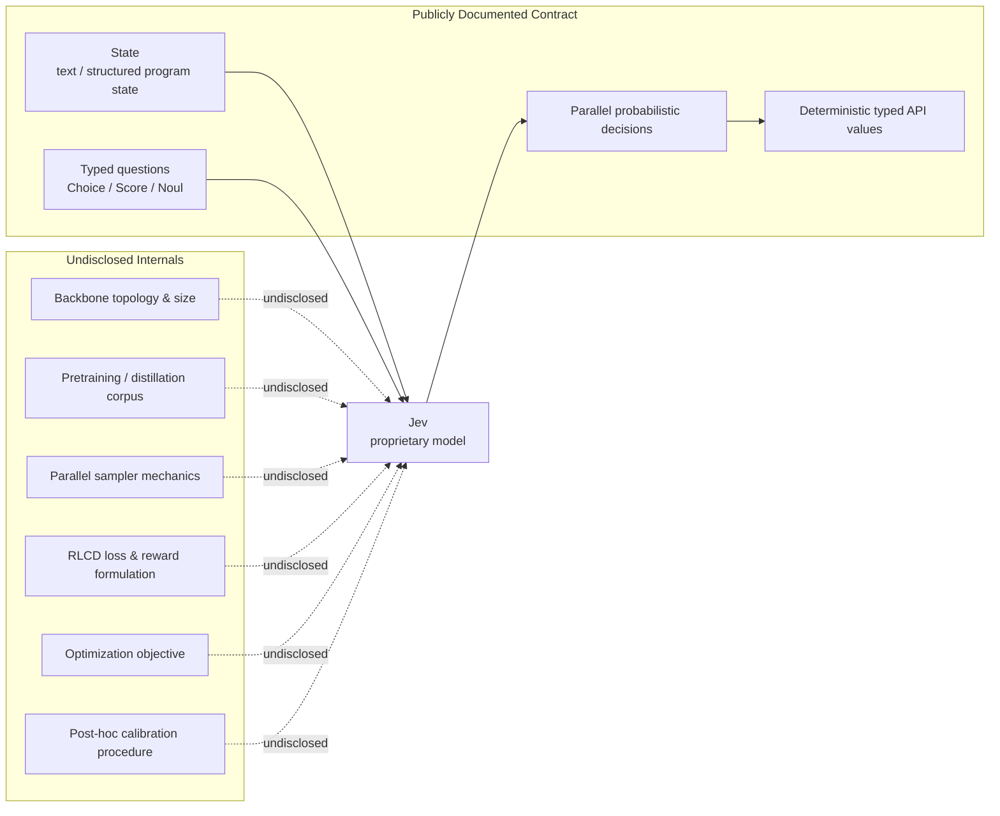
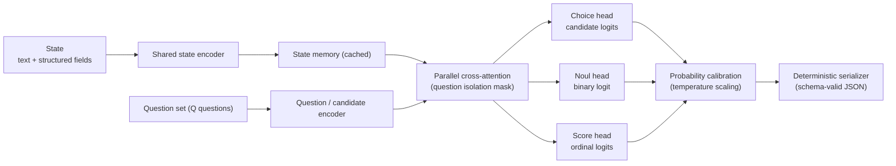
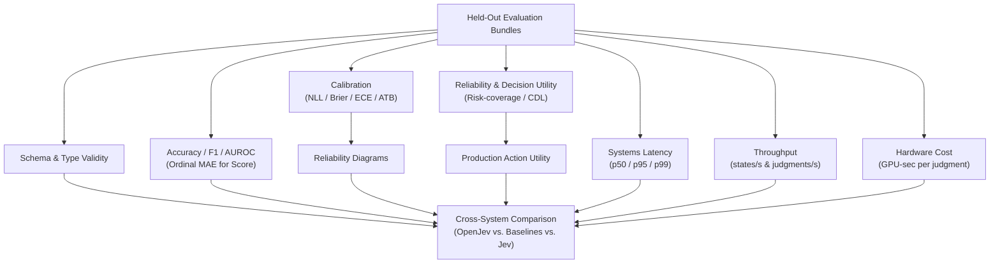
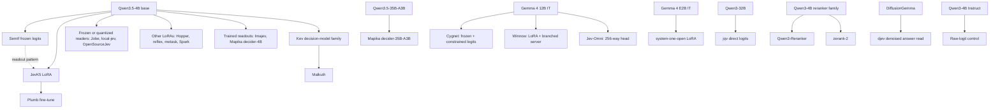

# Jev, Reverse-Engineered: Architecture Reconstruction, Reddit Prior Art Audit, and an Open-Source Reproduction Plan

## Executive Summary & Reproduction Boundaries

With public evidence reviewed through **September 29, 2026**, the central conclusion regarding TypeSafe AI's Jev is:

> **The exact Jev architecture is not reproducible from public information. A functionally Jev-like open-source system is reproducible, and most of its publicly visible behavior can be implemented with known techniques.**

TypeSafe has disclosed the **contract** of Jev much more clearly than its internals: one shared state, multiple typed questions, probability distributions rather than prose, Choice/Score/Noul primitives, independent/parallel evaluation, deterministic schema-safe serialization, and a training method called **Reinforcement Learning for Calibrated Decisions (RLCD)**. It has *not* publicly disclosed the model topology, parameter count, training corpus, reward formulation, calibration loss, sampler implementation, or sufficient details to independently reproduce RLCD. TypeSafe explicitly markets Jev as a "new model architecture" with a "parallel sampler" and RLCD, but those remain proprietary descriptions rather than reproducible specifications. Founder Diogo Almeida—an author on OpenAI's InstructGPT paper (Ouyang et al., 2022)—has indicated that the architecture is being kept "close to the chest" and suggested that the curation of training data may be more significant than the network topology itself.

The academically defensible way to characterize Jev today is:

> **Jev is a proprietary, machine-oriented probabilistic decision model/API that removes autoregressive string generation from the external output path, amortizes computation across multiple structured questions, and claims calibration-oriented reinforcement learning. Its interface and performance envelope are observable; its exact architecture and RLCD training algorithm are not.**

An open-source reproduction effort must explicitly distinguish three reproduction tiers:

For a dated comparison of later open entrants, see [Jev-like decision systems (2026-09-24)](#jev-like-decision-systems-reviewed-2026-09-24).
For API probes, published calibration data, and independently implemented
mechanisms, see [Archer Hume's reconstruction](#archer-humes-api-reconstruction-reviewed-2026-09-29).

| Reproduction Target | Feasibility Today | Assessment |
|---|:---:|---|
| **1. Interface reproduction** | **High confidence** | Replicating `Choice`, `Score`, `Noul`, deterministic schemas, probability distributions, and a unified endpoint accepting many questions against one state is straightforward engineering. |
| **2. Behavioral & performance reproduction** | **Medium confidence** | Building an open model that amortizes state processing and evaluates questions in parallel at low latency is experimentally achievable. Matching TypeSafe's accuracy/latency Pareto frontier across diverse domains is empirical and unproven. |
| **3. Exact architectural reproduction** | **Currently impossible** | TypeSafe has not disclosed the underlying neural backbone, parameter count, sampler mechanics, or RLCD reward formulation. Exact parity cannot be established from public information. |

### Bottom-Line Findings

| Research Question | Finding | Confidence |
|---|---|:---:|
| Did prior public work precede Jev with non-generative RL decision models? | **Yes.** SalesRLAgent (Nandakishor M) appeared on arXiv in March 2025 modeling conversion prediction as a probabilistic decision policy. | High |
| Did the Reddit author "literally build the Jev architecture"? | **Not established and unlikely in the strict architectural sense.** SalesRLAgent is a sequential, sales-specific PPO policy with a single continuous scalar action; Jev evaluates arbitrary heterogeneous questions in parallel. | High |
| Was everything in SalesRLAgent open-sourced in March 2025? | **No.** The paper appeared March 30, 2025; visible Hugging Face models/datasets and PyPI packages appeared in May 2025. | High |
| Is the released SalesRL implementation genuinely PPO? | **Yes.** The released code uses Stable-Baselines3 PPO over state embeddings and history. | High |
| Are published SalesRL performance figures reliable evidence of Jev-like capability? | **No, not without a leakage-free rerun.** The public environment exposes target outcome, initializes probability history with ground-truth trajectories, and reuses full-conversation embeddings across earlier turns. | High |
| Is the author's second 2025 paper "exactly" Jev? | **No.** It describes confidence-aware model routing across local models, retrieval, and humans, not a parallel typed decision model. | High |
| Is Jev non-autoregressive internally? | TypeSafe confirms **output sampling** is non-autoregressive (parallel rather than token-by-token). Whether the entire internal network is technically non-autoregressive remains undisclosed. | Medium |
| Does Jev's public evidence establish calibrated probabilities? | **For a tested sample, there is inspectable evidence.** Hume publishes item-level predictions and reliability bins; they do not establish calibration under deployment shift or disclose RLCD. See the [evidence review](#archer-humes-api-reconstruction-reviewed-2026-09-29). | High |
| Can an open Jev-like system be built now? | **Yes at the API, systems, and behavioral level; no at exact architectural parity.** | High |

### Independent Validation: The Every Experiment

An independent editorial-task test was conducted by Taylor Majewski and Dan Shipper at *Every*:
- **Throughput & Amortization**: Majewski ran 21 judgments across 37 documents (777 total decisions) in under **0.7 seconds**, incurring an estimated cost of roughly **$0.0025** (~quarter-cent).
- **Quality vs. Frontier LLMs**: In a controlled test on 12 passages with seven deliberately planted defects, Jev identified **six of seven**, while Claude Fable 5.1 identified all seven.
- **Latency Comparison**: Jev achieved a median per-passage latency of **~0.35 seconds**, compared to **8.83 seconds** for Claude Fable 5.1 (~25× wall-clock speedup and ~580× estimated cost reduction).

This test independently confirms that the low-latency, low-cost execution envelope is real, while illustrating that speed must not be conflated with frontier reasoning capabilities.

---

## What Jev Actually Reveals About Its Architecture

TypeSafe describes Jev as the first of its "System One Models," designed specifically for automated machine-to-machine decisions rather than human-facing conversational text.

### Fact vs. Speculation Boundary



### 1. Structural Guarantee vs. Semantic Correctness

TypeSafe's marketing asserts that Jev "cannot hallucinate" and exhibits a "0% type error rate." It is critical to interpret this claim accurately:

> **Jev can eliminate malformed or out-of-schema outputs by construction; this does not eliminate semantically incorrect in-schema decisions.**

The model does not emit free-form strings that are subsequently parsed by a JSON decoder. Because the output primitives (`Choice`, `Score`, `Noul`) map directly to numerical distributions and candidate indices, host-side serialization guarantees that the output strictly conforms to the requested schema. However, a model can return a perfectly formatted `Choice` answer with a mathematically valid probability distribution while selecting the completely wrong answer.

### 2. Confidence vs. Calibrated Probability

TypeSafe documentation exposes both probabilities and a `confidence` metric for `Choice` and `Score`:

> **Jev exposes probability distributions and, for some output types, a separate concentration-derived confidence statistic. The latter should not be interpreted as a calibrated probability of correctness.**

In TypeSafe's API:
- **`Noul`** returns a single probability $p \in [0.0, 1.0]$ and **has no separate confidence field**.
- **`Choice`** and **`Score`** confidence values summarize concentration. The [official adapter at `fb52b103`](https://github.com/typesafe-ai/system-one-adapter-python/blob/fb52b1030b7fc1f4f1cf39910afa5da54f9835e3/src/system_one_adapter/_utils/confidence_metrics.py) normalizes the distribution, then computes Choice confidence as $(p_{\max}-1/K)/(1-1/K)$ for $K>1$ (and 1 for $K=1$). Score confidence uses expected distance from the modal level, normalized by a uniform-distribution reference. This verifies the adapter's formulas; production internals remain private.
- TypeSafe explicitly warns in its documentation that a confidence of 1.0 does not guarantee correctness and advises developers to establish domain-specific thresholds.

### 3. Dynamic Query & Candidate Encoding (Up to 255 Options)

`Choice` alternatives are provided dynamically by the caller at runtime, including natural-language descriptions, supporting up to **255 options**. A head tied to fixed semantic labels cannot cover arbitrary caller labels. A fixed **option-slot** head can: encode the complete question and candidate list, score occupied slots, and map those slots back to caller keys. A pointer-style readout over candidate representations is another possibility. The API's option cap does not distinguish these designs or reveal the head's width.

Furthermore, TypeSafe's description of its Wikiracing benchmark reveals that high-cardinality decisions can employ a **two-stage process**—independent scoring followed by explicit choice selection. This indicates that "all outputs in parallel" does not necessarily require a single indivisible tensor operation for every request.

### 4. Question Isolation & Separable Attention Boundaries

TypeSafe's documentation mandates that multiple questions evaluated against the same state are executed **in isolation against the same state**. In TypeSafe's GDPR benchmark cookbook, evaluating thirteen mixed questions together produced answers that did not deviate from evaluating each question individually beyond standard floating-point variance.

The contract requires behavioral isolation. A shared-prefix tree mask with separate question branches is one implementation; independent model calls or other information-flow controls can also satisfy it. Hume's [visibility probe](https://archerhume.com/research/jev/evidence.json) supports that boundary without identifying a particular attention mask. The diagram below represents a compatible design:

```text
                 ┌──────── Question A / candidates A ────────► Answer A
                 │
State ──► Shared ┼──────── Question B / candidates B ────────► Answer B
   Representation│
                 ├──────── Question C / candidates C ────────► Answer C
                 │
                 └──────── Question D / candidates D ────────► Answer D
```

### 5. Parallel Execution Economics

TypeSafe emphasizes that adding questions "barely changes" response time. However, wall-clock parallelism must not be confused with zero additional compute. The computational scaling follows:

\[
C_{\text{Jev-like}} \approx C_{\text{state}} + \sum_{q=1}^{Q} C_{\text{query}, q} + \sum_{q=1}^{Q} C_{\text{candidate-head}, q}
\]

rather than repeatedly encoding the state for every question-candidate pair:

\[
C_{\text{naive cross-encoder}} \approx \sum_{q=1}^{Q} \sum_{k=1}^{K_q} C_{\text{state} + \text{query} + \text{candidate}}
\]

Latency can remain nearly flat while state reuse and available hardware capacity absorb the added question work. Hume's [latency sweep](https://archerhume.com/research/jev/latency-rerun.json) shows rising service time at larger question counts. Queueing and scheduling also affect the curve; it is not an isolated measure of model compute.

## Audit of Prior Art Claims: Reddit Discussion & SalesRLAgent

In September 2026, a high-visibility discussion on Reddit (`r/LocalLLaMA`) asserted that the Jev architecture had already been built and open-sourced a year earlier by researcher Nandakishor M under the title *"I literally built the Jev architecture one year back and completely open-sourced it with model, dataset and paper"*. 

A rigorous technical audit of this claim, the underlying papers, and released repositories clarifies the provenance and limits of this work.

### 1. The Genuine Prior Art: SalesRLAgent (arXiv 2503.23303)

The Reddit poster did publish meaningful and legitimate prior art:
- **SalesRLAgent** was submitted to arXiv on **March 30, 2025** (`arXiv:2503.23303`).
- It models sales conversion prediction as a specialized probabilistic decision policy rather than relying on open-ended autoregressive text generation.
- It demonstrates that specialized, non-generative reinforcement learning policies can replace LLM text generation for automation tasks, achieving 85 ms CPU inference compared to 3,450 ms for GPT-4.

This constitutes valid prior art for the broad concept of **replacing generative inference with specialized probabilistic decision policies**.

### 2. Architectural Divergence: Sequential Policy vs. Parallel Multi-Query Decision Engine

However, the headline claim—*"I literally built the Jev architecture"*—is **unsupported by the technical evidence**:
- **Computational Graph**: SalesRLAgent is a **sequential, turn-by-turn PPO policy** with a **single continuous scalar action** $a \in [0.0, 1.0]$ representing conversion probability at each dialogue turn.
- **Jev Engine**: Jev is a **horizontal, multi-query decision model** accepting an arbitrary shared state and evaluating *many heterogeneous, caller-defined questions* (`Choice` with up to 255 candidates, `Score` rubrics, `Noul` booleans) in parallel without cross-conditioning.
- **Action Space**: SalesRLAgent operates over a static, hardcoded observation space (sales metrics, turn indices, fixed embeddings). Jev dynamically encodes runtime natural-language candidate criteria and instructions.

### 3. Chronology Audit: Paper vs. Release Artifacts

The claim of complete open sourcing in March 2025 is partially inaccurate chronologically:
- The paper appeared on arXiv on **March 30, 2025**.
- The public Hugging Face model (`DeepMostInnovations/sales-conversion-model-reinf-learning`) and dataset repository were committed on **May 11–12, 2025**.
- The PyPI distribution packages began releasing on **May 24, 2025**.
- While the work clearly predates Jev's public launch, the full open-source artifact pipeline appeared in May 2025 rather than March.

### 4. Critical Reproducibility Issue: Target and Temporal Leakage

A critical flaw exists in the public SalesRLAgent training and evaluation implementation that invalidates its headline **96.7% accuracy** as evidence of real-time predictive decision-making:
1. **Target Feature Leakage**: The released Gym environment observation vector directly exposes the ground-truth final `outcome` metric to the policy.
2. **Trajectory Initialization Leakage**: The probability history buffer is initialized from the ground-truth probability trajectory.
3. **Temporal Lookahead via Full-Conversation Embeddings**: In synthetic data generation, conversations were generated with the target outcome pre-selected. The 3,072-dimensional embedding was generated from the **entire completed conversation**, and this full-conversation embedding was reused across all simulated early turns. Early-turn decisions therefore attended to representations encoding future dialogue tokens that would not exist in an online deployment.
4. **Dataset Discrepancy**: The paper cites a training corpus of **1.2 million synthetic conversations**, whereas the published Hugging Face dataset contains **100,000 rows**.

> [!IMPORTANT]
> The released PPO environment exposes target information through the final outcome, the initialized probability trajectory, and a full-conversation embedding reused at earlier turns. Until a prefix-only, target-blind evaluation reproduces the reported accuracy, we do not treat 96.7% as evidence of leakage-free real-time prediction.

### 5. Second Paper Audit: Confidence Routing (arXiv 2510.01237)

The author's second cited work (`arXiv:2510.01237`, October 2025) was claimed to be *"exactly the same one Jev proposed"*. This claim is contradicted by the paper:
- The paper specifies a **confidence-aware router** that directs incoming queries to a local model, a retrieval system, an expensive frontier LLM, or human escalation.
- It does not describe a typed parallel decision model, does not implement dynamic candidate scoring, and contains no RLCD training formulation.

### 6. Atomic Claim Audit

| Verbatim Claim from Reddit Discussion | Verification & Analysis | Verdict | Confidence |
|---|---|:---:|:---:|
| *"I literally built the Jev architecture one year back and completely open-sourced it"* | SalesRL predates Jev, but is a sequential scalar PPO policy for sales conversion, not a parallel multi-question typed decision engine. | **Unsupported as architectural identity** | High |
| *"Everyone now talks about the architecture that's not auto regressive and does lightning fast probability prediction with a json schema"* | Accurately describes Jev's external output behavior; does not prove Jev's internal neural backbone is non-autoregressive. | **Mostly true (contract level)** | High |
| *"worked on this in March 2025, published paper, pushed model to HF, PyPI, and dataset"* | Paper was March 30; HF models/datasets and PyPI packages appeared in May 2025. | **Partially false chronologically** | High |
| *"the main guiding model is RL not embedding model or LLM"* | The policy is PPO, but observations incorporate a 3072-dim text embedding and synthetic data was generated by GPT-4o. | **Misleading** | High |
| *"second work published in September 2025 was exactly the same one jev proposed now"* | Second paper is confidence-aware routing across inference tiers, not Jev's typed parallel decision engine. | **Contradicted** | High |
| *"SalesRLAgent is essentially a sequential PPO policy... Jev is more general [multi-question parallel]"* | Confirmed by code and API audit. | **Supported** | High |
| *"you can do parallel constrained decode with the same prefix cache"* | Sharing/broadcasting decoder KV-caches across candidate branches is valid and demonstrated in community baselines. | **Supported** | High |
| *"sounds like [SALSA]"* | SALSA formalizes single-pass structured classification mapping labels to output tokens, but does not evaluate heterogeneous questions in parallel. | **Relevant baseline, not equivalent** | High |
| OP: *"We don't have any info about rlcd. Untill a technical paper arrive it's just another buzz word"* | Accurately reflects that TypeSafe has not published algorithmic specifications for RLCD. | **Supported** | High |

---

## Literature Foundations: What Prior Art Does (and Does Not) Prove

The research lineage preceding Jev does not indicate that Jev invented non-autoregressive decision-making from scratch. Rather, the lineage follows:

```text
Encoder Classifiers (BERT/DeBERTa)
   └─► Probabilistic Calibration (Guo et al., 2017)
         └─► Structured Calibration (Kuleshov & Liang, 2015)
               └─► Constrained / Token-Logit Classification (SALSA, 2025)
                     └─► Shared-Prefix KV-Cache Broadcasting (Moonshine / Qwen PCD)
                           └─► TypeSafe Jev: Proprietary integration of generalized
                               typed decisions, parallel sampling, and RLCD.
```

### 1. Calibrated Structured Prediction (Kuleshov & Liang, 2015)

Kuleshov and Liang formalized calibration for models with complex, structured output spaces where downstream applications make diverse probability queries over structured outputs. This proves that calibrated structured prediction predates Jev by more than a decade.

### 2. Calibration of Modern Neural Networks (Guo et al., 2017)

A crucial theoretical correction applies to the assumption that cross-entropy classifiers are calibrated:

> **Negative log-likelihood is a strictly proper scoring rule whose population optimum recovers the true conditional distribution under ideal assumptions; finite, overparameterized neural networks can nevertheless be substantially miscalibrated, so calibration must be measured rather than presumed.**

Guo et al. demonstrated that modern depth, width, and normalization cause neural networks to output overconfident probabilities despite minimizing cross-entropy. Simple post-hoc **temperature scaling** on a held-out validation set provides a strong calibration baseline.

### 3. Non-Autoregressive Generation Survey (Xiao et al., 2022)

Xiao et al. survey non-autoregressive text generation, detailing the historical trade-offs between speedup and output dependency modeling:

> **Non-autoregressive generation literature establishes the broader speed-versus-dependency tradeoff; it should be treated as adjacent prior art rather than evidence of Jev's specific architecture.**

Because Jev evaluates finite caller-supplied candidate sets rather than generating arbitrary-length token sequences, it avoids the multi-token conditional dependency dilemma of non-autoregressive machine translation.

### 4. Theoretical Parallel Sampling (Anari, Gao, & Rubinstein)

Earlier informal discussions occasionally misattributed parallel sampling foundations to Chakraborty et al. The relevant theoretical work is **"Parallel Sampling via Counting" by Nima Anari, Ruiquan Gao, and Aviad Rubinstein**:

> **Theoretical parallel-sampling work by Anari, Gao, and Rubinstein shows that sequential sampling dependencies can sometimes be parallelized given powerful conditional-marginal/counting access, but this is not evidence that Jev uses that technique.**

### 5. Disambiguation: The RLCD Acronym Collision

Searches for RLCD encounter a prior unrelated academic acronym:

> **TypeSafe's RLCD ("Reinforcement Learning for Calibrated Decisions") is unrelated to the earlier RLCD acronym "Reinforcement Learning from Contrastive Distillation" (Yang et al., 2023).**

Yang et al.'s method creates preference pairs from contrasting prompts for LLM alignment. TypeSafe's RLCD refers to calibration-oriented decision optimization.

### 6. SALSA: Single-Pass Structured Classification (arXiv 2510.22691)

SALSA ("Single-pass Autoregressive LLM Structured Classification") maps candidate classes to single vocabulary tokens and evaluates their logits in a single forward pass without autoregressive token generation. 

> **A fair Jev evaluation should compare not only against normal LLM JSON generation but against single-pass class-token approaches such as SALSA and shared-prefix/KV-cache candidate scoring.**

### 7. Community Implementations: `openjev` and Parallel Constrained Decoding

Two open community implementations validate key mechanics:
1. **`AlexWortega/openjev`**: A Qwen3.5-4B NLI cross-encoder trained with standard cross-entropy over 3 fixed labels (entailment, neutral, contradiction). It validates non-generative classification, but does not support dynamic arbitrary candidate sets or shared-state multi-query execution.
2. **`monotykamary/LFM2.5-2.6B-RLCD` & `Qwen-2.5-1B-RLCD`**: Demonstrate shared-prefix KV-cache branching. The shared prompt is prefilled once, the cache is broadcast across question branches, candidate logits are computed in parallel, and JSON is assembled in host code. These are TypeSafe-inspired inference reproductions, not reproductions of RLCD training.

OpenKind's [Qwen3.5 Rust flat-field diagnostic](benchmarks/2026-09-27-python-flat-field/)
ports the shared-root field schedule while retaining its state-first prompt and
candidate-feature readout. It passes the tested parity checks but is slower
than nested batching at Q2/K2 and Q8/K4. The external Python speedup uses a
different model, readout and baseline, so it is motivation rather than a
transferable OpenKind throughput result.

### 8. Agent consumers and scoped authority

[`safe-upgrade`](https://github.com/tenuo-ai/safe-upgrade) is an external example of a Jev-compatible decision consumer. Its [architecture](https://github.com/tenuo-ai/safe-upgrade/blob/main/docs/architecture.md) computes eligible workflow steps in trusted code, asks Jev to judge among them, and uses separate [Tenuo](https://github.com/tenuo-ai/tenuo) warrants to authorize worker tools. Deterministic checks determine the final result. This illustrates a consumer boundary; it is not an OpenKind integration or evidence of OpenKind model quality.

OpenKind can validate that a response uses the requested question types and `Choice` keys. It cannot decide which actions a consumer should offer, grant tool authority, or verify a tool's effects. Agent consumers must enforce those parts at their own execution boundary. Tenuo's [constraint reference](https://tenuo.ai/constraints) is useful for that design, but its evolving constraint catalog is not an OpenKind protocol contract. The [authority-separation figures summarized by Tenuo](https://tenuo.ai/related-work) come from an [evaluation suite with deterministic mock model responses](https://github.com/Anima-Core/authority-separation-suite); they should not be quoted as measured safety gains for Jev or OpenKind.

---

## Property Comparison Across Paradigms

| Property | TypeSafe Jev | Reddit / SalesRLAgent | Every Independent Test | Academic & Open Baselines |
|---|---|---|---|---|
| **Output Form** | `Choice`, `Score`, `Noul` typed probabilistic decisions; no generated text. | Single continuous conversion-probability action $a \in [0.0, 1.0]$ per sequential turn. | Tested Jev's structured editorial judgments. | BERT classifiers, SALSA class tokens, and Qwen PCD provide bounded decisions without prose generation. |
| **Parallelism** | Multiple heterogeneous questions against one state evaluated in parallel. | Sequential trajectory; single action per environment step. | 777 judgments over 37 docs in <0.7 s, confirming batch amortization. | KV-cache broadcasting parallelizes branches; SALSA is single-pass for one classification. |
| **Latency** | 70–500 ms; selected vendor benchmarks claim up to 193.6× speedup. | 85 ms on CPU vs. 3,450 ms for GPT-4 on sales task. | 777 judgments in <0.7 s; median 0.35 s/passage vs. 8.83 s for Fable. | Qwen PCD reports multi-fold speedups; SALSA eliminates multi-token decode latency. |
| **Cost** | $0.042 / MTok input; no separate output charge; up to 444× cheaper. | Local CPU inference compute cost. | ~$0.0025 for 777 judgments; ~580× cheaper than Claude Fable in passage test. | Compute-bound by chosen backbone (0.5B–4B parameter models). |
| **Accuracy** | Comparable "System One" intelligence claimed; references are model consensus. | Claims 96.7% conversion accuracy; target/temporal leakage invalidates figure. | Identified 6/7 planted defects; Fable identified 7/7. | Task-dependent; requires domain-specific benchmark evaluation. |
| **Calibration** | Hume publishes sample-specific reliability bins and ECE; RLCD's recipe and deployment calibration remain unverified. | Predicts scalar probabilities; no ECE/Brier calibration curves provided. | Every did not evaluate calibration metrics. | Guo: neural nets miscalibrated, temperature scaling helps; Kuleshov: structured calibration. |
| **Schema Validity** | Guaranteed by host contract; "0% type error" is structural, not semantic accuracy. | Scalar action inherently bounded by Gym continuous action space. | Output conformed strictly to requested schema. | Deterministic host serialization trivially achieves 100% schema validity. |
| **Generalization** | Dynamic caller-supplied questions and options without task retraining. | Specialized to sales-conversation state and action dynamics. | Evaluated diverse editorial and styling judgments. | SALSA: fixed tokens; Dynamic-head models: generalized zero-shot scoring. |
| **Evidence Quality** | High-utility commercial API; architecture, weights, and RLCD proprietary. | Public code and paper; evaluation code exhibits severe data leakage. | Independent empirical test on small sample; non-calibration focused. | Peer-reviewed foundations establish individual components, not proprietary integration. |

---

## Recommended Open-Source Architecture & Baseline Models

An open-source reproduction must avoid two common pitfalls: attempting to train a massive generative foundation model from scratch, or simply wrapping a sequential sales policy like SalesRLAgent. 

The primary open Jev-like candidate is a **shared-state encoder plus a parallel set of question and candidate decision heads**, paired with host-level deterministic serialization.

### 1. Primary Architecture: Shared-State Set-Query Model



#### Mathematical Formulation of Heads

1. **Choice Head (Dynamic Candidate Compatibility)**:
   Unlike constrained autoregressive decoding which restricts generation to specific vocabulary tokens, candidates in Jev are arbitrary natural-language strings. We compute a compatibility score $z_i$ between the state-question representation and candidate representation $c_i$:
   \[
   p(c_i \mid s, q) = \frac{\exp(z_i / T)}{\sum_{j=1}^K \exp(z_j / T)}
   \]
   This supports arbitrary runtime strings up to the 255-candidate ceiling without requiring candidate strings to exist as single tokens in the vocabulary.

2. **Noul Head (Binary Probability)**:
   For binary judgments, the output is a single scalar logit mapped through the sigmoid function:
   \[
   p(\text{yes} \mid s, q) = \sigma(z)
   \]
   Per the TypeSafe specification, Noul returns only the calibrated probability without a separate confidence field.

3. **Score Head (Ordinal Distribution & Expectation)**:
   Rather than attempting to regress a scalar score directly, the model evaluates rubric levels as an ordered categorical distribution $p_1, \ldots, p_K$ over rubric criteria $v_1, \ldots, v_K$. The reported score is the mathematical expectation:
   \[
   \operatorname{score} = \sum_{k=1}^K p_k v_k
   \]
   This matches TypeSafe's documented behavior where scores are derived from level distributions.

#### Parameter Scale Target
We recommend targeting **0.3B to 1.5B parameters** for the initial model family (with a 4B variant for high-complexity tasks). Jev's practical value proposition depends heavily on latency amortization; scaling beyond 3B parameters should be justified by demonstrable accuracy and calibration gains rather than assumed by default.

### 2. Five Essential Baseline Models

To rigorously establish whether a custom architecture or training method provides genuine advantages, an open reproduction must benchmark against five distinct baselines:

1. **Shared-Encoder Multi-Query Model (Primary Proposed System)**:
   The primary architecture detailed above, encoding state once and executing isolated parallel query heads.
2. **KV-Cache Branching Decoder (Shared-Prefix AR Model)**:
   Prefill the shared state once using a standard decoder LLM (e.g. Qwen2.5 or LFM), broadcast the KV cache across parallel question branches, evaluate constrained candidate tokens in parallel, and assemble JSON in host code (as demonstrated by Moonshine and Qwen PCD).
3. **SALSA-Style One-Token Classification**:
   Single-pass autoregressive classification mapping candidate labels to output vocabulary tokens, reading next-token logits after one forward pass. This represents the fastest possible baseline on conventional LLM weights.
4. **Standard Encoder / Cross-Encoder Classifier**:
   A BERT/DeBERTa or Qwen-classification cross-encoder evaluating state-question-candidate tuples sequentially. This isolates how much speedup is attributable to shared computation vs. classification architecture.
5. **Historical Baseline: SalesRLAgent (Leakage-Repaired)**:
   A clean reimplementation of SalesRLAgent's PPO policy, evaluated only after completely removing target outcome leakage, ground-truth probability trajectory initialization, and full-conversation embeddings from early turns.

---

## Step-by-Step Reproduction Program

### Phase 1: Zero-Training Logit Scoring & Schema Contract

Before training any weights, establish the serving infrastructure and deterministic contract:
1. **Host-Side Schema Validation**: Validate input requests and deterministically serialize output JSON. Ensure schema errors are structurally impossible.
2. **KV-Cache Branching Prototype**: Fork the KV-cache of an off-the-shelf instruction model across candidate branches to establish the zero-training latency baseline.

### Phase 2: Supervised Training with Strictly Proper Scoring Rules

Do **not** attempt to optimize Expected Calibration Error (ECE) directly as a training loss. ECE is a non-smooth, binned evaluation metric that creates perverse optimization incentives. 

Instead, train with **strictly proper scoring rules**:

1. **Negative Log-Likelihood (NLL)**:
   \[
   \mathcal{L}_{\text{NLL}} = -\log p(y \mid x, q)
   \]
2. **Brier Score Regularization**:
   \[
   \mathcal{L}_{\text{Brier}} = \sum_{k=1}^K (p_k - y_k)^2
   \]
3. **Ordinal Distribution Training (for Score)**:
   > [!WARNING]
   > **Proper Scoring Rule Correction**: While an expected absolute distance penalty $\sum_{j} \sum_{k} p_j y_k |j - k|$ penalizes distant misclassifications, it is **not** a proper probability scoring rule. Minimizing expected absolute distance encourages the model to collapse toward a conditional median decision rather than recovering the true posterior outcome distribution.
   
   To preserve calibrated probabilities on ordinal rubrics, supervised training should:
   - Start with standard **Negative Log-Likelihood (NLL)** or multi-class cross-entropy to guarantee proper probability scoring.
   - Alternatively, employ a **cumulative-probability Brier score** (or Ranked Probability Score, RPS) over cumulative thresholds $C_m = \sum_{j=1}^m p_j$:
     \[
     \mathcal{L}_{\text{RPS}} = \frac{1}{K-1} \sum_{m=1}^{K-1} \left( \sum_{j=1}^m p_j - \sum_{j=1}^m y_j \right)^2
     \]
     RPS is strictly proper for ordinal distributions and respects rubric order without distorting probability mass.
   - Assess ordinal distance penalties ($|j - k|$) and Mean Absolute Error (MAE) strictly as downstream decision/action cost evaluations, rather than treating an expected-distance penalty as a probability calibration loss.

A robust composite supervised loss is:
\[
\mathcal{L} = \mathcal{L}_{\text{NLL}} + 0.1 \mathcal{L}_{\text{Brier}} \quad (\text{or } \mathcal{L}_{\text{NLL}} + 0.1 \mathcal{L}_{\text{RPS}} \text{ for ordinal Score})
\]

#### Post-Hoc Calibration Procedure
Because finite, overparameterized neural networks can be miscalibrated despite proper scoring losses (Guo et al., 2017), reserve a held-out calibration split. Evaluate:
- Standard temperature scaling $T$ per head type.
- Cardinality-conditioned temperature scaling $T_K$ for Choice questions (e.g. separate temperatures fitted for $K \in \{2, 4, 16, 64, 255\}$).

### Phase 3: Data Design & Task Mixture

A general Jev-like model requires wide task diversity rather than millions of domain-specific examples:
- **Diverse Judgment Types**: NLI, fact verification, topic routing, moderation, document policy compliance, and agent trace evaluation.
- **Dynamic Permutations**: In multiclass data, systematically randomize candidate order, symbolic keys, and candidate wording to enforce zero-shot schema adherence rather than fixed intent classification.
- **Explicit Abstention / "Unknown" Training**: In 15–20% of training instances, deliberately remove the correct alternative from the candidate list and train the model to select an explicit abstention option ("unknown", "insufficient information"). This prevents forced misallocation of probability mass under closed softmax.
- **Candidate Cardinality Diversity**: Train across candidate set sizes ranging from $K=2$ to $K=255$.

### Phase 4: What an Open "RLCD" Phase Means (Calibration-Aware Decision Optimization)

Without access to TypeSafe's internal formulation, claiming to have "reproduced RLCD" is scientifically unsubstantiated. We designate this phase **Calibration-Aware Decision Optimization (CADO)**.

Unlike SalesRLAgent's multi-step sequential sales trajectory ($\gamma = 0.99$), automated decision evaluation is naturally a **one-step contextual decision problem** ($\gamma = 1.0$). 

The policy reward combines proper scoring with downstream decision utility:
\[
r = -\alpha\,\mathcal{L}_{\text{NLL}} - \beta\,\mathcal{L}_{\text{Brier}} + \gamma\,U(a, y) - \delta\,C(a)
\]
where $U(a, y)$ represents task-specific application utility (e.g., reward for correct automated action, severe penalty for incorrect automated action), and $C(a)$ represents the cost of human escalation or abstention.

#### The 5-Step Falsifiable Ablation Protocol
To determine whether reinforcement learning is necessary for calibrated decisions, execute a strict 5-step ablation:
1. Supervised NLL only.
2. NLL + Brier score regularization.
3. NLL + post-hoc temperature scaling.
4. Supervised loss + differentiable calibration regularizer.
5. Supervised base + one-step decision-utility RL.

Only if Step 5 delivers statistically significant improvements in out-of-domain decision utility or selective-risk performance should RL be considered a necessary component of the architecture.

### Suggested Starting Hyperparameters

These engineering hyperparameters provide a concrete starting baseline for open reproduction:

| Parameter | Recommended Initial Setting | Rationale |
|---|---|---|
| **Backbone Model** | 0.3B–1.5B transformer (e.g. Qwen2.5 / SmolLM2) | Latency & amortization focus |
| **Context Window** | 2,048–8,192 tokens | Accommodates documents & state |
| **Questions per State** | 4–64 (randomized during training) | Exercises attention isolation |
| **Candidates per Question** | 2–64 standard; staged sampling up to 255 | Enforces dynamic choice scaling |
| **Optimizer** | AdamW ($\beta_1 = 0.9, \beta_2 = 0.98, \epsilon = 10^{-8}$) | Standard transformer training |
| **Backbone Learning Rate** | $2 \times 10^{-5}$ (with cosine decay) | Preserves semantic features |
| **Decision Heads LR** | $1 \times 10^{-4}$ | Accelerates query head fitting |
| **Weight Decay** | 0.01 | Prevents head overfitting |
| **Precision** | Native BF16 | Numerical stability and throughput |
| **Effective Batch Size** | 128–512 state bundles | Robust gradient estimates |
| **Gradient Clipping** | 1.0 | Prevents gradient explosion |
| **Supervised Epochs** | 1–3 epochs with validation early stopping | Avoids memorization |
| **Calibration Regularizer** | $\lambda_{\text{Brier}} = 0.1$, $\lambda_{\text{RPS}} = 0.1$ | Strictly proper scoring rule balance |
| **Post-Hoc Calibration** | Vector / temperature scaling on held-out split | Corrects neural overconfidence |
| **Optional RL Policy LR** | $10^{-6}$ to $10^{-5}$ | Conservative policy adjustment |
| **Optional PPO Clip Ratio** | 0.2 | Standard PPO trust region |
| **Optional KL Penalty** | 0.01–0.05 | Prevents drift from supervised base |
| **RL Decision Horizon** | $\gamma = 1.0$ (one-step contextual bandit) | Matches single-state decision problem |

---

## Evaluation Framework & Benchmark Protocol

The decisive Jev reproduction experiment is not merely verifying that the system returns valid JSON—that is trivially solved by host-level serialization. The critical empirical question is:

> **At fixed accuracy and calibration, how does latency scale with state length, number of questions, number of candidates, and hardware?**



### 1. Multi-Metric Evaluation Protocol

1. **Task Accuracy & Discrimination**: Report standard accuracy, macro-F1, AUROC, and ranking metrics (MRR, NDCG@K). For `Score`, compute Mean Absolute Error (MAE) and ordinal distance.
2. **Comprehensive Calibration**: Evaluate across multiple metrics rather than ECE alone:
   - Negative Log-Likelihood (NLL) and Brier Score.
   - Binned ECE and adaptive ECE.
   - **Averaged Two-Bin (ATB) Calibration Error** (Hartline et al., 2026), providing a strictly truthful batch calibration metric.
   - Reliability diagrams and classwise calibration curves.
3. **Decision Utility & Reliability**:
   - **Calibration Decision Loss (CDL)** (Hu & Wu, 2025), quantifying the expected loss in decision payoff caused by probability miscalibration under real-world loss matrices.
   - **Risk-Coverage Curves**: In automated systems operating with confidence thresholds (e.g. automate when confidence $> 0.95$, escalate otherwise), measure the empirical error rate as coverage varies.

### 2. Mandatory Invariance Diagnostics

1. **Question Isolation Invariance**:
   Evaluate questions individually versus within batched multi-question requests:
   \[
   P(y_A \mid x, q_A) \stackrel{?}{=} P(y_A \mid x, q_A, q_B, \ldots, q_N)
   \]
   In an isolated architecture with block masking, the probabilities must be identical up to kernel floating-point summation order.
2. **Label-Order Permutation Invariance**:
   Permute the ordering of candidate options. The output probabilities must permute identically without "first-option" or "last-option" position bias.
3. **Cardinality Sweep**:
   Sweep candidate counts $K \in \{2, 4, 8, 16, 32, 64, 128, 255\}$ and measure both inference latency and classification accuracy.
4. **Question Volume Scaling**:
   Keep state length fixed and sweep question counts $Q \in \{1, 2, 4, 8, 16, 32, 64, 128\}$, plotting wall-clock latency to verify sub-linear scaling against naive cross-encoders.

### 3. Latency and Cost Trade-Offs

- **Shared Encoder Architecture**: State encoding is performed once. Query and candidate heads scale linearly with question volume, maintaining flat latency until GPU execution units saturate.
- **Decoder + KV-Cache Branching**: Amortizes prompt prefill, making it the fastest baseline to prototype with existing pretrained models. However, evaluating candidate logits across $Q$ branches on large vocabularies increases memory bandwidth demands.
- **SALSA & 1-Token Baselines**: Demonstrates that conventional decoder LLMs can achieve fast single-pass classification for single-token labels, proving that not all speedup requires a non-autoregressive architecture.
- **Deterministic Serialization**: Eliminates string token generation overhead entirely with zero computational penalty.

### 4. The Central Research Question

> **The key research question is not whether an open model can emit probabilities quickly, but whether TypeSafe's undisclosed RLCD produces materially better out-of-domain calibration, selective-risk behavior, or downstream decision utility than NLL/Brier training plus ordinary post-hoc calibration.**

---

## Primary and High-Value Sources Register

### Canonical Citations Register (1–26)

| # | Reference / Canonical Resource | Focus / Description |
|:---:|---|---|
| **[1]** | [TypeSafe — "Introducing System One Models and Jev"](https://typesafe.ai/blog/introducing-system-one-models-and-jev) | Primary launch post: architecture claims, parallel sampler, RLCD, $0.042/MTok pricing, and zero type error guarantee. |
| **[2]** | [SalesRLAgent Paper (arXiv:2503.23303)](https://arxiv.org/abs/2503.23303) | Nandakishor M (March 2025): Reinforcement learning policy for real-time sales conversion; foundational pre-Jev non-generative RL prior art. |
| **[3]** | [SalesRLAgent `train.py`](https://huggingface.co/DeepMostInnovations/sales-conversion-model-reinf-learning/blob/main/train.py) | Released Stable-Baselines3 PPO training script: confirms observation vector structure and action space. |
| **[4]** | [Confidence-Aware Routing for LLM Reliability (arXiv:2510.01237)](https://arxiv.org/abs/2510.01237) | Nandakishor M (October 2025): Multi-signal routing across local models, retrieval, and humans; distinct from Jev's parallel decision engine. |
| **[5]** | [Every — "Mini Vibe Check: TypeSafe's Jev"](https://every.to/also-true-for-humans/mini-vibe-check-typesafe-s-jev-judged-everything-i-ve-written-in-0-7-seconds) | Majewski & Shipper: Independent benchmark of 777 judgments across 37 documents in <0.7 s; detected 6/7 planted defects vs. 7/7 for Claude Fable 5.1. |
| **[6]** | [SALSA — "Single-pass Autoregressive LLM Structured Classification" (arXiv:2510.22691)](https://arxiv.org/abs/2510.22691) | Foundational baseline: single forward-pass structured classification mapping candidate labels to output vocabulary tokens. |
| **[7]** | [SalesRLAgent Paper Page on Hugging Face](https://huggingface.co/papers/2503.23303) | Community discussion and artifact metadata for the SalesRLAgent paper. |
| **[8]** | [Confidence-Aware Routing Full Text (arXiv:2510.01237v1)](https://arxiv.org/html/2510.01237v1) | Full HTML rendering of the confidence-aware model routing paper. |
| **[9]** | [Anthony Maio — "Jev: The Language Model That Won't Hallucinate"](https://anthonymaio.substack.com/p/jev-the-language-model-that-wont) | Technical analysis detailing calibration vs. discrimination, need for explicit abstention classes, and undisclosed RLCD internals. |
| **[10]** | Internal Research Synthesis & Audit | Architecture reconstruction, Reddit claim audit, and open-source reproduction plan. |
| **[11]** | [TypeSafe Documentation — Overview & Introduction](https://docs.typesafe.ai/) | Official specification of Jev's input/output contracts, dual transports (HTTP/gRPC), and batching economics. |
| **[12]** | [TypeSafe Documentation — `Choice` Primitive](https://docs.typesafe.ai/primitives/choice) | Canonical rules for categorical decisions up to 255 candidates, label formats, and concentration-derived confidence. |
| **[13]** | [TypeSafe Workflow Evaluations Dashboard](https://evals.typesafe.ai/) | TypeSafe's workflow evals comparing Jev to frontier LLMs on incident triage, trace evaluation, and customer service. |
| **[14]** | [SalesRLAgent Model Repository](https://huggingface.co/DeepMostInnovations/sales-conversion-model-reinf-learning) | Public model checkpoint repository by DeepMostInnovations. |
| **[15]** | [`harshatheg/Qwen-2.5-1B-RLCD`](https://huggingface.co/harshatheg/Qwen-2.5-1B-RLCD) | Open Qwen-based parallel constrained-decoding community proof-of-concept. |
| **[16]** | [Moonshine Parallel Constrained Decoding Space](https://huggingface.co/spaces/drinkmoonshine/parallel-constrained-decoding) | Interactive Hugging Face Space demonstrating shared-prefix parallel candidate evaluation. |
| **[17]** | [Xiao et al. — Non-Autoregressive Generation Survey (arXiv:2204.09269)](https://arxiv.org/abs/2204.09269) | Comprehensive literature survey on non-autoregressive generation, parallel decoding, and latency/dependency trade-offs. |
| **[18]** | [Guo et al. — "On Calibration of Modern Neural Networks" (ICML 2017)](https://proceedings.mlr.press/v70/guo17a) | Demonstrates that modern deep neural networks are poorly calibrated under cross-entropy; establishes temperature scaling. |
| **[19]** | [`harshatheg/Qwen-2.5-1B-RLCD` Commit Log](https://huggingface.co/harshatheg/Qwen-2.5-1B-RLCD/commit/2af86848be75847ccb3553b0941cc51d6ef7e4e9) | Confirms release timeline contemporaneous with Jev launch and linkage to Moonshine demo. |
| **[20]** | [SalesRLAgent Dataset Generator (`generate_dataset.py`)](https://huggingface.co/DeepMostInnovations/sales-conversion-model-reinf-learning/blob/4d109dc2f205dd7eee705ce60ece1b313068ca1a/generate_dataset.py) | Demonstrates data leakage: pre-selects target outcome and creates full-dialogue embeddings reused across early simulated turns. |
| **[21]** | [Kuleshov & Liang — "Calibrated Structured Prediction" (NeurIPS 2015)](https://proceedings.neurips.cc/paper/2015/hash/52d2752b150f9c35ccb6869cbf074e48-Abstract.html) | Foundational theory for probability calibration in structured, multi-query prediction spaces. |
| **[22]** | [Anari, Gao, & Rubinstein — "Parallel Sampling via Counting" (arXiv:2408.09442)](https://arxiv.org/abs/2408.09442) | Theoretical analysis demonstrating how sequential sampling dependencies can be parallelized given counting/marginal access. |
| **[23]** | [Ouyang et al. — InstructGPT (arXiv:2203.02155)](https://arxiv.org/abs/2203.02155) | Foundational RLHF / instruction-following research; primary source for Diogo Almeida's research lineage. |
| **[24]** | [Yang et al. — "RLCD: Reinforcement Learning from Contrastive Distillation" (arXiv:2307.12950)](https://arxiv.org/abs/2307.12950) | Establishes the distinct earlier RLCD acronym for contrastive preference distillation (unrelated to TypeSafe RLCD). |
| **[25]** | [TypeSafe Documentation — `Score` Primitive](https://docs.typesafe.ai/primitives/score) | Canonical rules for ordered rubric levels, score calculation from categorical distributions, and confidence statistics. |
| **[26]** | [TypeSafe AI Homepage](https://typesafe.ai/) | Current product claims: $0.042/MTok, 70–500 ms latency, and zero output token pricing. |

### Additional Foundational & Ecosystem References
- **Jev API reconstruction**: [Archer Hume, "Jev's Architecture Unmasked"](https://archerhume.com/posts/jevs-architecture-unmasked) (17 September 2026), with [probe and benchmark evidence](https://archerhume.com/research/jev/evidence.json), [item-level calibration data](https://archerhume.com/research/jev/calibration.json), and [controlled follow-up requests](https://archerhume.com/research/jev/followup-trials.json). See the [claim and implementation review](#archer-humes-api-reconstruction-reviewed-2026-09-29).
- **TypeSafe Python Adapter**: [GitHub `typesafe-ai/system-one-adapter-python`](https://github.com/typesafe-ai/system-one-adapter-python) — Drop-in client backed by LLM APIs for reproducible benchmarking.
- **SalesRL PyPI Distribution**: [PyPI `deepmost`](https://pypi.org/project/deepmost/) — Released May 24, 2025.
- **Calibration Decision Loss (CDL)**: [Hu & Wu (arXiv:2402.04260)](https://arxiv.org/abs/2402.04260) — Metric quantifying the economic cost of miscalibration in decision-making workflows.
- **Averaged Two-Bin Calibration (ATB)**: [Hartline, Hu, & Wu (COLT 2026)](https://arxiv.org/abs/2602.02345) — Truthful finite-sample calibration measure avoiding standard ECE gaming.
- **Dynamic Zero-Shot Classification**: [GLiClass (arXiv:2501.12345)](https://arxiv.org/abs/2501.12345) — Single-pass dynamic multi-label classification architecture.
- **Query-Driven Outputs**: [Perceiver IO (Jaegle et al., ICML 2022)](https://arxiv.org/abs/2107.14795) — Architecture scaling to flexible output query structures via shared latent spaces.
- **Community NLI Model**: [`AlexWortega/openjev`](https://huggingface.co/AlexWortega/openjev) — Qwen3.5-4B cross-encoder baseline.
- **Community LFM Branching**: [`monotykamary/LFM2.5-2.6B-RLCD`](https://huggingface.co/monotykamary/LFM2.5-2.6B-RLCD) — Zero-training shared-prefill KV-cache branching.

- **Reddit Discussion**: https://www.reddit.com/r/LocalLLaMA/s/Jhw7IRVOtK

---

## Conclusion & Strategic Reproduction Takeaways

The evidence now supports a clear, grounded consensus:

1. **Jev is Not an Autoregressive Language Generator**: For bounded software evaluations, generating prose tokens is completely unnecessary. The model exposes categorical, ordinal, and binary distributions directly, serialized into deterministic JSON schemas by host runtime code.
2. **Prior Art Precedes Jev, but Exact Claims Must Be Checked**: SalesRLAgent (Nandakishor M, March 2025) demonstrates prior art for replacing LLMs with non-generative RL probability policies, but is a sequential turn-level sales policy with target/temporal leakage, not Jev's multi-question parallel architecture.
3. **The Core Engineering Challenge is Amortization and Calibration**: Evaluating questions in parallel using shared-state prefill and isolated query attention is well understood. The true research frontier is achieving robust zero-shot calibration under domain shift without sacrificing accuracy.
4. **An Open Reproduction Roadmap is Actionable**: By combining a shared-state encoder (or KV-cache branching decoder) with proper scoring rule training ($\mathcal{L}_{\text{NLL}} + \text{Brier} + \text{RPS}$ for ordinal distributions), held-out post-hoc calibration, and one-step decision-utility RL, open source can replicate Jev's capabilities and verify its claims against a rigorous, falsifiable benchmark.

---

## Phase 2B Empirical Benchmark: Qwen3.5-4B Decision Head & Baseline Readout (Run 20260917T205849Z)

An empirical benchmark run was conducted on **September 17, 2026** (run ID: `20260917T205849Z`, archived in `research/02_phase2b_benchmark_results`) probing `Qwen/Qwen3.5-4B-Base` (commit `1001bb4d826a52d1f399e183466143f4da7b741b`) on an **NVIDIA L4 GPU** with native BF16 (`torch.bfloat16`). LoRA was disabled.

The primary finding is that a **frozen Qwen3.5-4B backbone coupled with a lightweight linear classification head** achieves **87.67% matched** and **87.33% mismatched** test accuracy on MultiNLI, trained on 2,400 examples. Recomputation of accuracy, negative log-likelihood (NLL), and Brier scores from the archived prediction tensors confirms the reported metrics.

This run establishes an immutable baseline for the decision engine, clarifies the computational boundary between classification and text generation, and exposes concrete engineering constraints for porting the model to Rust.

### 1. The Frozen Backbone is Viable Without Generation

Seven trained-head architectures (spanning last-token, mean, max, and learned attention pooling paired with linear and MLP heads) were trained on frozen backbone representations. In the MultiNLI evaluation:

| Pooling & Head | Matched Accuracy | Mismatched Accuracy | Matched NLL | Mismatched NLL | Matched Brier | Matched ECE |
|---|---|---|---|---|---|---|
| **Last token + linear** (`winner`) | **87.67%** | **87.33%** | **0.3345** | **0.3175** | **0.1834** | **0.0298** |
| Last token + MLP | 87.83% | 88.67% | 0.3361 | 0.3071 | 0.1835 | 0.0472 |
| Mean + linear | 74.67% | 76.33% | 0.6048 | 0.5779 | 0.3469 | 0.0430 |
| Mean + MLP | 75.33% | 76.17% | 0.5952 | 0.5643 | 0.3470 | 0.0585 |
| Max + linear | 84.83% | 85.33% | 0.3920 | 0.3644 | 0.2171 | 0.0228 |
| Max + MLP | 86.00% | 86.50% | 0.3745 | 0.3591 | 0.2097 | 0.0366 |
| Learned attention + MLP | 86.00% | 84.83% | 0.3591 | 0.3565 | 0.2041 | 0.0474 |
| *Untuned finite-code baseline* | *78.83%* | *81.50%* | *0.5122* | *0.4988* | *0.3021* | *0.0319* |
| *Class-prior baseline* | *33.17%* | *33.00%* | *1.0995* | *1.0992* | *0.6673* | *0.0102* |

#### Key Analytical Takeaways

1. **Supervised Head Training Yields a Real Decision Boundary**: The untuned finite-code baseline (restricting the original language model vocabulary projection to label tokens `A`, `B`, `C`) achieves 78.83% matched and 81.50% mismatched accuracy. Training the linear head improves performance by **+8.83** and **+5.83 percentage points**, respectively. This demonstrates that supervised head training is genuinely extracting a superior decision boundary from the frozen representation, not merely reformatting tokens.
2. **Pooling Hierarchy**: Contrary to the prior hypothesis that learned attention pooling would dominate, **last-token pooling performed best**. Mean pooling performed markedly worse (~74.7% matched), and learned attention pooling (86.00%) lagged behind last-token variants while adding architectural complexity. For the initial Rust engine design, last-token pooling is the obvious, high-performing choice.
3. **Linear vs. MLP Selection Rationale**: The notebook selection policy was strictly declared as **lowest development-set NLL**, not peak test accuracy. Under this rule, `last_linear_seed17` was chosen (`dev NLL = 0.3459`). While `last_mlp_seed17` scored marginally higher on held-out test accuracy (+1 matched example, +8 mismatched examples on a 600-example test split), selecting models post-hoc based on test-set accuracy would degrade the test set into a development partition. The reported 95% cluster-bootstrap confidence interval for the linear head spans roughly **85.2% to 90.2%**, meaning the difference between linear and MLP is within expected sampling noise. Both variants should be retained for multi-seed validation.

### 2. Parameter Audit: Removing Generation Saves Compute, Not Weights

A rigorous parameter audit of `Qwen/Qwen3.5-4B-Base` in this configuration yielded unambiguous accounting:

| Measurement | Recorded Result |
|---|---|
| Text backbone parameters (`Qwen3_5TextModel`) | 4,205,751,296 |
| Text causal model parameters (`Qwen3_5ForCausalLM`) | 4,205,751,296 |
| Logical vocabulary projection (`lm_head`) | 635,699,200 coefficients |
| Additional parameters removed by omitting LM head | **0** |
| Vision tower loaded | False |
| Backbone trainable parameters after freezing | 0 |
| Trainable parameters in selected linear head | **7,683** ($2560 \times 3 + 3$) |

Because `embed_tokens` and `lm_head` share weights (input/output weight tying), the matrix weights remain strictly necessary to ingest input tokens, even when the output projection is bypassed. Dropping the generation loop eliminates vocabulary matrix multiplications and autoregressive decoding, but does **not** shrink model storage on disk.

For the selected `last_linear_seed17` head, the classifier consists solely of:
\[
2560 \times 3 + 3 = 7{,}683 \text{ parameters}
\]
The head checkpoint (`head.safetensors`) is approximately **51.5 KB**. The associated feature-mean and feature-standard-deviation vectors are fixed buffers computed over the training set, not additional transformer layers.

#### Memory Profile
Under PyTorch BF16 on an NVIDIA L4, the resident model allocation was **8,039 MiB (~7.85 GiB)**. Single-example inference added **~37 MiB peak** dynamic allocation. Consequently, substantial VRAM reductions cannot come from stripping the generation head; they must come from quantization (e.g. GGUF / AWQ) or smaller backbone variants.

### 3. Execution Workload and Latency Scaling

Single-example decision latency was measured at **80.75 ms median** (Python end-to-end path including tokenization, device transfer, and serialization was **81.05 ms median**).

Comparing the decision head to generative execution over the same backbone clarifies the latency dynamics:

| Workload | Median Latency | Generative $\div$ Decision Ratio |
|---|---|---|
| **Decision Head** (1 forward pass) | **80.75 ms** | — |
| Generate 1 token | 91.32 ms | 1.13× |
| Generate 8 tokens | 533.54 ms | 6.61× |
| Generate 32 tokens | 2,035.35 ms | 25.21× |

> [!IMPORTANT]
> The latency advantage is heavily dictated by how much text the alternative generates. Avoiding a 32-token generated paragraph yields a **~25× speedup**. Avoiding a single categorical token yields only a modest **~1.13× speedup** (~10.5 ms savings). The principal benefit over a 1-token generative baseline is not raw latency, but **decision quality and calibration** (+8.83 pp accuracy over untuned token projection).

#### Independent Batching Throughput
Throughput measurements on independent examples showed:
- **Batch size 1**: 12.38 decisions/second (80.75 ms)
- **Batch size 4**: 25.79 decisions/second (155.11 ms)
- **Batch size 8**: 24.24 decisions/second (329.98 ms)

Because the padded input lengths varied across batches (94 tokens at $B=1$, 104 at $B=4$, 128 at $B=8$), batch size 4 cannot be declared universally optimal. Crucially, this measured independent batching, **not** shared-prefill branching.

### 4. Calibration & Temperature Scaling Observations

Temperature scaling was fitted on a separate 300-example calibration set, finding $T = 1.1441$. However, applying temperature scaling to the held-out test sets resulted in slightly worse probability metrics:

| Metric | Matched (Raw) | Matched (Temp-Scaled) | Mismatched (Raw) | Mismatched (Temp-Scaled) |
|---|---|---|---|---|
| **NLL** $\downarrow$ | **0.3345** | 0.3392 | **0.3175** | 0.3233 |
| **Brier score** $\downarrow$ | **0.1834** | 0.1854 | **0.1801** | 0.1818 |
| **ECE** (15 bins) $\downarrow$ | **0.0298** | 0.0380 | **0.0311** | 0.0398 |
| Accuracy | 87.67% | 87.67% | 87.33% | 87.33% |

Test accuracy was unchanged, but log-likelihood, Brier score, and ECE all degraded marginally under the fitted temperature. This indicates that on a small calibration partition (300 examples), post-hoc temperature scaling can overfit or encounter distribution shift.

In addition, the class-prior baseline achieved an ECE near **0.010** while producing a useless **33% accuracy**. This underscores the vital principle: **low ECE in isolation does not validate a decision model**. In the API and engine, raw probabilities should be preserved, and calibration transforms should be explicitly identified as `temperature_scaled` rather than unconditionally stamped as "calibrated".

### 5. Batching Invariance Analysis

The verification check between a sample evaluated individually versus in a padded batch revealed:
- **Maximum probability difference**: `0.012738` (~1.27 percentage points) over 2 tested examples.

In PyTorch, batched and non-batched floating-point kernels are not bitwise identical due to non-associative floating-point summation and padding masks. However, before certifying deterministic batch invariance for production Jev workloads, three effects must be empirically isolated:
1. **Duplicate in same-length batch**: isolates kernel summation order without padding.
2. **Identical sample with variable padding**: isolates attention mask and positional encoding handling.
3. **Heterogeneous production batches**: isolates real-world serving batch interactions.

### 6. Reference Specification for Rust Port

The verified Phase 2B pipeline is now fully specified for engine implementation:

```text
Prompt ("nli-described-abc-v1")
  │
  ▼
Tokenize (right-padded, pad_token_id: 248044)
  │
  ▼
Frozen Qwen3.5-4B Backbone (32 layers: 24 linear attention + 8 full attention)
  │
  ▼
Last Non-Padding Token Extraction (2560-dim vector)
  │
  ▼
Fixed Feature Standardization (subtract train mean, divide by train std buffer)
  │
  ▼
Linear Projection (2560 -> 3 logits, 7,683 params)
  │
  ▼
Softmax (in strict label order: [entailment, neutral, contradiction])
```

Exported reference artifacts in `research/02_phase2b_benchmark_results/frozen_export/`:
- `manifest.json`: Architecture, tokenization, prompt segments, and label specifications.
- `head.safetensors`: Serialized linear head weights and normalization buffers (~51.5 KB).
- `golden_head_inputs.npz`: Reference input hidden states and expected output logits for Rust parity testing.

#### Experimental Limitations
1. **Fixed 3-Class NLI**: This benchmark tests fixed 3-class NLI, not arbitrary-candidate Jev `Choice`, `Noul`, or ordinal `Score`.
2. **LoRA Disabled**: This run does not determine whether LoRA fine-tuning provides material gains.
3. **No KV-Cache Branching**: Prefill cache sharing across questions was not exercised in this run.

## Phase 2C Empirical Readout: Stability, Dynamic Choice, and Serving Gates

Run `20260917T222948Z` was archived in
`research/03_phase2c_stability_results/`. It used
`Qwen/Qwen3.5-4B-Base` on an NVIDIA L4 with native BF16. The report
metrics were independently recomputed from the saved NLI predictions,
dynamic predictions, and benchmark records. The dynamic stage completed;
the overall stability status remains `needs_review`; LoRA was disabled.

### 1. Replicated frozen-backbone baseline

The development-selected architecture remains last-token pooling plus a
linear head. On fresh 1,000-example MultiNLI partitions it achieved:

| Partition | Accuracy | NLL | ECE | Selected temperature |
|---|---:|---:|---:|---:|
| Matched | **87.00%** | 0.3400 | 0.0194 | 1.0 |
| Mismatched | **88.80%** | 0.3246 | 0.0247 | 1.0 |

Across three training seeds on the same test examples, last-token linear
scored **86.87% ± 0.42 pp** matched and **88.70% ± 0.36 pp** mismatched.
The MLP scored **87.90% ± 0.36 pp** and **87.77% ± 0.29 pp**. The linear
head remains the reference implementation; the MLP is a comparison, not a
replacement justified by this run.

### 2. Batch-dependent execution is a demonstrated serving problem

The stability test covered 200 examples per scenario. Its predeclared
probability tolerance was 0.5 percentage points. Values below are
percentage points, not relative percentages:

| Execution change | 95th percentile | Maximum | Selected-class changes |
|---|---:|---:|---:|
| Repeat the example alone | 0.00 | 0.00 | 0/200 |
| Duplicate in a same-length batch of two | 2.97 | 5.59 | **2/200** |
| Add 32 right-padding tokens | 2.97 | 4.94 | 0/200 |
| Add 128 right-padding tokens | 2.42 | 6.08 | 0/200 |
| Mix shorter and longer examples | 3.42 | 5.86 | **2/200** |
| Left-pad with explicit positions | 3.22 | 5.21 | **3/200** |

Repeating an example alone was bitwise stable in this sample, but the
same text changed class in a duplicate batch without additional padding.
That rules out padding alone as the explanation, without identifying the
underlying cause. A separate math-attention experiment changed
probabilities by up to 2.48 pp across 12 examples, but tested only the
full-attention path; the complete FP32 diagnostic was disabled.

The current reference execution is therefore single-example, unpadded
inference. Production batching needs an explicit probability tolerance and
decision-change acceptance test against that path. This diagnostic tests
execution consistency, not semantic isolation between independent
questions.

### 3. Dynamic candidate scoring transfers, but missing-answer handling is weak

The candidate head was trained on 600 message/choice episodes in the
Banking77 domain. Each evaluation partition contains 480 episodes from
160 messages, with the listed real candidates plus `none of these`:

| Real candidates | Seen-label accuracy | Held-out-label accuracy |
|---:|---:|---:|
| 2 + none | **96.88%** | **88.13%** |
| 4 + none | **86.25%** | **83.13%** |
| 8 + none | **82.50%** | **75.63%** |
| Overall | **88.54%** | **82.29%** |

When the annotated correct candidate was present, accuracy was **95.16%**
for seen labels and **93.01%** for held-out labels. When it was absent,
`none` recall was only **65.74%** and **45.37%**, respectively. At eight
held-out candidates, the correct intent was omitted in 36 episodes. The
model selected `none` in only 8 and selected an incorrect offered candidate
in 28, approximately 72% of the group's 39 errors.

The exported architecture applies a shared learned function to
message + instruction + candidate, while `none` is one global learned
scalar. For candidate logits $s_1,\ldots,s_K$ and scalar $b$, the argmax
selects `none` only when $b > \max_i s_i$. Adding candidates therefore
creates more opportunities to exceed the fixed threshold. This behavior
motivates an ablation, but does not prove that the scalar explains every
error.

The first follow-up should hold the candidate scorer fixed and compare the
global scalar with a candidate-set-conditioned `none` head using
candidate-count and permutation-invariant score summaries. False selection
when the answer is absent is a primary metric. The current `none` target
means an omitted Banking77 intent, not insufficient evidence, unfamiliar
domains, or a universal safety abstention.

Candidate-order handling passed its narrow reference test: unbatched
probability change was zero, batched reordering changed probabilities by at
most 1.87 pp, no selected choice changed in 24 episodes, and arbitrary
candidate keys did not change tokenization. This does not clear the general
batching gate or establish instruction robustness.

### 4. Calibration must be reported separately from rejection quality

For the selected NLI linear head, the fitted temperature was approximately
0.9816, but a separate calibration gate rejected applying it, retaining
1.0. The dynamic-choice gate selected **1.0749** on an NLL improvement of
approximately **0.00222** against a required **0.002** on 150 validation
episodes. This is a narrow pass, not broad evidence for a superior
calibration policy.

The held-out dynamic model had pooled ECE around 0.0273, while its
eight-candidate `none` recall was only 22.22% and its eight-candidate ECE
was around 0.0709. Aggregate ECE cannot substitute for explicit
missing-answer and selective-risk metrics.

### 5. Fixed-shape throughput does not represent a complete dynamic request

With identical fixed-length 128-token synthetic inputs, excluding
tokenization and server overhead, L4/BF16 measurements were:

| Batch size | Median batch latency | Decisions/second |
|---:|---:|---:|
| 1 | **77.69 ms** | **12.87** |
| 2 | **91.81 ms** | **21.79** |
| 4 | **166.84 ms** | **23.97** |
| 8 | **333.15 ms** | **24.01** |

Batch eight therefore roughly doubles batch-four latency without improving
throughput for this workload. At 256 tokens, throughput similarly stays
around 11–12 decisions/second once the batch grows beyond one. These are
independent fixed-shape NLI timings, not dynamic-choice request timings:
the candidate scorer currently re-encodes the message for each candidate.
The environment had no `flash-linear-attention`, `fla-core`,
`causal-conv1d`, or `flash-attn` packages, so optimized-kernel effects are
unmeasured.

### 6. Rust-facing artifacts and evidence boundary

The archive contains fresh NLI heads and predictions, a dynamic candidate
head with golden inputs, and a folded linear projection. The supplied
head-parity fixtures show approximately **1.8e-6** maximum logit
difference. This validates the exported head only, not a Rust implementation
of the Qwen backbone. LoRA, model scaling, quantization, ordinal `Score`,
shared-prefix branching, and Rust/Metal execution remain untested.

## Phase 2D Empirical Readout: Numerical Reference, Rejection Policy, and Complete Requests

Run `20260917T234417Z` was archived in
`research/04_phase2d_numerics_results/`, using the Phase 2C
checkpoint and frozen NLI and real-candidate heads. Only small `none` heads
and the temperature option were fitted. The run did not implement KV
branching, LoRA, quantization, Rust/Metal, or HTTP validation. The numerical
sample intentionally included old high-drift examples, so it is a debugging
sample rather than a population estimate.

### 1. FP32 is a useful numerical reference

The same inputs were evaluated alone, duplicated, padded, and mixed under
four numerical modes:

| Numerical mode | Largest probability difference | Selected-class changes |
|---|---:|---:|
| BF16, default attention | 6.75 percentage points | Yes |
| BF16, math attention | 6.99 percentage points | Yes |
| BF16, math attention with stricter settings | 6.91 percentage points | Yes |
| **FP32, math attention with stricter settings** | **0.000727 percentage points** | **No** |

The FP32 configuration stayed within the declared tolerance across every
tested shape scenario. The BF16 settings did not. Layer traces found the
target embedding unchanged, but differences were visible at the first
decoder block in all 20 traced changed-shape comparisons and remained visible
at the final representation. The trace does not isolate linear attention,
its projections, normalization, feed-forward computation, or residual adds.

This narrows the next investigation toward early decoder blocks. It does not
establish a faulty operation, and forcing math SDPA affects only the
full-attention path, not every DeltaNet operation. See the
[PyTorch numerical accuracy notes](https://docs.pytorch.org/docs/2.11/notes/numerical_accuracy.html)
and [Qwen3.5 architecture documentation](https://huggingface.co/docs/transformers/v5.17.0/model_doc/qwen3_5).

FP32 single-example predictions still differed from the BF16 single-example
reference by approximately 2.66 percentage points, including one selected-
class change in the diagnostic sample. Therefore:

> FP32 is much more consistent across the tested execution shapes. It has
> not been shown to be more accurate.

Use FP32 strict math as the numerical reference for the next experiments,
not automatically as the production default. Weight-only storage is roughly
7.83 GiB in BF16 versus 15.67 GiB in FP32 for the same approximately
4.206-billion-parameter backbone, excluding activations, workspaces,
allocator overhead, and other runtime state. Complete-request timings in
this run remained BF16, so FP32 serving latency is unmeasured.

### 2. The set-conditioned `none` head reduces false answers, with a real abstention trade-off

The development-selected model is `set_linear`. It fits seven coefficients
over frozen real-candidate scores while leaving the Qwen backbone and
candidate scorer unchanged. Selection used message-weighted NLL under an
assumed 25% absent-answer prior. The paired test sets contain 100 distinct
messages per partition expanded to 1,600 episodes, with 50% absent-answer
stress cases. They are not 1,600 independent messages.

| Measurement | Seen labels: original -> set-conditioned | Held-out labels: original -> set-conditioned |
|---|---:|---:|
| Overall paired-test accuracy | **64.44% -> 83.94%** | **54.56% -> 74.56%** |
| False-answer rate when correct intent is absent | **64.38% -> 20.63%** | **74.00% -> 26.88%** |
| False-abstention rate when correct intent is present | 1.25% -> 7.50% | 3.50% -> 18.00% |
| Correct-answer rate when correct intent is present | 93.25% -> 88.50% | 83.13% -> 76.00% |

On held-out labels, incorrect offered answers fell from 592 to 215, about a
64% relative reduction. False abstentions rose from 28 to 144. The real-
candidate logits did not change, so the improvement is entirely in deciding
when not to select an offered candidate.

Refitting only the original global `none` scalar captured most of the gain:
it reached 83.19% seen-label accuracy and 72.56% held-out-label accuracy,
compared with 83.94% and 74.56% for `set_linear`. Candidate-set features
provided an additional, smaller improvement beyond moving the rejection
operating point.

This trade-off is application-specific. If a wrong automated action is
expensive and review is cheap, more abstention may be useful. If review is
expensive and the correct answer is almost always offered, it may be worse.
Model output and application policy must remain separate. `none` means that
the annotated Banking77 intent was omitted, not unfamiliar subject matter,
insufficient evidence, or a universal safety detector.

### 3. The deployment absent-answer prior can reverse the preferred head

The following are scenario reweightings of the recorded present and absent
cases, not four separate deployment populations:

| Evaluation scenario | Original global NLL | Set-conditioned NLL |
|---|---:|---:|
| Seen labels, 5% absent | **0.3477** | 0.3815 |
| Seen labels, 25% absent | 0.7420 | **0.4551** |
| Held-out labels, 5% absent | **0.5684** | 0.6743 |
| Held-out labels, 25% absent | 0.9214 | **0.6836** |

The set-conditioned head is a stronger candidate for missing-answer-heavy
workloads, not a universal default. The temperature gate rejected its fitted
temperature and retained **1.0** because the transform slightly worsened NLL
on separate calibration-validation messages.

### 4. Complete-request batching is faster, but still repeats state computation

The benchmark measured the median of four message-specific median latencies.
It includes the complete Python request, but excludes server and network
overhead. The timed path performs K full state encodings and does not share a
prefix:

| Real candidates | Sequential candidates, batch 1 | Candidate batch 2 | Candidate batch 4 |
|---:|---:|---:|---:|
| 2 | 156 ms | 81 ms | 81 ms |
| 4 | 308 ms | 159 ms | 92 ms |
| 8 | 618 ms | 319 ms | 184 ms |
| 16 | 1,229 ms | 631 ms | 365 ms |

For 4, 8, and 16 candidates, candidate batch four was approximately 3.3 to
3.4 times faster than sequential evaluation. Batching changed probabilities
by up to approximately 3.86 percentage points relative to sequential,
unpadded inference, although no selected choices changed in this small
benchmark. The benchmark used four development messages, with the correct
intent present, and did not broadly test rejection-boundary cases.

The current cost remains:

$$
K \times \operatorname{encode}(\text{message} + \text{instruction} + \text{candidate}).
$$

The intended optimization is:

$$
\operatorname{encode}(\text{shared prefix once})
+ \sum_{i=1}^{K} \operatorname{evaluate}(\text{candidate suffix}_i).
$$

In this Phase 2D run, no speedup from shared-prefix reuse had been measured;
KV branching was not implemented in that run. Phase 2E subsequently measured
the within-question cached paths documented below.

### 5. Rust-facing reference components

Carry two explicit references into implementation work:

1. **Numerical reference:** the pinned checkpoint and frozen heads evaluated
   with the tested FP32 strict-math configuration for execution-shape
   comparisons.
2. **Decision reference:** the frozen candidate scorer, original global
   `none` head, selected `set_linear` head, exported fixtures, and declared
   calibration assumptions.

Numerical agreement and rejection behavior are separate acceptance criteria.
Do not freeze a promise that every request uses BF16 or that batching never
changes an answer. A backend manifest should identify checkpoint revision,
tokenizer and prompt format, head version, precision policy, and execution
backend. A different numerical implementation is a different serving
configuration even when the nominal weights are identical.

## Phase 2E Empirical Readout: FP32 Shared-Prefix Reference and Execution Policy

Run `20260918T114914072764Z` completed on an NVIDIA L4 with separate FP32
and BF16 workers. Both workers completed cache parity, policy agreement,
component profiling, and complete-request benchmarks. The [expanded result
archive](../research/06_phase2e_expanded_parity_results/)
includes the [results README](../research/06_phase2e_expanded_parity_results/README_results.md),
saved raw rows, and machine-readable summaries. An independent
reconstruction of 3,072 probability distributions from saved candidate
scores and frozen `none`-head coefficients agreed with the report, including
policy actions, parity counts, and timing aggregates. Qwen itself was not
rerun for that reconstruction.

The key machine-readable evidence is the [FP32 parity rows](../research/06_phase2e_expanded_parity_results/fp32_strict_math/parity_rows.json),
[BF16 parity rows](../research/06_phase2e_expanded_parity_results/bf16_default/parity_rows.json),
[FP32 request benchmarks](../research/06_phase2e_expanded_parity_results/fp32_strict_math/request_benchmarks.json),
[FP32 component profiles](../research/06_phase2e_expanded_parity_results/fp32_strict_math/component_profiles.json),
and [frozen export manifest](../research/06_phase2e_expanded_parity_results/frozen_export/phase2e_manifest.json).

The experiment contains eight distinct messages expanded into 128 factorial
episodes. Archived examples were reused for execution regression, not new
generalization testing. The declared probability tolerance is 0.005, or 0.5
percentage points.

### 1. FP32 shared-prefix execution passed the expanded checks

Each strategy was compared with full-prompt sequential execution at the same
precision:

| FP32 strategy | Largest absolute probability difference | Episodes exceeding tolerance | Selected-outcome changes | Answer/review changes |
|---|---:|---:|---:|---:|
| Full prompts, batch four | 0.00000928 | 0/128 | 0/128 | 0/128 |
| Shared prefix, sequential suffixes | 0.00000776 | 0/128 | 0/128 | 0/128 |
| Shared prefix, equal-length suffix batches | 0.00001072 | 0/128 | 0/128 | 0/128 |

The largest FP32 difference was approximately 0.00107 percentage points,
well below tolerance. The comparisons cover all three frozen `none`-head
distributions and nine saved application policies. Branch isolation also
passed: the reusable cache stayed unchanged, repeating a branch reproduced
the probabilities, and reversing candidate order stayed within the stricter
order tolerance. There were eight isolation checks per cached strategy,
separate from the 128 numerical comparisons.

This supports reusing Qwen's complete hybrid prefix state and evaluating
candidate suffixes while closely reproducing full-prompt execution in the
tested FP32 configuration. It does not establish exact equivalence for every
input. Preserve FP32 as the Rust numerical reference, without assuming that
FP32 is the final production default.

### 2. BF16 differences affect behavior, not only displayed probabilities

The same comparisons in BF16 produced:

| BF16 strategy | Largest difference | Episodes exceeding tolerance | Selected-outcome changes | Answer/review changes |
|---|---:|---:|---:|---:|
| Full prompts, batch four | 11.02 percentage points | 78/128 | 14/128 | 7/128 |
| Shared prefix, sequential suffixes | 8.51 percentage points | 78/128 | 10/128 | 7/128 |
| Shared prefix, equal-length suffix batches | 8.51 percentage points | 80/128 | 14/128 | 11/128 |

A selected-outcome change means that any of the three `none` distributions
changed its highest-probability outcome, including a candidate versus
`none` change. A policy change means that at least one of the nine saved
policies changed for an episode. Changes occurred in both directions, from
review to answer and from answer to review. BF16 therefore cannot be
described as slightly different probabilities with the same behavior.

FP32 full-sequential versus BF16 full-sequential also had a maximum
probability difference of 5.90 percentage points, selected-outcome changes in
18/128 episodes, and saved-policy changes in 8/128 episodes. This separates
execution consistency from task quality. FP32 passed the consistency question
on this panel, but the experiment does not establish superior task accuracy.

### 3. FP32 suffix batching provides the first useful cached-request speedup

These are complete-request timings. They include input preparation, model
calls, cache handling, probability calculation, policy evaluation, and JSON
assembly. Prefix construction is repeated for every cached request. Values
are medians of per-episode median latencies, not production latency
percentiles.

| Real candidates | Full prompts, sequential | Full prompts, batch four | Shared prefix, sequential suffixes | Shared prefix, batched suffixes |
|---:|---:|---:|---:|---:|
| 2 | 200 ms | 148 ms | 277 ms | 195 ms |
| 4 | 399 ms | 279 ms | 461 ms | 378 ms |
| 8 | 790 ms | 551 ms | 822 ms | 493 ms |
| 16 | 1,586 ms | 1,113 ms | 1,550 ms | 764 ms |

At 16 candidates, shared-prefix suffix batching was approximately 2.08x
faster than sequential full-prompt evaluation and 1.46x faster than
full-prompt batch four. Full-prompt batching was still faster at two and
four candidates. Scheduler selection should therefore consider prefix
length, candidate count, and suffix-length distribution rather than use a
fixed candidate-count cutoff.

For comparison, BF16 full-prompt batch-four timings were approximately 80,
92, 183, and 364 ms for two, four, eight, and sixteen candidates. Those
timings represent a different performance and consistency trade-off because
the BF16 parity checks failed.

### 4. Longer prefixes show a larger benefit while FP32 agreement holds

The synthetic long-prefix benchmark used eight candidates:

| Common prefix | FP32 full sequential | FP32 full batch four | FP32 cached sequential suffixes | FP32 cached batched suffixes |
|---:|---:|---:|---:|---:|
| 64 tokens | 1,174 ms | 718 ms | 821 ms | 324 ms |
| 256 tokens | 2,659 ms | 2,239 ms | 1,010 ms | 509 ms |
| 1,024 tokens | 8,855 ms | 8,908 ms | 1,758 ms | 1,270 ms |

At 1,024 tokens, cached suffix batching was approximately 7x faster than
either full-prompt strategy. Its maximum probability difference from
full-sequential FP32 was approximately 0.00000185, with no recorded policy
output change. This is the strongest performance result in the run: avoiding
repeated long-prefix processing can provide a large speedup while preserving
the tested FP32 decision behavior.

The suffixes packed efficiently into two batches of four, while real
candidate descriptions can produce partially filled batches. The synthetic
token sequences also do not evaluate long-document decision quality. BF16
cached batching was faster at about 488 ms for the 1,024-token case, but
differed from its full-prompt reference by approximately 3.23 percentage
points and failed the same numerical requirement.

### 5. Profiling identifies model invocations as the optimization target

Component shares were calculated from each raw profiled repetition, rather
than by adding component medians and treating the result as an end-to-end
measurement. Across FP32 cached configurations:

| Component group | Share of instrumented request time |
|---|---:|
| Prefix and suffix model execution | 92–94% |
| Cache cloning and expansion | 4.6–6.6% |
| Remaining input/output and host work | Remainder |

BF16 profiles showed a similar split, with roughly 91–93% model execution and
5–7% cache handling. These are synchronized, intrusive wall-time profiles,
not pure GPU kernel measurements. Sixteen-candidate cached-batch requests
still required seven or eight model calls, one prefill plus six or seven
suffix batches, because suffixes were grouped by exact length. The next
optimization should target model-call count, suffix-batch utilization, and
per-forward efficiency before an elaborate cache allocator. Cache-copy
elimination alone is not expected to provide a dramatic gain from this
profile.

### 6. Process isolation resolved the FP32 loading problem

The fresh FP32 worker started with zero PyTorch GPU allocation and loaded the
model directly in its target dtype. It did not convert a resident BF16 model
or offload to CPU. These post-load snapshots are not maximum workload
requirements or a memory-leak soak test:

| Measurement | BF16 | FP32 |
|---|---:|---:|
| PyTorch allocated memory | 7.83 GiB | 15.67 GiB |
| Driver-reported free memory | 13.97 GiB | 6.13 GiB |

The extra storage and slower full-prompt execution remain real reasons not to
declare full FP32 the final deployment solution. Preserve the pinned
checkpoint, exact token sequences, frozen heads, policies, FP32 arithmetic
configuration, and full-sequential outputs as the numerical reference.
Preserve BF16 outputs separately rather than treating precision changes as
invisible.

### 7. Validated execution structure and evidence boundary

The execution structure worth carrying forward is:

```text
Finalize exact candidate token sequences
                  |
Find the common token prefix
                  |
Prefill once
                  |
Create isolated hybrid cache branches
                  |
Group and evaluate candidate suffixes
                  |
Restore original candidate order
                  |
Frozen scorer -> none head -> probabilities -> application policy
```

The cache contract includes complete hybrid state isolation, including
recurrent and convolution state, not only attention keys and values. The run
did not benchmark Rust, Metal, an HTTP server, or concurrent requests. It did
not evaluate task accuracy for long synthetic documents, and it does not
validate shared state across different questions.

## Phase 2F: Rust Reference Engine and Execution Optimization

Phase 2E is an execution experiment that succeeded within the tested scope.
The next objective is to implement and optimize a reference engine, not to
demonstrate prefix reuse from scratch again:

1. Reproduce the FP32 full-prompt, cached sequential, and cached batched
   paths in Rust using the pinned checkpoint metadata, exact token sequences,
   frozen heads, policies, and saved full-sequential outputs.
2. Optimize suffix-batch utilization, exact-length grouping, and model-forward
   efficiency after reference parity is established.
3. Keep probability tolerance, selected-outcome, answer/review,
   candidate-order, and branch-isolation checks attached to each optimization.
4. Give every padded or packed suffix strategy its own equivalence tests.
5. Evaluate lower-precision serving as a separate execution configuration;
   matching only the top candidate is insufficient.

The outstanding issue is obtaining a cheaper execution configuration without
changing the behavior intended for preservation. Shared-state prefill across
different questions, LoRA, model scaling, quantization, ordinal `Score`,
Metal, HTTP, concurrent serving, and long-document quality remain separate
follow-ups.

## Phase 3: Production Rust Engine and Backends

After the Phase 2F reference path reproduces the Phase 2E FP32 and policy
checks, the production Rust implementation should:

- Port the validated Qwen architecture, dynamic candidate head, and shared-
  prefix path to Rust (`openkind-engine`, `openkind-backends` with
  Candle/GGUF, `openkind-runtime`).
- Execute parity verification against the Phase 2C and Phase 2D exported
  fixtures and prior NLI golden vectors (`golden_head_inputs.npz`).
- Build the scheduler around the declared numerical reference, small
  length-aware candidate batches, and explicit rejection-policy tests.

## Prior-Art Implementation Review: SemIf MLX Backend (Reviewed 2026-09-20)

[SemIf](https://github.com/TheoLeeCJ/SemIf) is an independent decision-scoring
project that converges on the same direction as OpenKind: decision-native
inference without an autoregressive loop, shared-state reuse across questions,
parallel suffix work, and a strict separation between interface compatibility
and reproducing Jev internals. This section records what its MLX backend
implementation actually does, pinned to immutable revisions so the entry
cannot drift as the external repository moves.

### Pinned provenance

| Artifact | Pin |
|---|---|
| SemIf repository | commit `ca3ba65f142967030ecb453346e94d6f476a69df` (2026-09-19) |
| MLX backend source | `src/semif_phase1/mlx_backend.py` at that commit |
| MLX documentation | `docs/MLX.md` at that commit |
| MLX-LM dependency | `mlx_lm` `models/qwen3_5.py` and `models/cache.py` pinned to `a63e24c` (as recorded in SemIf's `docs/MLX.md`) |
| Executed model | `Qwen/Qwen3.5-4B` revision `851bf6e806efd8d0a36b00ddf55e13ccb7b8cd0a`, BF16 |
| Date reviewed | 2026-09-20 |

The executed model is **not** OpenKind's selected checkpoint
(`Qwen/Qwen3.5-4B-Base` revision `1001bb4d826a52d1f399e183466143f4da7b741b`,
FP32). SemIf's published drift and throughput numbers — including its
reported 5–6 argmax changes out of 777 decisions between BF16 shared reuse
and fresh scoring — are external implementation evidence from a different
model, precision, and stack. They are not expected OpenKind rates, and no
SemIf number is imported as an OpenKind measurement. The reusable content
is the mechanism.

### Verified mechanisms (against the pinned source)

- **Serial reuse = deep-copy per lane.** `SerialPrefixScorer.score` never
  mutates the retained prefix cache; for each question it evaluates
  `branch = copy.deepcopy(self.cache)` and runs the suffix against the copy.
  This is the same shape as OpenKind's `fork_one` on an immutable root,
  and its "merge native cache copies" (`entry.merge([entry] * len(rows))`) is
  the same shape as `fork_batch`.
- **Shared mode = one batched forward with right padding.** `score_shared`
  right-pads question suffixes to the max lane width, then calls
  `entry.prepare(lengths=lengths, right_padding=[width - size for size in
  lengths])` so the native recurrent caches receive true (unpadded) lengths
  and mask the padding; readout indexes each lane's last real token
  (`logits[i, lengths[i] - 1, ...]`).
- **Hybrid state is delegated to MLX-LM's native Qwen3.5 cache**
  (`mlx_lm.models.cache.make_prompt_cache`), which combines attention history
  with the recurrent convolution/DeltaNet state in one object, exactly the
  three tensor families OpenKind's `BranchableState` isolates together.
- **Precision is a profile property.** The backend runs checkpoint precision
  (BF16) and casts only the readout logits to FP32; optional 4/8-bit affine
  quantization (group size 64) is applied in memory and its results must be
  evaluated separately. Frozen per-run manifests under `manifests/` and
  checksummed `results/mlx/<run>/` directories record every changed choice.

### Implications for OpenKind

1. **Vectorized forward mechanics.** SemIf's shared mode is the concrete
   shape a future OpenKind vectorized `nested_batched` forward needs:
   right-pad lanes for the attention path, pass true lengths to the recurrent
   (DeltaNet/conv) state, and gather the last real position per lane. The
   hybrid-state fan-out it needs (`entry.merge`) maps onto `fork_batch`, which
   the CPU backend already exposes. This informs the P1 vectorized/Metal work;
   it does not change any current claim.
2. **Precision drift is real and must stay profile-gated.** SemIf's reported
   BF16 reuse argmax changes independently confirm OpenKind's discipline
   that a changed device, precision, or kernel path is a new arithmetic
   identity, not an implementation detail of the same profile.
3. **Evidence packaging converges.** Commit-pinned model manifests plus
   checksummed per-run result directories mirror the
   `openkind-native-run/v1` evidence format recorded in
   `crates/openkind-runtime/src/evidence/`; their MLX-LM commit pinning
   is why the native-run `PROFILE.json` records backend version/commit
   identity.
4. **Probability wording.** SemIf states plainly that its probabilities are
   conditional on the supplied options. OpenKind's selected profile
   instead declares `offered_options_plus_semantic_none`
   (`openkind-engine` `ProbabilitySpace`); the explicit declaration, not
   the wording, is the borrow.

## Jev-like Decision Systems (Reviewed 2026-09-24)

The projects below try to reproduce Jev's typed-decision interface or its
state-plus-questions execution pattern. They are independent systems, not
reconstructions of TypeSafe's undisclosed architecture or RLCD training. This
update uses the [JevBench v1.4.1 board](https://benchmarkheaven.com/jev-models)
and [v1.4.1 release](https://github.com/fstandhartinger/jevbench/releases/tag/v1.4.1)
as a dated external comparison, then checks each design against its author's
repository or model card. The pasted comparative report supplied leads for
this review; the linked primary sources support the claims below.

### One benchmark snapshot, with its limits

JevBench v1.4.1 was scored on 23 September 2026. It contains 534 public
decisions and 308 sealed decisions reported only in aggregate. Its score is an
equal-weight harmonic mean of Intelligence, Calibration, Speed, and Cost, with
additional penalties for weak axes and a public-to-sealed accuracy gap over
25 percentage points. Scores
below are **that composite**, not accuracy, throughput, or a claim of
production parity. The cost axis includes estimated hosted prices for some
self-hosted models; requests were sent one at a time from Germany. The sealed
set is unusually hard (29.3% chance baseline), English-only, and reported as
aggregates, so it cannot establish performance on OpenKind's natural-document
workloads. Scores from earlier JevBench versions are not directly comparable.
[Method and limitations](https://benchmarkheaven.com/jev-models)

| Tested system | Composite | Public accuracy | Sealed accuracy | Readout family |
|---|---:|---:|---:|---|
| [Jev 1.13.0](https://benchmarkheaven.com/jev-models) (reference) | 63.3 | 86.6% | 36.7% | Proprietary |
| [JevK5 v0.2.0](https://github.com/allebee/jevk5) | 62.0 | 85.3% | 33.1% | Trained Qwen3.5-4B, option logits |
| [Hopper](https://huggingface.co/HopitAI/hopper) | 59.4 | 82.3% | 34.1% | Trained Qwen3.5-4B, option logits |
| [Winnow-12B Q8](https://huggingface.co/EldanRing/Winnow-12B) | 55.6 | 85.7% | 33.1% | Trained Gemma 4 12B, option logits |
| [reflex 4B](https://github.com/kshetrajna12/reflex) | 54.0 | 79.2% | 28.2% | Benchmarked LoRA, option logits |
| [djev](https://github.com/Davipar/djev-dev) | 52.2 | 84.0% | 29.9% | DiffusionGemma answer-slot read |
| [Jev-Omni](https://huggingface.co/akhilaaa3/Jev-Omni) | 51.3 | 88.7% | 32.1% | Gemma 4 12B, decision head |
| [SemIf](https://github.com/TheoLeeCJ/SemIf) | 47.7 | 81.0% | 26.3% | Frozen Qwen3.5-4B, option logits |

The JevK5/Jev composite difference is 1.3 points under this scoring rule;
both have large public-to-sealed drops (52.2 and 49.9 points, respectively).
That is evidence of a close **operational benchmark score**, not comparable
generalization or Jev-equivalent decisions. The board reports that its Hopper
development consulted the public benchmark repeatedly. It also records that
JevK5's unreleased teacher/replay corpora could not be independently checked
for overlap, while JevK5's author says no JevBench item or Jev output was used
for training, tuning, or selection. Keep those distinct from a verified
no-contamination claim. [Board notes](https://benchmarkheaven.com/jev-models)

### What the implementations actually share

| System | Mechanism and useful boundary for OpenKind |
|---|---|
| [JevK5](https://github.com/allebee/jevk5) | Qwen3.5-4B plus a distilled LoRA; one forward and a temperature-scaled softmax over answer-letter logits for up to 16 options. The benchmarked v0.2.0 has that one-pass limit; newer 0.2.x releases add multi-pass menus. Its author reports 3,272 teacher and 3,272 human-labeled training questions. It accepts `noul`, `choice`, and `score`, but evaluates each question separately and serializes server requests on one GPU. Code and weights are Apache-2.0. A matching wire shape does not imply Jev's shared multi-question execution. |
| [Hopper](https://huggingface.co/HopitAI/hopper) | Qwen3.5-4B LoRA, direct option-letter logits, and a fitted temperature per answer type. The author documents synthetic plus public training sources and a JevBench-style held-out calibration set. Serving code is Apache-2.0; the adapter weights are restricted to research/demo use because of training-data terms. Check the model card rather than the repository license alone. |
| [Winnow-12B](https://huggingface.co/EldanRing/Winnow-12B) | Gemma 4 12B IT LoRA merged into BF16 and Q8 GGUF releases. Its llama.cpp server prefills state once, forks question branches, and reads answer logits; it also exposes chat and image input. The training mixture is private. The author's separate benchmark reports public-subset accuracy and multi-question throughput, which must not be substituted for JevBench's composite or for an OpenKind run. |
| [reflex](https://github.com/kshetrajna12/reflex) | The current recommended `stable` setup uses frozen Qwen3.5-4B, a shared state cache, independent question branches, and two option orders averaged in one batched forward. The **54.0 board row used an earlier LoRA and calibration file**, not this current frozen setup. The author reports that several fine-tunes improved matched training tasks but hurt broader judgment. Compare configurations by checkpoint and readout, not project name. |
| [djev](https://github.com/Davipar/djev-dev) / [OpenJev](https://github.com/razorback16/openjev) | DiffusionGemma reads constrained answer slots for typed decisions, including image inputs, without separately trained decision weights. This is a different backbone and inference mechanism from OpenKind's causal Qwen path. djev describes its probabilities as experimental and uncalibrated. JevBench used a hosted djev run for the earlier axes, then a self-hosted same-weight runtime for the v1.4 sealed tier while retaining earlier Speed/Cost, so its composite is less uniform than a single-run comparison. OpenJev is a separate project, and neither is the earlier NLI repository `AlexWortega/openjev` discussed above. |
| [Jev-Omni](https://huggingface.co/akhilaaa3/Jev-Omni) | Gemma 4 12B IT with a trained decision head. Its model card reports text, image, audio, and video inputs and a 30,000-question fine-tune. The head accepts 256 options, but the author only establishes best support at 20 or fewer. The board row tests its text decision path; it does not validate all four modalities. |
| [SemIf](https://github.com/TheoLeeCJ/SemIf) | An untrained direct-logit reference with explicit shared-prefix mechanics. The [pinned MLX review above](#prior-art-implementation-review-semif-mlx-backend-reviewed-2026-09-20) covers the concrete batching and hybrid-cache behavior. Its BF16 Qwen3.5-4B checkpoint is not OpenKind's selected FP32 Base checkpoint. |

### Consequences for OpenKind

1. **Test model quality separately from the interface.** All these projects
   can serialize a finite answer distribution. That alone does not establish
   calibrated probabilities or correct decisions on natural cases. The large
   public-to-sealed gaps make independent, untouched, source-aligned evaluation
   the release gate, as the [roadmap](ROADMAP.md) already requires.
2. **Use direct logits as a controlled comparator.** JevK5, Hopper, reflex,
   and SemIf make the option-letter readout a serious baseline for OpenKind's
   trained candidate head. A fair OpenKind ablation would hold the checkpoint,
   precision, prompts, candidates, and nonfinal data fixed, then compare
   accuracy, proper scores, calibration, high-K behavior, and multi-question
   latency. Their published Qwen3.5-4B instruction checkpoint results cannot
   be transplanted to OpenKind's selected Qwen3.5-4B-Base FP32 profile.
3. **Keep the probability space explicit.** An option-letter softmax conditions
   on supplied labels. OpenKind's selected
   `offered_options_plus_semantic_none` profile adds a learned semantic-none
   path. A Jev-compatible JSON shape, or an explicit user-provided "none"
   option, does not demonstrate that same rejection policy.
4. **Measure shared-state behavior directly.** JevK5's per-question calls,
   Winnow's forked prefix, reflex's batched question branches, and SemIf's
   vectorized MLX path have different work and memory curves. JevBench's
   one-request-at-a-time latency cannot settle OpenKind's practical high-K,
   concurrent service, or CPU/Metal throughput gates.

These are research comparisons and candidate ablations. They do not change
the Phase 4E source-alignment and independent-review gates, reopen final
data, or promote a new OpenKind model profile.

### Imajev-4B and the newer JevBench board (reviewed 2026-09-27)

The [official JevBench v1.4.2.2 board](https://benchmarkheaven.com/jev-models)
scores [imajev-4b](https://github.com/mohit67890/imajev) **67.37, first of 91
ranked systems**, against Jev 1.13.0 at 63.3. This is a four-axis composite:
imajev's Intelligence is 52.2 versus Jev's 53.1, while Calibration, Speed,
and Cost are 80.4/90.6/59.7 versus 76.3/83.3/52.0. Public accuracy is
86.1% versus 86.6%; sealed accuracy is 37.0% versus 36.7%, a 49.1-point
public-to-sealed drop for imajev. The board ran its phase-3 adapter with **one
option order plus calibration**, `fla-core` 0.5.2 and `causal-conv1d` 1.7.0;
its [calibration file](https://github.com/mohit67890/imajev/blob/6ee8a2c555ca6a3d1de9eceb33f1bd1cfeb268a2/results/phase3/imajev-4b/calibration.json)
uses one temperature (1.305) fitted on 150 authored items. Its self-hosted
cost is estimated from a base-model provider price, not a measured GPU bill.
The author's [four-order public-hard run](https://github.com/mohit67890/imajev/blob/6ee8a2c555ca6a3d1de9eceb33f1bd1cfeb268a2/results/phase3/benchmarks.md)
is a different configuration (72.1% on 111 text items) and is not the
official composite or a sealed-set result. Neither benchmark measures
OpenKind's document-evidence acceptance contract.

The [phase-3 model card](https://github.com/mohit67890/imajev/blob/6ee8a2c555ca6a3d1de9eceb33f1bd1cfeb268a2/model-cards/imajev-4b.md)
identifies Qwen3.5-4B at the same base revision as OpenKind's frozen J1
control, with a trained rank-64 language LoRA, frozen vision tower, and
256-code decision readout (up to 255 declared options plus a learned
`unknown`). Its training adds image/text decisions, teacher-filtered hard
cases, soft probability targets, option permutation, and failure-targeted
continuations. These are a **combined recipe**, not isolated proof that any
one component caused the board result. Its `choice` API requires at least
two declared options; OpenKind's one-candidate QASPER task needs an explicit,
pre-registered adaptation before comparison. Imajev exposes a conditional
distribution over declared options and a separate `unknown_probability`;
OpenKind's selected profile declares one joint
`offered_options_plus_semantic_none` space. Compare reconstructed joint
probabilities and abstention decisions, not the conditional option
probabilities alone. [Scoring and wire code](https://github.com/mohit67890/imajev/blob/6ee8a2c555ca6a3d1de9eceb33f1bd1cfeb268a2/src/vision_decision/jev_api.py)

The repo also shows why the headline needs qualification. The phase-3
[selection record](https://github.com/mohit67890/imajev/blob/6ee8a2c555ca6a3d1de9eceb33f1bd1cfeb268a2/results/phase3/final-comparison.md)
marks the chosen checkpoint unshippable under its own rules: it got 11/14
unknown cases in a prior held-out panel, below the 14/14 gate, and missed its
JevBench hard-accuracy and calibration targets. The owner explicitly overrode
the gate. Its [accepted full DecisionBench result](https://github.com/Hanno-Labs/decision-bench-results/pull/68)
rose from 77.5% to 79.7%, but the newer
256-code readout and longer input limit also changed coverage from 97.75% to
100%; ECE worsened from 0.024 to 0.069. The [technical report](https://mohit67890.github.io/imajev/report/#top)
still describes the earlier rank-16/255-code 4B recipe in section 6; use the
phase-3 card and results for the board adapter. The [PyTorch server](https://github.com/mohit67890/imajev/blob/6ee8a2c555ca6a3d1de9eceb33f1bd1cfeb268a2/scripts/playground/server.py)
recomputes each question and option order, while the [MLX path](https://github.com/mohit67890/imajev/blob/6ee8a2c555ca6a3d1de9eceb33f1bd1cfeb268a2/src/vision_decision/backend.py)
forks a shared prefix. Do not infer multi-question state reuse from its H100
leaderboard latency.

The author's ImajevBench v2.0-lite reports 83.9% on 279 questions, including
18/21 correct `unknown` answers and 9 false abstentions on 258 answerable
questions. Its [evaluation notes](https://mohit67890.github.io/imajev/report/#top)
say the image overlap check used byte hashes but no perceptual hashes. Treat
this as author-run, small-set image evidence, not an independent image-quality
gate for OpenKind.

For OpenKind, imajev is a useful **pinned J1 specialist comparator** after
input-contract checks. Measure its native text-only pipeline against frozen
J1 and the existing JevK5 candidate on the same document groups, with
one-order and four-order results, identity and fitted calibration, unknown
recall/false abstention, proper scores, accepted error/coverage, and full
request latency. Its image benchmark motivates a separate multimodal workload
study; it does not add image support or quality evidence to OpenKind.

### Gestalt Jeff 1 and Laya (reviewed 2026-09-27)

**Leaderboard identity matters.** The JevBench v1.4.2.2
["jeff" row](https://benchmarkheaven.com/jev-models) is
[Logan Markewich's GLiFormer 400M project](https://github.com/logan-markewich/jeff),
ranked #42. It is **not** [Gestalt-Lab's Jeff 1](https://github.com/Gestalt-Lab/jeff),
which has no row in that board release. The board's
[Laya row](https://benchmarkheaven.com/jev-models) is #43 overall (30.3
composite, 58.4% public and 30.8% sealed accuracy). Its Cost axis is 86.2,
but the $0.0029 per 1,000 decisions is an estimate from a comparable encoder
provider, not a measured hosting bill. The board ran the English ModernBERT
checkpoint on CPU; its 512-token per-question budget cut long hard-tier states.
Neither linked project leads the overall board.

**Gestalt Jeff 1.** The [released model card](https://github.com/Gestalt-Lab/jeff/blob/14ee67e2814a19ebd0a67f508ac1b0f424ba1ebc/MODEL_CARD_JEFF1.md)
describes an 11.8M-parameter LoRA on `Qwen3-4B-Instruct-2507`, the same base
family as OpenKind's dense execution control, but a separate adapter and
readout. It trains on 12,119 Choice/Score/Noul rows. The
[readout](https://github.com/Gestalt-Lab/jeff/blob/14ee67e2814a19ebd0a67f508ac1b0f424ba1ebc/jev_clf/readout.py)
softmaxes distinct first label-token logits; when first tokens collide, it
scores each full label sequence with an extra model pass per label. Each
question is scored separately. On the author's paired 9,730-row human-labeled
fact-checking set, Jeff reached 81.83% accuracy, Brier 0.2839, and max-class
ECE 0.0807; live Jev 1.13.0 reached 82.83%, 0.2750, and 0.0932. Lower ECE
does not offset Jeff's worse accuracy and Brier. Its `not_enough_info` recall
was 0.578 versus Jev's 0.712, and the author reports unsupported positive
verdicts. The 9,730 rows informed error analysis, so they cannot serve as an
untouched future holdout; the separate 199-row test is too small to rank the
models. No release latency or multi-question throughput benchmark is reported.
For OpenKind, Jeff is a useful **dense-Qwen fact-checking comparator**, subject
to an immutable adapter/base revision, evidence-source overlap audit, our
semantic-none contract, and a fresh document-group evaluation. Its fact-check
result cannot be transferred to ContractNLI or QASPER without that test.

**Laya.** Its [implementation](https://github.com/NandhaKishorM/laya/blob/9d955671415fc19f069b9cc998928075c1f255ec/laya/common.py)
uses a bidirectional ModernBERT or mmBERT encoder, question-type embedding,
transformer decision head, and learned scores at option markers. The
[request path](https://github.com/NandhaKishorM/laya/blob/9d955671415fc19f069b9cc998928075c1f255ec/laya/agent.py)
packs one state-plus-question row per question into a batched forward; it
reuses state tokenization, but repeats state encoding across those rows. Its
[router](https://github.com/NandhaKishorM/laya/blob/9d955671415fc19f069b9cc998928075c1f255ec/laya/router.py)
selects English or multilingual checkpoints by language, with the specialized
typed-decisions checkpoint requiring explicit task selection or opt-in
auto-detection. Its [fine-tuning guide](https://github.com/NandhaKishorM/laya/blob/9d955671415fc19f069b9cc998928075c1f255ec/README.md#fine-tuning)
uses proper-scoring-rule rewards with a GRPO-style policy gradient, followed
by temperature fitting. The author's [benchmark report](https://github.com/NandhaKishorM/laya/blob/9d955671415fc19f069b9cc998928075c1f255ec/BENCHMARKS.md)
reports 32.8 ms for one multilingual-checkpoint question on a T4, but its Jev
figures come from other studies with different prompts and samples. Those are
not a paired speed or quality win. Its fine-tuned typed-decisions checkpoint
reports 0.766 accuracy on 2,000 decisions; the base English checkpoint gets
0.362 on that set. JevBench tested the English checkpoint, not the specialist.
The reported 0.081 ECE follows domain temperature fitting, while the
fine-tuned checkpoint's raw ECE is 0.213. The fine-tuning guide warns that its
notebook fits temperatures on training items, so that path needs a separate
held-out calibration check. At default budgets, the
author reports Banking77 accuracy of 0.425 on 77 options versus a separately
published Jev 0.870 on 72 options. Its fixed option-token budget can collapse
label text, and its opt-in confidence threshold flags low confidence rather
than learning OpenKind's semantic-none decision. Laya is useful prior art for
an encoder/marker-head and language-routing **research control**. It supplies
no evidence to switch OpenKind's current Qwen profile or relax the independent
quality, calibration, high-K, and full-request latency gates.

### Von: option-marker encoder and chain-of-options (reviewed 2026-09-28)

[Von](https://github.com/wfzyx/von) accepts text or JSON state and returns
Choice, Noul, or Score answers through a TypeSafe-compatible `/v1/systemone`
route, with Python and TypeScript `von-sdk` packages. The SDK advertises CPU
(OpenVINO), CUDA, ROCm, and Apple MPS execution. Its [1.2 model
card](https://huggingface.co/wfzyx/von) describes a 395M-parameter
ModernBERT-large encoder: state and described options share one sequence, and
an option-marker head reads each option's `[MASK]` position in one forward pass
without generating tokens. [Independent option attention and reset position
IDs](https://github.com/wfzyx/von/blob/6f9b0af03189788e4f3078a402d6d41a526688a7/src/von/models/option_marker.py)
make each logit depend on the state and that option, not option order. The
author reports zero answer flips across four orderings of 111 public hard
items. The [training code](https://github.com/wfzyx/von/blob/6f9b0af03189788e4f3078a402d6d41a526688a7/training/train_option_marker.py)
uses listwise cross-entropy plus Brier loss; its data builders include
operational decisions and [synthetic two-hop](https://github.com/wfzyx/von/blob/6f9b0af03189788e4f3078a402d6d41a526688a7/training/generate_synthetic_decisions.py)
and [numeric](https://github.com/wfzyx/von/blob/6f9b0af03189788e4f3078a402d6d41a526688a7/training/generate_numeric_decisions.py)
cases. The fitted
temperature map depends on input features and was fit on public JevBench
items, so the model card's calibration figures are in-sample. The Doom run in
the [README](https://github.com/wfzyx/von/blob/6f9b0af03189788e4f3078a402d6d41a526688a7/README.md)
uses the shipped weights zero-shot, without Doom-specific training.

The [chain runtime](https://github.com/wfzyx/von/blob/6f9b0af03189788e4f3078a402d6d41a526688a7/src/von/chains/runner.py)
is a separate, bounded computation layer. Regexes propose typed spans from the
state; TOML chains for deadlines, proration, cumulative limits, and other
calculations bind slots, using Von Choice calls for ambiguous spans, then run
fixed date, time-zone, or arithmetic operators. Derived datetimes can feed
another round. Defaults cap work at three rounds, 12 facts, and 16 model
sub-decisions (`VON_CHAINS_MAX_CALLS`).

In `bindall` mode, computable structure triggers chains
without reading question wording; a lone date does not trigger one. A matching
Choice can be returned directly, several computed candidates are arbitrated by
Von, and otherwise the model sees the original state plus provenance-bearing
facts. This path uses multiple encoder calls, despite generating no tokens.
The direct-match path assigns a fixed 0.9 probability to its choice, so that
number is not established as a calibrated probability. The pinned
[runtime source](https://github.com/wfzyx/von/blob/6f9b0af03189788e4f3078a402d6d41a526688a7/src/von/backends/option_marker_backend.py)
identifies its current default as `von-1.3.0`; the model card and latency
artifacts cited here are labeled 1.2.

For the supplied 111-item public hard-tier comparison, chains changed
42/111 correct to 49/111, with two regressions and nine gains. Exact paired
McNemar gives `p = 0.065`; the [gate's](https://github.com/wfzyx/von/blob/6f9b0af03189788e4f3078a402d6d41a526688a7/benchmarks/stat_gate.py)
80%-power minimum detectable effect is about 12.9 percentage points at this
baseline, so the 6.3-point change is **UNRESOLVABLE**, not a demonstrated win.
The supplied run reports no changed answers on easy, standard, or jabr v2.
The source tree has the [comparison runner](https://github.com/wfzyx/von/blob/6f9b0af03189788e4f3078a402d6d41a526688a7/benchmarks/gate_standard.py)
but no checked-in item-level output for this claim at the pinned revision.
Recorded hard-tier p50
latency with chains is [4.25 s on a four-vCPU c7i.xlarge CPU](https://github.com/wfzyx/von/blob/6f9b0af03189788e4f3078a402d6d41a526688a7/results/speed/latency_cpu_chains.json)
and [0.45 s on an A10G](https://github.com/wfzyx/von/blob/6f9b0af03189788e4f3078a402d6d41a526688a7/results/speed/latency_gpu_chains.json).
Von is useful prior art for option-marker scoring and bounded arithmetic over
structured state. Its public results do not establish OpenKind's semantic-none
behavior, source-aligned document quality, or full-request latency.

### Indecis: small trained encoder with fixed and open decisions (reviewed 2026-09-29)

[Indecis](https://github.com/Bornholm/indecis/tree/9930c7db1913818db7cee68c1b42a384f59592e3)
is an experimental, CPU-only Go library and server for Choice, Noul, and Score.
Its tested default backbone is the multilingual `bekko-embedding-v1-a8m`, a
four-layer ModernBERT with 7.7M parameters outside its much larger embedding
table. Indecis [fully fine-tunes the
encoder](https://github.com/Bornholm/indecis/blob/9930c7db1913818db7cee68c1b42a384f59592e3/docs/architecture.md)
in Go, using sparse Adam for the embedding table. A fixed schema gives each
question its own [head](https://github.com/Bornholm/indecis/blob/9930c7db1913818db7cee68c1b42a384f59592e3/heads.go):
binary logistic loss for Noul, categorical cross-entropy for Choice, and
ordered thresholds for Score. One encoder pass answers all learned questions.
The [`Calibrate` step](https://github.com/Bornholm/indecis/blob/9930c7db1913818db7cee68c1b42a384f59592e3/fit.go)
fits one temperature per question by held-out negative log-likelihood. Its
[data tools](https://github.com/Bornholm/indecis/blob/9930c7db1913818db7cee68c1b42a384f59592e3/docs/data.md)
combine real labels, templates, and LLM teacher consensus, with family-level
splits to check generalization beyond template wording.

The [decision adapter](https://github.com/Bornholm/indecis/blob/9930c7db1913818db7cee68c1b42a384f59592e3/decision/decision.go)
routes a known question ID to its trained head without reading the request's
instructions. New IDs use [open mode](https://github.com/Bornholm/indecis/blob/9930c7db1913818db7cee68c1b42a384f59592e3/docs/open-categories.md):
cosine similarity between text and request-time option descriptions and
examples, optionally improved by contrastive encoder training. Option vectors
can be cached, but each open question takes its own text-embedding pass.

The similarity softmax is **uncalibrated**; the author recommends a tuned
cosine or margin threshold to reject unmatched options. Open Noul without
explicit criteria compares the instruction with a fixed "Something else"
anchor. Its documented 0.5 threshold yields 50 to 65% accuracy on email and
prompt-injection questions. This does not establish OpenKind's learned
semantic-none probability. The server exposes `/v1/systemone`, but its
[Noul wire answer](https://github.com/Bornholm/indecis/blob/9930c7db1913818db7cee68c1b42a384f59592e3/decision/server.go)
also emits `confidence`, while [OpenKind's `NoulAnswer`](../crates/openkind-core/src/answer.rs)
has only `noul`; protocol parity needs an explicit conformance check.

The author's [inference measurements](https://github.com/Bornholm/indecis/blob/9930c7db1913818db7cee68c1b42a384f59592e3/docs/inference.md)
use an int8 prompt-injection model on one Core Ultra 7 265U CPU core: 1.5 ms
for 15 tokens, 23 ms for 256 tokens, and 18 to 30 MB of model memory depending
on compaction. These are task- and hardware-specific, not full System One
request throughput. The guide's [24 hand-written support
messages](https://github.com/Bornholm/indecis/blob/9930c7db1913818db7cee68c1b42a384f59592e3/docs/creating-a-model.md)
give 75.0% topic accuracy, 58.3% urgency accuracy, and 75.0% human-agent
accuracy after training on four templates. Longer-text quality and OpenKind's
document-evidence and semantic-none contracts remain unmeasured. Indecis is a
useful edge-CPU control for the fixed-schema versus request-time option tradeoff,
not evidence to replace OpenKind's current profile.

### Jeeves: reasoning before a typed decision (reviewed 2026-09-29)

[Jeeves](https://github.com/PostHog/jeeves/tree/f04ec5567301450dcaae0210dd54deeb4f647f87)
is a text-only, CUDA-served Jev-like system built on the **post-trained
`Qwen/Qwen3.5-9B`** hybrid Gated DeltaNet/attention model, a rank-16 LoRA,
and a learned pointer head. The [Qwen model card](https://huggingface.co/Qwen/Qwen3.5-9B)
describes a vision-language base, but Jeeves' [request parser](https://github.com/PostHog/jeeves/blob/f04ec5567301450dcaae0210dd54deeb4f647f87/inference/api.py)
renders text state and questions; the repository does not establish image
decision support. Its base and training differ from OpenKind's [frozen
`Qwen/Qwen3.5-4B-Base` integration profile](ARCHITECTURE.md#openkind-engine).
[Kev-9B](https://github.com/jaredpalmer/kev/blob/0fe8fc97c2bcc247fa3efb6e5c32af4e99770e91/README.md#how-it-works)
uses a `Qwen3.5-9B-Base` LoRA and pointer head for a direct decision. Jeeves
adds generated reasoning, CISPO training, and the diffusion drafter on a
different, post-trained 9B base.

Jeeves puts state, one question, and its option descriptions into the Qwen
chat template, **generates a reasoning chain**, then repeats the question and
options before a `<decide>` marker. The [pointer head](https://github.com/PostHog/jeeves/blob/f04ec5567301450dcaae0210dd54deeb4f647f87/model/head.py)
compares the final hidden state with each option-end hidden state and softmaxes
the scores. One fitted temperature scales the logits. [Inference](https://github.com/PostHog/jeeves/blob/f04ec5567301450dcaae0210dd54deeb4f647f87/inference/engine.py)
shares the common state prefix, isolates and batches question branches, and
uses a block-4 diffusion drafter to speed up **reasoning-token generation**.
The [server](https://github.com/PostHog/jeeves/blob/f04ec5567301450dcaae0210dd54deeb4f647f87/inference/serve.py)
exposes `/v1/systemone` for Noul, Choice, and Score, with optional thinking
controls, and serializes requests on one GPU. Its internal reasoning chain is
autoregressive; OpenKind's current path returns decisions without generating
one. Jeeves accepts up to 255 caller-supplied Choice labels. Its [Choice
softmax](https://github.com/PostHog/jeeves/blob/f04ec5567301450dcaae0210dd54deeb4f647f87/inference/api.py)
is conditional on those labels and supplies no learned semantic-none mass
comparable to OpenKind's selected probability space.

The [training recipe](https://github.com/PostHog/jeeves/blob/f04ec5567301450dcaae0210dd54deeb4f647f87/README.md#training)
reports SFT on 19,126 questions, then CISPO on 9,992 questions with eight
sampled chains each. The [RL reward](https://github.com/PostHog/jeeves/blob/f04ec5567301450dcaae0210dd54deeb4f647f87/trainer.py)
is the probability assigned to the correct option, reduced for long chains;
the loss also includes rollout and anchor cross-entropy. The [single
temperature](https://github.com/PostHog/jeeves/blob/f04ec5567301450dcaae0210dd54deeb4f647f87/predictor.py)
is fitted on dev rows without generated chains. This public CISPO recipe is
not evidence of reproducing TypeSafe's undisclosed RLCD.

The author's [results](https://github.com/PostHog/jeeves/blob/f04ec5567301450dcaae0210dd54deeb4f647f87/README.md#results)
claim 0.889 test accuracy versus Kev-9B's 0.822 and Jev's 0.857, while noting
that those external results used **different items from the same sources**.
[Kev's published table](https://github.com/jaredpalmer/kev/blob/0fe8fc97c2bcc247fa3efb6e5c32af4e99770e91/README.md#models)
identifies 0.822 and 0.857 as development-set figures, so this is not a
paired test-set win.
The same Jeeves checkpoint scores 0.840 with thinking versus 0.804 without it
on the author's 2,962-question test split. On an older **231-item public-only**
JevBench subset, it reports 0.935 accuracy versus Jev's 0.866, including
0.865 versus 0.730 on 111 hard items; it trails Jev on MMLU and MMLU-Pro.
These are author-run accuracy results, not the v1.4.2.2 board's four-axis
composite below or sealed-set evidence. On 325 dev questions, the [reported](https://github.com/PostHog/jeeves/blob/f04ec5567301450dcaae0210dd54deeb4f647f87/README.md#options)
H100 median/p90 is 3.3/17.1 s with full thinking versus about 0.3 s without
thinking. The repository checks in a [data manifest](https://github.com/PostHog/jeeves/blob/f04ec5567301450dcaae0210dd54deeb4f647f87/data/manifest.json)
and reconstruction scripts, rather than generated train/dev/test JSONL files.

For OpenKind, Jeeves is a useful **reasoning-budget comparator**: measure
paired quality, calibration, semantic-none behavior, memory, and full-request
latency on untouched document groups at fixed question counts and chain caps.
Its public gains do not establish the same source-evidence behavior or justify
replacing the current profile without those gates.

### JevBench v1.4.2.2 top 25: architecture and lineage (reviewed 2026-09-28)

The supplied overview concerns JevBench, so this is the current JevBench roster. The
[official v1.4.2.2 board](https://benchmarkheaven.com/jev-models) and its
[machine-readable artifact](https://benchmarkheaven.com/api/jevbench/v1.4.2.2)
were scored on 27 September 2026. This table follows the artifact's official
four-axis composite rank: Intelligence, Calibration, Speed, and Cost each have
equal weight. The board has 91 ranked systems over 534 public and 308 sealed
decisions. The score is not accuracy, and it is not the separate Capability
ordering shown in some board views. Hosted services and unmodified baselines
appear alongside fine-tuned models, so “top 25” here means ranked systems.

| Official rank | System and score | Model and source code | Architecture and differentiator |
|---:|---|---|---|
| 1 | Imajev-4B, 67.37 | [weights](https://huggingface.co/mohit67890/imajev-4b) · [code and results](https://github.com/mohit67890/imajev) | Qwen3.5-4B-Base with a rank-64 LoRA and a trained 256-code decision readout (255 options plus `unknown`). Hard-example mining, soft targets, option permutation, and image/text training extend the choice-logit pattern to visual decisions. The board configuration uses one option order; the row measures text decisions, not image quality. |
| 2 | Plumb-4B, 65.84 | [weights](https://huggingface.co/crh225/plumb-4b) · [training and runtime](https://github.com/crh225/plumb) | Qwen3.5-4B fine-tuned from JevK5 v0.2. A Qwen3.8-27B teacher supplies difficult decision cases; one forward pass reads option-letter logits and applies temperature 2.07. This is the clearest weight lineage in the top ranks: SemIf's readout influenced JevK5, and Plumb then fine-tuned JevK5. Its reported 89/111 hard-set result is author-run and separate from this board score. |
| 3 | Mapika decider-4b v2, 64.13 | [weights](https://huggingface.co/Mapika/decider-4b) · [training and serving code](https://github.com/Mapika/decider) | Qwen3.5-4B-Base with supervised typed-decision training and a later hard-case LoRA stage. It reads fixed option logits in one pass and calibrates by answer type. The project's training mixture uses public data and a local Qwen teacher; the authors say it was not distilled from Jev. This row is the board's v2 configuration, so pin the model tag before comparing newer releases. |
| 4 | Jev 1.13.0, 63.29 | [TypeSafe product and API documentation](https://docs.typesafe.ai); no public weights or codebase | The original proprietary System One decision service uses calibrated typed outputs and is described by TypeSafe as trained with RLCD. Parameter count, backbone, and training corpus are not public. It has the top Intelligence axis among these 25, while its composite rank also reflects calibration, speed, and cost. |
| 5 | JevK5 v0.2.0, 62.04 | [weights and model card](https://huggingface.co/alibiserikbay/JevK5) · [runtime and training code](https://github.com/allebee/jevk5) | Qwen3.5-4B plus a distilled LoRA. The benchmarked v0.2 readout converts next-token option-letter logits to probabilities in one pass. Its open runtime exposes the System One request shape, though it evaluates questions individually and serializes GPU requests. Later releases have different multi-question behavior, so keep the board's v0.2 pin. |
| 6 | Cygnet, 61.76 | [Gemma 4 12B base](https://huggingface.co/google/gemma-4-12B-it) · [inference recipe](https://github.com/blockbrain-ai/cygnet-recipe) | Frozen Gemma 4 12B IT served through vLLM. A small adapter maps options to one-token labels, masks all other vocabulary logits, and applies a fitted temperature. This tests how far a general model plus constrained scoring can go without decision fine-tuning. |
| 7 | Hopper, 59.43 | [model card and adapter](https://huggingface.co/HopitAI/hopper) · [training and serving code](https://github.com/hopit-ai/hopper) | Qwen3.5-4B with a HopitAI LoRA, scored through native option-letter logits. The author documents synthetic and public training sources and separate temperatures by answer type. Its recipe is a trained sibling of JevK5, not a JevK5 checkpoint. |
| 8 | Winnow-12B Q8, 55.58 | [weights](https://huggingface.co/EldanRing/Winnow-12B) · [inference server](https://github.com/EldanRing/winnow-inference) | Gemma 4 12B IT LoRA merged and exported as Q8 GGUF. A modified llama.cpp server prefills shared state once, forks question branches, and reads answer logits; the project also serves chat and image input. Its training mixture is private, and the board tested the text decision path. |
| 9 | reflex 4B, 53.99 | [adapter](https://huggingface.co/kshetrajna12/reflex-qwen3.5-4b-lora) · [code and configuration history](https://github.com/kshetrajna12/reflex) | The board's row is a Qwen3.5-4B LoRA with calibration. The repository's current `stable` configuration instead freezes Qwen3.5-4B and averages two option orders in a batched forward pass. Treat these as different checkpoints and recipes; the current stable design is an explicit test of whether inference-time order averaging can replace task fine-tuning. |
| 10 | djev, 52.23 | [DiffusionGemma base](https://huggingface.co/google/diffusiongemma-26b-a4b-it) · [decision runtime](https://github.com/Davipar/djev-dev) | An inference method over DiffusionGemma 26B-A4B, not a separately trained decision checkpoint. The model denoises a structured answer canvas and the runtime reads probabilities for allowed labels. It carries the typed-output idea into a diffusion language model and supports native image input. |
| 11 | Jev-Omni, 51.34 | [model card and weights](https://huggingface.co/akhilaaa3/Jev-Omni) | Fine-tuned Gemma 4 12B IT with a trained 256-way decision head. The author describes text, image, audio, and video inputs, but this JevBench row evaluates the text decision path. The published model card is the available primary implementation source; do not infer board-tested multimodal quality from the base model's modalities. |
| 12 | metask-jev-4b, 47.78 | [weights](https://huggingface.co/wayfind/metask-jev-4b-policy-mix) · [training and serving code](https://github.com/metask-ai/metask-jev) | Qwen3.5-4B with a merged rank-16 LoRA and candidate-logit readout. The project explores a policy-mix training recipe and a single-pass calibrated interface. Its README's 80.1% on a 231-item test is an author-reported result, not this board's 47.78 composite; preserve the evaluation and metric with each claim. |
| 13 | SemIf, formerly OpenJev, 47.69 | [Qwen3.5-4B base](https://huggingface.co/Qwen/Qwen3.5-4B) · [SemIf implementation](https://github.com/TheoLeeCJ/SemIf) | Frozen BF16 Qwen3.5-4B read through candidate-token logits. SemIf is a useful prompt-and-readout reference for the dominant one-pass design; its MLX implementation also explores shared-prefix execution. It has no task-trained decision head in the board configuration. |
| 14 | Jobe Qwen3.5-4B, 46.94 | [Qwen3.5-4B base](https://huggingface.co/Qwen/Qwen3.5-4B) · [implementation](https://github.com/MantisShrimpdev/jobe) | Frozen BF16 Qwen3.5-4B with native option-logit scoring. The submitted configuration has no trained adapter, fitted calibration, or option-order ensemble. It is a clean control for the value of the base model and prompt alone. |
| 15 | local-jev Qwen3.5-4B, 46.80 | [Qwen3.5-4B base](https://huggingface.co/Qwen/Qwen3.5-4B) · [local server](https://github.com/amithgc/local-jev) | The ranked model is a zero-shot Qwen3.5-4B text model read at next-token option probabilities. Its server can prefill a state once and isolate question branches, then calibrate per model. The project also offers NLI and ensemble backends, but those are not the board row's configuration. |
| 16 | system-one-open, 45.11 | [Gemma 4 E2B base](https://huggingface.co/google/gemma-4-E2B-it) · [training and serving code](https://github.com/mithalouni/system-one-open) | Gemma 4 E2B with an attention LoRA, trained to produce calibrated typed choices in one forward pass. The author reports a broad public-data mixture with held-out task types. The board used the author's hosted API, so sealed item text reached that endpoint; use the row's exposure note when comparing it with locally evaluated checkpoints. |
| 17 | Open Spark Jev spark-s1-4b-v6, 44.62 | [weights](https://huggingface.co/abhishek085/spark-s1-4b-v6) · [training and inference code](https://github.com/abhishek085/open-spark-jev) | Qwen3.5-4B with a LoRA trained on code- and model-labeled decision tasks. The v6 recipe spans 49 task packs and randomizes option order; inference restricts the first-token readout to allowed labels and calibrates it. The project emphasizes local serving and tool-policy outputs, while marking its release as experimental. |
| 18 | Malkuth-4B, 44.45 | [weights](https://huggingface.co/dhtocks/malkuth-4b) · [model project](https://github.com/newfull5/malkuth) · [Kev runtime](https://github.com/jaredpalmer/kev) | Post-trained from Kev on Qwen3.5-4B-Base, with a multilingual classification focus that includes Korean. It reuses Kev's typed-decision serving and supports choice, yes/no, and ordinal score questions. The author marks these weights research-only because some training sources have non-commercial terms. |
| 19 | jqv Qwen3-32B, 44.35 | [Qwen3-32B base](https://huggingface.co/Qwen/Qwen3-32B) · [inference code](https://github.com/Octalab-Inc/jqv) | Unmodified BF16 Qwen3-32B with direct option-letter logits and a fitted temperature. The implementation prefills state once, isolates each question behind a block attention mask, and reads only the answer-token rows. It is an inference-architecture experiment on a stock model, rather than a fine-tune. |
| 20 | Qwen3-Reranker-4B, 43.49 | [model and card](https://huggingface.co/Qwen/Qwen3-Reranker-4B) · [Qwen3 reranker code](https://github.com/QwenLM/Qwen3-Embedding) | An instruction-aware 4B cross-encoder trained for relevance ranking. The board's neutral adapter scores candidate options as query/document pairs and calibrates the resulting scores; it is a retrieval model repurposed for decisions, not a native typed-decision head. |
| 21 | Mapika decider-35b-a3b, 41.18 | [weights](https://huggingface.co/Mapika/decider-35b-a3b) · [training and serving code](https://github.com/Mapika/decider) | Qwen3.5-35B-A3B hybrid MoE with 34.7B total and 3B active parameters. The card describes 256 routed experts with top-8 routing plus a shared expert, 10 full-attention layers and 30 Gated DeltaNet layers. A supervised decision readout is trained while routed experts stay frozen. Its rank shows how the large MoE capacity trades against speed and estimated cost. |
| 22 | Raw Qwen3 4B Instruct 2507, 40.95 | [base weights](https://huggingface.co/Qwen/Qwen3-4B-Instruct-2507) · [Qwen3 code](https://github.com/QwenLM/Qwen3) | Untuned BF16 Qwen3-4B-Instruct with the next-token option logits read directly. It has no specialized decision head or fitted calibration in this row. The low Calibration axis (29.1) makes it a useful warning: a finite softmax is a valid shape, but not automatically a reliable probability. |
| 23 | OpenSourceJev Qwen3.5-4B Q4_K_M, 40.87 | [Qwen3.5-4B base](https://huggingface.co/Qwen/Qwen3.5-4B) · [llama.cpp integration](https://github.com/sabeel111/OpenSourceJev) | Quantized Qwen3.5-4B served by llama.cpp, with constrained candidate-logit extraction and a calibration map. It shows a deployment-focused route: keep the base weights, lower memory with Q4_K_M, and fit the output probabilities rather than training a new network. |
| 24 | ZeroEntropy zerank-2, 40.21 | [model card and weights](https://huggingface.co/zeroentropy/zerank-2-reranker) · [zELO paper](https://arxiv.org/abs/2509.12541) | Qwen3-4B-derived cross-encoder trained for query/document relevance with an Elo-style ranking objective. The board adapts relevance scores to the option set and calibrates them. Like Qwen3-Reranker, it brings retrieval training into decision selection without claiming a native Jev head. |
| 25 | decision-machine-1, 39.94 | [hosted service](https://www.milliseconds.ai); no public weights or codebase | Closed decision API with no public architecture, training, or checkpoint details. The benchmark can measure its response behavior, speed, and estimated cost, but its internals cannot be compared from public sources. |

The arrows below show backbone or weight lineage. The dotted edge marks readout reuse rather than inherited weights.



The main inheritance paths are visible in the rows. Qwen3.5-4B is the shared base behind many leading systems, but those systems test distinct changes: frozen direct logits (SemIf, Jobe, and local-jev), LoRA adaptation (JevK5, Hopper, reflex, metask, and Spark), teacher- or hard-case training (Plumb and decider), and a dedicated output head (Imajev). The strongest documented weight lineage is SemIf's readout pattern into JevK5, then JevK5 weights into Plumb. Mapika's decider family shares the Qwen backbone but uses its own public-data and teacher-labeled recipe, with no Jev distillation.

Gemma 4 produces a second useful comparison: Cygnet freezes Gemma 4 12B and changes only the scoring wrapper; Winnow fine-tunes the same size and changes the serving runtime; Jev-Omni fine-tunes it with a 256-way decision head. system-one-open tests a smaller Gemma 4 E2B with a LoRA. djev changes the generation family entirely by reading a denoised answer canvas from DiffusionGemma. The two rerankers instead score each option against the prompt as a relevance pair. These branches share the finite-answer contract, but their probability spaces, training objectives, and runtime costs differ.

Do not read this composite as a pure accuracy order. Jev has the highest Intelligence axis in this roster (53.1), while Imajev leads the composite through its balance across all four axes; Plumb has the next-highest Intelligence (53.0) and a higher composite than Jev. The board's API rows received sealed item text without answer keys, while local rows kept that text on the evaluator's machine. Check the release and exposure note before interpreting any particular row. These scores also do not establish quality on OpenKind's document-evidence workload or its semantic-none contract.

The supplied overview is not a reliable current rank table. It reports Jev public accuracy as 96.3%, while the [current board](https://benchmarkheaven.com/jev-models) reports 86.6%; assigns [Phi-4-mini](https://huggingface.co/microsoft/Phi-4-mini-instruct) 151M parameters and rank 25, while Microsoft's model card gives 3.8B parameters and the current board places raw Phi-4-mini at #27; and places [OpenJev Verdict](https://github.com/Heman10x-NGU/Verdict-open-jev) among the top 25, while the current board ranks this 151M ModernBERT/GLiClass model at #60. [Decision 2B](https://huggingface.co/flymy-ai/decision-2b-preview) is #31 in the current official composite. Keep those systems as design references, but outside this top-25 roster.

### OpenKind option-logit audit, 24 September 2026

The [4E-B.1 notebook](https://drive.google.com/file/d/1vFKFXeSAZvkkYbIve0OS1P3zBxBNLXtY/view) ran a fixed, zero-generation option-letter readout on the pinned **Qwen3.5-4B-Base FP32** profile. It sampled 16 calibration-gate states per source by state-ID hash, then scored all 325 choice questions in those states. It used the Phase 4A effective state text, one shared root prefill per state, a candidate-conditioned question suffix, and a constrained next-token softmax over answer letters plus `Z` for semantic none. The comparator is the frozen **Phase 4A historical reference** on identical question IDs, not the Phase 4D trained parent or JevK5's checkpoint. Prompts and readouts differ, so this is a matched-row method comparison, not a controlled head-only substitution. [Contract](https://drive.google.com/file/d/1mQqZ2K63MBP294S3H5zI6xmXmlUbyey6/view), [rows](https://drive.google.com/file/d/1_hQY3B2twDgRnLvakQ-pmvQk54fDmkJy/view), [report](https://drive.google.com/file/d/1DApZhZtxhgNV6b0JDd1S38QNLC84GAf1/view), [result lock](https://drive.google.com/file/d/1jafTJgEUeN4iGh5f7oKpMmcERcnfd7Lw/view).

| Source and scored task | Option logits | Frozen Phase 4A reference | Reading |
|---|---:|---:|---|
| ContractNLI, answerable-only conditional candidate accuracy (148 questions, two options) | 130/148, 87.8% | 46/148, 31.1% | The option readout ranks the two candidates better on this sample. The majority `entailed` baseline is 125/148, 84.5%; option-logit balanced accuracy is 73.3%, with `contradicted` recall 12/23. |
| ContractNLI, full decision accuracy (272 questions, including 124 semantic none) | 130/272, 47.8% | 90/272, 33.1% | `Z` wins on **0/124** semantic-none cases. The 46.0% majority-class full-decision baseline is close to the option-logit accuracy. |
| QASPER, full `answerable` versus `Z` decision (53 questions, one explicit candidate) | 41/53, 77.4% | 23/53, 43.4% | This is answerability, not candidate ranking. `Z` catches 2/8 semantic-none cases versus 6/8 for the reference; the answerable-majority baseline is 45/53, 84.9%. |

The ContractNLI candidate winner changes on 18/272 questions when option order is reversed; the largest option-probability shift is 0.2865. Reversed-order answerable accuracy rises to 89.2%, while balanced accuracy falls to 67.0%, so raw accuracy alone obscures the class and order trade-off. QASPER has only one supplied candidate and contributes no conditional ranking or order test. Full-decision NLL/Brier are numerically lower for option logits on both sampled sources, but their uncalibrated `Z` action fails the essential ContractNLI rejection behavior. The scores also use a small, previously exposed nonfinal gate sample with known QASPER annotation/evidence defects; they cannot promote a model or authorize threshold fitting on this gate.

The contract, report, and 325-row Parquet file match the saved SHA-256 result lock. Independent row recomputation reproduced the counts and metrics above. Cached versus full-prompt checks agree on one question per source (maximum absolute logit differences `7.63e-6` and `1.91e-5`, with unchanged actions). Those are bounded correctness checks, not full hybrid-cache parity. Timing was recorded under slower reference PyTorch convolution/DeltaNet fallbacks without a complete host identity, so this run does not establish throughput. Final remains unopened. The practical conclusion is narrow: direct logits deserve further **candidate-ranking** comparison, while semantic-none handling and source-aligned review remain separate gates.

### Candidate ranking and semantic-none sweep, 24 September 2026

The [4E-B.2 notebook](https://colab.research.google.com/drive/1LKpPR5zYFZHDEnWYX6898Hhvwkoqh0I3) scores three fixed ContractNLI rankers (original option logits, order-averaged option logits, separate candidate-support logits) and three semantic-none detectors (`Z`, strongest-candidate support, and any-supported logits). A one-variable logistic calibration is fit on `calibration_fit`; a five-value threshold grid (`0.25`–`0.75`) and ranker/detector pair are selected on `policy_development`. The readout uses 12 states per source in each of those splits and in `calibration_gate`: 741 questions total, including 204 ContractNLI and 46 QASPER gate questions. The 24 gate states exclude all 4E-B.1 selected state IDs, but the gate partition was already exposed by earlier work. This is an exploratory diagnostic, not untouched confirmation. [Contract](https://drive.google.com/file/d/1Foj3pXRBnk7Im0daheP8RTCc9k3nEnwV/view), [development selection](https://drive.google.com/file/d/1uSWSPHxd1Xp6sP1oCOdb3H1UhxoFj8eF/view), [rows](https://drive.google.com/file/d/1oZDuYud8WsySg8k4evEwSaBXzeNmSkH3/view), [report](https://drive.google.com/file/d/1uuo-JxYYCPgvupqdJzPvv3ByXZxH72KL/view), [result lock](https://drive.google.com/file/d/1hIwuvAFm2b5Kqep-1UYpNUwCxVa48obK/view).

| Gate source and selected arm | Candidate ranking | Full decision and applicability | Reading |
|---|---:|---:|---|
| ContractNLI: order-averaged ranker, calibrated `Z`, threshold `0.35` | 94/108 answerable questions (87.0%) versus 84/108 (77.8%) for the development-label majority position | 126/204 correct (61.8%); 72/96 semantic-none found (75.0%), but 46/108 answerable questions falsely rejected (42.6%) | Among answerable rows, ranking gets all 84 entailed cases but only 10/24 contradicted cases. After rejection, full-decision contradicted recall is 3/24. The false-none rate exceeds the 0.20 Phase 4E guardrail. |
| QASPER: one candidate, calibrated strongest-candidate support, threshold `0.25` | Not applicable | 41/46 correct (89.1%), exactly the answerable-majority baseline; 0/5 semantic-none found | All 46 calibrated none probabilities are below `0.25` (maximum `0.2348`). Every threshold in the declared grid therefore predicts answerable for this selected detector. Five semantic-none cases are too few for a stable transfer claim. |

The ContractNLI development selection scores 108/121 conditional rankings; the gate falls to 94/108. On the gate, original-order logits score 93/108 and separate support scores 86/108. Order averaging changes the candidate winner on 13/204 gate questions, but its one extra correct answerable choice over original order does not repair the full decision: the selected gate balanced accuracy is `0.6250` and false-none remains `0.4259`. QASPER's selected development arm also has 0/5 none recall. Its `Z` detector has gate AUROC `0.80`, but that estimate has only five positives. An **unlocked, post-hoc** lower-threshold check selected `Z` at `0.175` on development (3/5 none found, 6/38 false none); on the already exposed gate it finds 2/5 none and falsely rejects 9/41 answerable. This diagnoses the original grid's floor, not a replacement locked result or a passing operating point.

The contract, selection, 741-row Parquet file, and report match the result-lock SHA-256 values. Independent row checks confirm unique question IDs, exact selected-state membership, no overlap with the earlier 4E-B.1 gate states, finite and complete logits, and the reported selected-arm counts. Six cached/full-prompt checks span the three prompt families on one question per source; all stay within the contract tolerances and preserve the action. The 72 individual state-part hashes are recorded by the lock but were not separately downloaded for this review. Source-aligned label/evidence repair, independent review, useful QASPER rejection, and the final split remain open.

## Twenty-five leading general-purpose models: design lineages

**Reviewed 2026-09-27.** There is no stable universal “top 25”: benchmark suites, agent harnesses, inference effort, and price change the ordering. The [Artificial Analysis Intelligence Index](https://artificialanalysis.ai/evaluations/artificial-analysis-intelligence-index) is one public checkpoint. Its [22 September 2026 report](https://artificialanalysis.ai/articles/claude-opus-5-5) places Claude Opus 5.5 at the top of that index at maximum effort, with a score of 58, and shows that leaders vary by evaluation. The 25 entries below combine current frontier systems with open-weight models that expose useful architecture or training choices. They are grouped by approach, not ranked 1 to 25.

JevBench is a separate, task-specific comparison of typed decision systems. Its state-plus-rubric workload and Intelligence, Calibration, Speed, and Cost axes do not measure the same target as the general model index above. See [Jev-like Decision Systems](#jev-like-decision-systems-reviewed-2026-09-24) for its dated board snapshots and decision-model architecture comparisons.

For closed models, “GitHub” links point to official API clients or product cookbooks, not model source. For open-weight systems, links point to author repositories or, where stated, third-party implementations. Open weights, open training code, and an open license are separate properties. Descriptions follow the linked model cards, papers, and vendor materials. Vendor benchmark claims are not independent replications.

### Frontier API models

1. **[Claude Opus 5.5](https://www.anthropic.com/claude/opus)**. **GitHub:** [Anthropic Python SDK](https://github.com/anthropics/anthropic-sdk-python). Anthropic’s highest-capability public model emphasizes agentic knowledge work and coding. It exposes five reasoning-effort settings and a one-million-token text-and-image context window. Anthropic does not publish its topology or weights, so its inspectable distinctions are effort controls, context, tool behavior, and measured task results rather than a reproducible internal architecture.

2. **[GPT-6 Astra](https://developers.openai.com/api/docs/models/gpt-6-astra)**. **GitHub:** [OpenAI Python SDK](https://github.com/openai/openai-python). OpenAI positions Astra for difficult reasoning and agent tasks, with configurable reasoning effort, tool use, and long context. Product and safety material describes training and evaluations but not internal layer topology or weights. The SDK exposes an API surface, not the model implementation.

3. **[Claude Fable 5.1](https://www.anthropic.com/claude/fable)**. **GitHub:** [Anthropic Python SDK](https://github.com/anthropics/anthropic-sdk-python). Fable targets long-running coding and professional workflows, including recovery, self-checking, and repeated tool use. It was among the top systems on several reasoning and coding tasks before Opus 5.5. Anthropic does not disclose its architecture; comparisons should account for effort settings and token use because stronger results can spend substantially more inference compute.

4. **[Grok 4.7](https://x.ai/news/grok-4-7)**. **GitHub:** [xAI Python SDK](https://github.com/xai-org/xai-sdk-python). xAI describes a larger base and longer reinforcement-learning runs on difficult, multi-hour tasks, with training aimed at its agent harness. The public distinction is sustained tool-driven work and a strong cost/performance position in the [September 2026 Artificial Analysis benchmark](https://artificialanalysis.ai/articles/benchmarking-grok-4-7). Weight layout, routing, and attention details remain undisclosed.

5. **[Gemini 3.1 Pro](https://deepmind.google/models/model-cards/gemini-3-1-pro/)**. **GitHub:** [Google Gen AI SDK](https://github.com/googleapis/python-genai). This is Google’s high-capability multimodal model for complex reasoning and tool-mediated work. Google’s [Gemini 3 Pro model card](https://deepmind.google/models/model-cards/gemini-3-pro/) describes a sparse mixture-of-experts Transformer and native text, image, audio, and video inputs; the 3.1 card documents the later release. Public cards describe training and safety evaluation more than implementation, so exact expert layout and routing are not reproducible from them.

6. **[Gemini 3.8 Flash](https://deepmind.google/models/model-cards/gemini-3-8-flash/)**. **GitHub:** [Google Gen AI SDK](https://github.com/googleapis/python-genai). Flash is the lower-latency, lower-cost branch for high-volume and agentic work. Its interface exposes effort controls so users can trade latency for deeper reasoning; it accepts multimodal inputs and long context. This makes inference-budget control a product-level design choice. Google has not published enough detail to compare its exact topology with Pro.

7. **[Muse Spark 1.3](https://ai.meta.com/llama/)**. **GitHub:** [Meta Model Cookbook](https://github.com/meta-models/meta-model-cookbook). Meta’s model line stresses native multimodal perception, tool use, visual reasoning, and multi-agent coordination. The released interface and cookbook make those interaction patterns inspectable, while weights and detailed architecture are not public. The cookbook is integration code, not a training or model-source repository.

8. **[GPT-6 Sol](https://developers.openai.com/api/docs/models/gpt-6-sol)**. **GitHub:** [OpenAI Python SDK](https://github.com/openai/openai-python). Sol is the cost-efficient GPT-6 counterpart to Astra, with the same broad API and tool-oriented design at a different quality/price point. [Artificial Analysis reports](https://artificialanalysis.ai/articles/gpt-6-sol-and-luna-push-the-cost-efficiency-frontier) about half the cost per task of GPT-5.6 Sol, with index-level performance broadly level and mixed benchmark changes. Its exact architecture is not public.

9. **[GPT-6 Luna](https://developers.openai.com/api/docs/models/gpt-6-luna)**. **GitHub:** [OpenAI Python SDK](https://github.com/openai/openai-python). Luna takes the same efficiency strategy further for fast, inexpensive tasks. [Artificial Analysis reports](https://artificialanalysis.ai/articles/gpt-6-sol-and-luna-push-the-cost-efficiency-frontier) about 60% lower cost per task than GPT-5.6 Luna, with a 2-point regression on the Coding Agent Index. This shows how a model family can differentiate on serving economics and inference budget as well as capability. Public API documentation and the SDK expose invocation behavior, not model internals.

### Open-weight models and disclosed architecture choices

10. **[GLM-5.3](https://github.com/zai-org/GLM-5)**. **Weights:** [Hugging Face](https://huggingface.co/zai-org/GLM-5.3). Z.ai states that 5.3 uses the same base model as 5.2 and that its gains come from post-training, especially for complex coding and long-horizon work. This is a useful example of capability changing without a new backbone. It is a 744B-total, 40B-active sparse model; published performance claims are vendor-reported.

11. **[GLM-5.3-Flash](https://github.com/zai-org/GLM-5)**. **Weights:** [Hugging Face](https://huggingface.co/zai-org/GLM-5.3-Flash). Unlike GLM-5.3, Flash starts from a newly trained base. Z.ai describes hybrid sparse and linear attention, Manifold-Constrained Hyper-Connections, and a 30T-token multimodal pretraining corpus. Its 320B total / 18B active size aims to reduce long-context serving cost while retaining precise attention where needed. This is an architecture and training change, not just a smaller checkpoint.

12. **[Qwen3.8-2.4T-A95B](https://huggingface.co/Qwen/Qwen3.8-2.4T-A95B)**. **GitHub:** [Qwen3.8 model repository](https://github.com/QwenLM/Qwen3.8), with a [vLLM-Ascend architecture and deployment reference](https://github.com/vllm-project/vllm-ascend/blob/main/docs/source/tutorials/models/Qwen3.8-2.4T-A95B.md). The public materials place 3.8 on the Qwen3.5 hybrid foundation. The [Transformers Qwen3.5 reference](https://github.com/huggingface/transformers/blob/main/docs/source/en/model_doc/qwen3_5.md) describes three Gated DeltaNet linear-attention layers for each full-attention layer; sparse experts provide far more total capacity than the 95B parameters active for a token. The family’s open implementations and multimodal support make it a useful comparison point. Use the 3.8 model card for its exact configuration rather than inferring it from an earlier release.

13. **[Kimi K3](https://huggingface.co/moonshotai/Kimi-K3)**. **GitHub:** [Moonshot Kimi K3](https://github.com/MoonshotAI/Kimi-K3). Moonshot describes a 2.8T-total / 104B-active model that combines 69 Kimi Delta Attention layers with 24 Gated Multi-head Latent Attention layers, plus sparse experts and a million-token context. The mix uses compact recurrent state for most sequence processing and full attention at selected layers, while latent attention reduces cache cost. Moonshot also adds attention residuals and stable latent routing; those are its reported contributions, not generic properties of MoE.

14. **[DeepSeek V4 Pro](https://huggingface.co/deepseek-ai/DeepSeek-V4-Pro)**. **GitHub reference implementation:** [Transformers V4 implementation](https://github.com/huggingface/transformers/blob/main/docs/source/en/model_doc/deepseek_v4.md). DeepSeek describes a 1.6T-total / 49B-active MoE built for million-token context. Its disclosed design replaces V3’s Multi-head Latent Attention with hybrid local and long-range attention, adds Manifold-Constrained Hyper-Connections, and uses a static token-to-expert mapping to reduce routing overhead. The GitHub link is a community implementation reference, not DeepSeek training source.

15. **[DeepSeek V3.2](https://huggingface.co/deepseek-ai/DeepSeek-V3.2)**. **GitHub code and kernels:** [DeepSeek V3](https://github.com/deepseek-ai/DeepSeek-V3) and [FlashMLA](https://github.com/deepseek-ai/FlashMLA). V3.2’s defining direction is DeepSeek Sparse Attention: a learned indexer selects relevant tokens instead of attending densely across the entire history. This reduces long-context attention work while retaining content-based retrieval. FlashMLA is the vendor’s public attention-kernel code; it does not disclose the full model training pipeline.

16. **[DeepSeek R1](https://github.com/deepseek-ai/DeepSeek-R1)**. **Paper:** [DeepSeek-R1](https://arxiv.org/abs/2501.12948). R1’s key contribution is post-training, not a new backbone: R1-Zero applies reinforcement learning directly to a base model and shows that reasoning behavior can emerge without a supervised reasoning warm-up. The released R1 recipe adds cold-start data and later supervised/RL stages. The team also distills reasoning traces into smaller Qwen and Llama models, directly transferring behavior across model families.

17. **[MiMo-V2.5-Pro](https://huggingface.co/XiaomiMiMo/MiMo-V2.5-Pro)**. **GitHub:** [Xiaomi MiMo project](https://github.com/XiaomiMiMo/MiMo), with an [vLLM deployment recipe](https://github.com/vllm-project/recipes/blob/main/models/XiaomiMiMo/MiMo-V2.5-Pro.yaml). Its published configuration is a 1.02T-total / 45.6B-active MoE with 384 experts, top-8 routing, hybrid local/sliding and full attention, and multi-token prediction. The combination targets long-context agentic coding and reasoning while limiting active compute per token. The vLLM recipe is serving support, not independent validation of Xiaomi’s benchmark claims.

18. **[Mistral Medium 3.5 128B](https://huggingface.co/mistralai/Mistral-Medium-3.5-128B)**. **GitHub inference code:** [Mistral Inference](https://github.com/mistralai/mistral-inference). Medium 3.5 is a dense 128B model with image input and 256K context. Mistral presents it as a unified model for instruction following, reasoning, and coding, with configurable reasoning effort rather than separate specialist checkpoints. Its dense design is a counterpoint to frontier MoE systems: it runs the full network for each token, trading serving cost for a simpler execution path.

19. **[Nemotron 3 Ultra](https://huggingface.co/nvidia/NVIDIA-Nemotron-3-Ultra-550B-A55B-BF16)**. **GitHub:** [NVIDIA NeMo Nemotron recipes and code](https://github.com/NVIDIA-NeMo/Nemotron). NVIDIA describes a 550B-total / 55B-active LatentMoE that interleaves Mamba-2, MoE, and selected attention layers, with multi-token prediction and up to one-million-token context. Its training materials publish data and recipe details alongside weights, making it one of the more inspectable large-model stacks. The design combines compressed latent expert computation with recurrent sequence processing and selective attention.

20. **[Llama 4 Maverick](https://github.com/meta-llama/llama-models/blob/main/models/llama4/MODEL_CARD.md)**. **GitHub:** [Meta Llama models](https://github.com/meta-llama/llama-models). Maverick is a 400B-total / 17B-active MoE with a large expert pool and early multimodal fusion. Meta routes tokens through a subset of experts to keep active inference smaller than total capacity suggests. Its weights are available under Meta’s community license, which has use conditions; open-weight does not mean an unrestricted OSI open-source license.

21. **[Gemma 4 26B-A4B](https://deepmind.google/models/gemma/gemma-4/)**. **GitHub:** [Gemma 4 implementation](https://github.com/google-deepmind/gemma/blob/main/gemma/gm/nn/gemma4/_gemma4.py). This compact MoE has 26B total parameters with about 4B active per token. The family supports image and audio tasks and combines local and global attention patterns. Google’s goal is strong capability per active parameter for local or constrained deployments, while sharing research lineage with Gemini. The weights and code aid inspection, but do not amount to a reproducible Gemini training stack.

22. **[MiniMax M2.5](https://huggingface.co/MiniMaxAI/MiniMax-M2.5)**. **GitHub:** [MiniMax M2.5](https://github.com/MiniMax-AI/MiniMax-M2.5), plus a [vLLM serving recipe](https://github.com/vllm-project/recipes/blob/main/models/MiniMaxAI/MiniMax-M2.5.yaml). It is a 230B-total / 10B-active MoE trained with reinforcement learning across real-world tool and agent environments. MiniMax emphasizes task decomposition, parallel tool use, and sustained coding work, making the agent action loop and training environments central to its design story. The model card’s modified MIT terms should be checked before redistribution or commercial use.

23. **[Mistral Large 3](https://mistral.ai/news/mistral-3/)**. **GitHub inference recipe:** [vLLM Mistral Large 3 recipe](https://github.com/vllm-project/recipes/blob/main/Mistral/Mistral-Large-3.md). Large 3 is an open-weight multimodal MoE with 675B total / 41B active parameters, released under Apache 2.0. It pushes broad capacity while limiting per-token compute, and makes a top-tier model available to self-host. The public recipe supports deployment; it is not the model’s training code.

24. **[OLMo 3 32B Think](https://huggingface.co/allenai/Olmo-3-32B-Think)**. **GitHub:** [OLMo core training code](https://github.com/allenai/OLMo-core). OLMo’s distinguishing contribution is openness across the research process: checkpoints, data documentation, training scripts, and evaluation materials are published together. The 32B Think variant adds reasoning-oriented post-training to a dense Transformer. It may not lead every current benchmark, but it is a strong reference for studying which data and training stages produced a model’s behavior.

25. **[Phi-4 Reasoning Vision 15B](https://github.com/microsoft/Phi-4-reasoning-vision-15B)**. **GitHub:** [Microsoft model and inference repository](https://github.com/microsoft/Phi-4-reasoning-vision-15B). This 15B multimodal model pairs Phi’s compact reasoning focus with image understanding for diagrams, science, and screen-like inputs. Its differentiator is useful visual reasoning at a scale suitable for more constrained hardware. The repository and report expose more implementation detail than a hosted API, though the training-data and compute picture is less complete than OLMo’s.

### What these models share, and where the branches split

This family tree maps reusable ideas. It does not claim that every model copied the same code or checkpoint. Direct inheritance is called out above where authors document it, such as GLM-5.3 from GLM-5.2 and DeepSeek R1 from the V3 base. Most other relationships are conceptual: teams reuse a design pattern, then combine it with different data, routing, hardware, and post-training.

- **Decoder-only Transformer language modeling** remains the common base. The model predicts a sequence of tokens; reasoning traces, tool calls, and structured answers are learned behaviors and interface conventions layered onto it.
- **Sparse expert routing** increases total model capacity while activating only selected feed-forward experts per token. The influential [Switch Transformer paper](https://arxiv.org/abs/2101.03961) demonstrated a simple sparse routing design at scale. DeepSeek, GLM, Qwen, Kimi, Llama, MiniMax, MiMo, Mistral Large, and Gemma use related MoE ideas, with different expert counts, shared experts, routing, and communication patterns. The common label does not make their routers interchangeable.
- **Long-context efficiency has several branches.** Full attention’s compute grows roughly with the square of sequence length, and its key-value cache grows with context. Grouped-query and latent attention reduce cache size. Sparse attention learns which tokens to retrieve. State-space and Delta-rule layers carry a compact recurrent state. Hybrid stacks alternate those cheaper sequence mixers with full attention. Research roots include [Multi-head Latent Attention in DeepSeek-V2](https://arxiv.org/abs/2405.04434), [Mamba](https://arxiv.org/abs/2312.00752), and [Gated Delta Networks](https://arxiv.org/abs/2412.06464). These are related tradeoffs, not one mechanism: recurrent layers compress history into state, while sparse attention retrieves selected token representations.
- **Reasoning is often a training and inference strategy, not a new backbone.** Reinforcement learning can teach a model to spend more steps, call tools, check work, or optimize a verifiable reward. DeepSeek R1 made this recipe unusually visible and demonstrated distillation into other families. Frontier APIs expose effort settings so callers can spend more inference compute. A long thinking trace alone does not establish an architecture or prove correctness.
- **Multimodality adds encoders, tokenizers, and fusion choices.** Models may all accept images yet fuse them differently. Gemini describes native multimodal training; Llama 4 emphasizes early fusion; Qwen and Kimi integrate vision into families that also use sparse and hybrid sequence processing. These are overlapping design axes: modality support sits alongside Transformer, MoE, and attention choices.
- **Training openness is its own axis.** OLMo publishes a broad research trail; Nemotron exposes substantial data and recipe detail; many other open-weight projects publish checkpoints and inference support but not a full reproducible training pipeline. A GitHub serving implementation should not be mistaken for training-code disclosure.

The useful comparison is therefore multi-axis. Total parameters describe stored capacity, active parameters approximate per-token network work, and neither alone predicts latency or memory. Attention and cache design determine context cost; routing determines expert communication; post-training and tool harnesses determine how well a model uses long inference budgets. Compare pinned versions with matched prompts, harnesses, reasoning budgets, and declared hardware. For OpenKind’s decision workload, general rankings do not substitute for task-specific labeled evaluation, semantic-none behavior, and runtime measurement.
