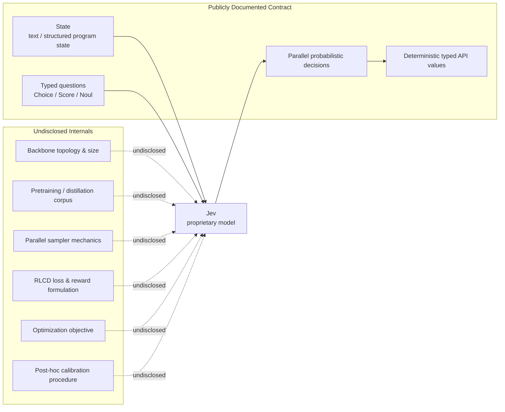
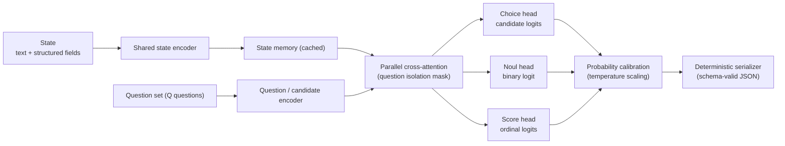
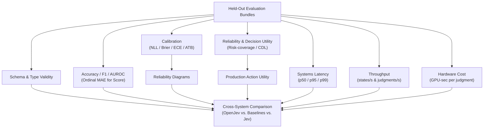

# Jev, Reverse-Engineered: Architecture Reconstruction, Reddit Prior Art Audit, and an Open-Source Reproduction Plan

## Executive Summary & Reproduction Boundaries

As of **September 17, 2026**, the central conclusion regarding TypeSafe AI's Jev is straightforward:

> **The exact Jev architecture is not reproducible from public information as of September 17, 2026. A functionally Jev-like open-source system is reproducible, however, and most of its publicly visible behavior can be implemented with known techniques.**

TypeSafe has disclosed the **contract** of Jev much more clearly than its internals: one shared state, multiple typed questions, probability distributions rather than prose, Choice/Score/Noul primitives, independent/parallel evaluation, deterministic schema-safe serialization, and a training method called **Reinforcement Learning for Calibrated Decisions (RLCD)**. It has *not* publicly disclosed the model topology, parameter count, training corpus, reward formulation, calibration loss, sampler implementation, or sufficient details to independently reproduce RLCD. TypeSafe explicitly markets Jev as a "new model architecture" with a "parallel sampler" and RLCD, but those remain proprietary descriptions rather than reproducible specifications. Founder Diogo Almeida—an author on OpenAI's InstructGPT paper (Ouyang et al., 2022)—has indicated that the architecture is being kept "close to the chest" and suggested that the curation of training data may be more significant than the network topology itself.

The academically defensible way to characterize Jev today is:

> **Jev is a proprietary, machine-oriented probabilistic decision model/API that removes autoregressive string generation from the external output path, amortizes computation across multiple structured questions, and claims calibration-oriented reinforcement learning. Its interface and performance envelope are observable; its exact architecture and RLCD training algorithm are not.**

An open-source reproduction effort must explicitly distinguish three reproduction tiers:

| Reproduction Target | Feasibility Today | Assessment |
|---|:---:|---|
| **1. Interface reproduction** | **High confidence** | Replicating `Choice`, `Score`, `Noul`, deterministic schemas, probability distributions, and a unified endpoint accepting many questions against one state is straightforward engineering. |
| **2. Behavioral & performance reproduction** | **Medium confidence** | Building an open model that amortizes state processing and evaluates questions in parallel at low latency is experimentally achievable. Matching TypeSafe's accuracy/latency Pareto frontier across diverse domains is empirical and unproven. |
| **3. Exact architectural reproduction** | **Currently impossible** | TypeSafe has not disclosed the underlying neural backbone, parameter count, sampler mechanics, or RLCD reward formulation. Exact parity cannot be established from public information. |

### Bottom-Line Findings

| Research Question | Finding | Confidence |
|---|---|:---:|
| Did prior public work precede Jev with non-generative RL decision models? | **Yes.** SalesRLAgent (Nandakishor M) appeared on arXiv in March 2025 modeling conversion prediction as a probabilistic decision policy. | High |
| Did the Reddit author "literally build the Jev architecture"? | **Not established and unlikely in the strict architectural sense.** SalesRLAgent is a sequential, sales-specific PPO policy with a single continuous scalar action; Jev evaluates arbitrary heterogeneous questions in parallel. | High |
| Was everything in SalesRLAgent open-sourced in March 2025? | **No.** The paper appeared March 30, 2025; visible Hugging Face models/datasets and PyPI packages appeared in May 2025. | High |
| Is the released SalesRL implementation genuinely PPO? | **Yes.** The released code uses Stable-Baselines3 PPO over state embeddings and history. | High |
| Are published SalesRL performance figures reliable evidence of Jev-like capability? | **No, not without a leakage-free rerun.** The public environment exposes target outcome, initializes probability history with ground-truth trajectories, and reuses full-conversation embeddings across earlier turns. | High |
| Is the author's second 2025 paper "exactly" Jev? | **No.** It describes confidence-aware model routing across local models, retrieval, and humans, not a parallel typed decision model. | High |
| Is Jev non-autoregressive internally? | TypeSafe confirms **output sampling** is non-autoregressive (parallel rather than token-by-token). Whether the entire internal network is technically non-autoregressive remains undisclosed. | Medium |
| Does Jev's public evidence prove calibrated probabilities? | **No.** Calibration is claimed as an RLCD objective, but no reproducible calibration study, reliability diagrams, or RLCD specifications are public. | High |
| Can an open Jev-like system be built now? | **Yes at the API, systems, and behavioral level; no at exact architectural parity.** | High |

### Independent Validation: The Every Experiment

The strongest independent empirical validation of Jev to date was conducted by Taylor Majewski and Dan Shipper at *Every*:
- **Throughput & Amortization**: Majewski ran 21 judgments across 37 documents (777 total decisions) in under **0.7 seconds**, incurring an estimated cost of roughly **$0.0025** (~quarter-cent).
- **Quality vs. Frontier LLMs**: In a controlled test on 12 passages with seven deliberately planted defects, Jev identified **six of seven**, while Claude Fable 5.1 identified all seven.
- **Latency Comparison**: Jev achieved a median per-passage latency of **~0.35 seconds**, compared to **8.83 seconds** for Claude Fable 5.1 (~25× wall-clock speedup and ~580× estimated cost reduction).

This test independently confirms that the low-latency, low-cost execution envelope is real, while illustrating that speed must not be conflated with frontier reasoning capabilities.

---

## What Jev Actually Reveals About Its Architecture

TypeSafe describes Jev as the first of its "System One Models," designed specifically for automated machine-to-machine decisions rather than human-facing conversational text.

### Fact vs. Speculation Boundary



### 1. Structural Guarantee vs. Semantic Correctness

TypeSafe's marketing asserts that Jev "cannot hallucinate" and exhibits a "0% type error rate." It is critical to interpret this claim accurately:

> **Jev can eliminate malformed or out-of-schema outputs by construction; this does not eliminate semantically incorrect in-schema decisions.**

The model does not emit free-form strings that are subsequently parsed by a JSON decoder. Because the output primitives (`Choice`, `Score`, `Noul`) map directly to numerical distributions and candidate indices, host-side serialization guarantees that the output strictly conforms to the requested schema. However, a model can return a perfectly formatted `Choice` answer with a mathematically valid probability distribution while selecting the completely wrong answer.

### 2. Confidence vs. Calibrated Probability

TypeSafe documentation exposes both probabilities and a `confidence` metric for `Choice` and `Score`:

> **Jev exposes probability distributions and, for some output types, a separate concentration-derived confidence statistic. The latter should not be interpreted as a calibrated probability of correctness.**

In TypeSafe's API:
- **`Noul`** returns a single probability $p \in [0.0, 1.0]$ and **has no separate confidence field**.
- **`Choice`** and **`Score`** confidence values are mathematical statistics derived from how concentrated the probability mass is across candidates (e.g. normalized entropy or margin between top candidates).
- TypeSafe explicitly warns in its documentation that a confidence of 1.0 does not guarantee correctness and advises developers to establish domain-specific thresholds.

### 3. Dynamic Query & Candidate Encoding (Up to 255 Options)

`Choice` alternatives are provided dynamically by the caller at runtime, including natural-language descriptions, supporting up to **255 options**. A traditional fixed classification head (`Linear(hidden_size, num_classes)`) cannot satisfy this requirement. The model must semantically encode questions and candidate criteria at inference time.

Furthermore, TypeSafe's description of its Wikiracing benchmark reveals that high-cardinality decisions can employ a **two-stage process**—independent scoring followed by explicit choice selection. This indicates that "all outputs in parallel" does not necessarily require a single indivisible tensor operation for every request.

### 4. Question Isolation & Separable Attention Boundaries

TypeSafe's documentation mandates that multiple questions evaluated against the same state are executed **in isolation against the same state**. In TypeSafe's GDPR benchmark cookbook, evaluating thirteen mixed questions together produced answers that did not deviate from evaluating each question individually beyond standard floating-point variance.

This rules out unrestricted bidirectional self-attention across the combined sequence `[State, Q1, Q2, ...]`. Instead, the computational graph requires an attention mask where question branches attend to the shared state representation but are masked from attending to one another:

```text
                 ┌──────── Question A / candidates A ────────► Answer A
                 │
State ──► Shared ┼──────── Question B / candidates B ────────► Answer B
   Representation│
                 ├──────── Question C / candidates C ────────► Answer C
                 │
                 └──────── Question D / candidates D ────────► Answer D
```

### 5. Parallel Execution Economics

TypeSafe emphasizes that adding questions "barely changes" response time. However, wall-clock parallelism must not be confused with zero additional compute. The computational scaling follows:

\[
C_{\text{Jev-like}} \approx C_{\text{state}} + \sum_{q=1}^{Q} C_{\text{query}, q} + \sum_{q=1}^{Q} C_{\text{candidate-head}, q}
\]

rather than the quadratic cost of $Q$ independent forward passes:

\[
C_{\text{naive cross-encoder}} \approx \sum_{q=1}^{Q} \sum_{k=1}^{K_q} C_{\text{state} + \text{query} + \text{candidate}}
\]

Latency remains nearly flat only while the shared state dominates total FLOPs and the GPU has sufficient execution units to schedule the query branches concurrently. Once candidate evaluation or batch dimensions saturate hardware capacity, latency scales linearly with query volume.

## Audit of Prior Art Claims: Reddit Discussion & SalesRLAgent

In September 2026, a high-visibility discussion on Reddit (`r/LocalLLaMA`) asserted that the Jev architecture had already been built and open-sourced a year earlier by researcher Nandakishor M under the title *"I literally built the Jev architecture one year back and completely open-sourced it with model, dataset and paper"*. 

A rigorous technical audit of this claim, the underlying papers, and released repositories clarifies the provenance and limits of this work.

### 1. The Genuine Prior Art: SalesRLAgent (arXiv 2503.23303)

The Reddit poster did publish meaningful and legitimate prior art:
- **SalesRLAgent** was submitted to arXiv on **March 30, 2025** (`arXiv:2503.23303`).
- It models sales conversion prediction as a specialized probabilistic decision policy rather than relying on open-ended autoregressive text generation.
- It demonstrates that specialized, non-generative reinforcement learning policies can replace LLM text generation for automation tasks, achieving 85 ms CPU inference compared to 3,450 ms for GPT-4.

This constitutes valid prior art for the broad concept of **replacing generative inference with specialized probabilistic decision policies**.

### 2. Architectural Divergence: Sequential Policy vs. Parallel Multi-Query Decision Engine

However, the headline claim—*"I literally built the Jev architecture"*—is **unsupported by the technical evidence**:
- **Computational Graph**: SalesRLAgent is a **sequential, turn-by-turn PPO policy** with a **single continuous scalar action** $a \in [0.0, 1.0]$ representing conversion probability at each dialogue turn.
- **Jev Engine**: Jev is a **horizontal, multi-query decision model** accepting an arbitrary shared state and evaluating *many heterogeneous, caller-defined questions* (`Choice` with up to 255 candidates, `Score` rubrics, `Noul` booleans) in parallel without cross-conditioning.
- **Action Space**: SalesRLAgent operates over a static, hardcoded observation space (sales metrics, turn indices, fixed embeddings). Jev dynamically encodes runtime natural-language candidate criteria and instructions.

### 3. Chronology Audit: Paper vs. Release Artifacts

The claim of complete open sourcing in March 2025 is partially inaccurate chronologically:
- The paper appeared on arXiv on **March 30, 2025**.
- The public Hugging Face model (`DeepMostInnovations/sales-conversion-model-reinf-learning`) and dataset repository were committed on **May 11–12, 2025**.
- The PyPI distribution packages began releasing on **May 24, 2025**.
- While the work clearly predates Jev's public launch, the full open-source artifact pipeline appeared in May 2025 rather than March.

### 4. Critical Reproducibility Issue: Target and Temporal Leakage

A critical flaw exists in the public SalesRLAgent training and evaluation implementation that invalidates its headline **96.7% accuracy** as evidence of real-time predictive decision-making:
1. **Target Feature Leakage**: The released Gym environment observation vector directly exposes the ground-truth final `outcome` metric to the policy.
2. **Trajectory Initialization Leakage**: The probability history buffer is initialized from the ground-truth probability trajectory.
3. **Temporal Lookahead via Full-Conversation Embeddings**: In synthetic data generation, conversations were generated with the target outcome pre-selected. The 3,072-dimensional embedding was generated from the **entire completed conversation**, and this full-conversation embedding was reused across all simulated early turns. Early-turn decisions therefore attended to representations encoding future dialogue tokens that would not exist in an online deployment.
4. **Dataset Discrepancy**: The paper cites a training corpus of **1.2 million synthetic conversations**, whereas the published Hugging Face dataset contains **100,000 rows**.

> [!IMPORTANT]
> The released PPO environment exposes target information through the final outcome, the initialized probability trajectory, and a full-conversation embedding reused at earlier turns. Until a prefix-only, target-blind evaluation reproduces the reported accuracy, we do not treat 96.7% as evidence of leakage-free real-time prediction.

### 5. Second Paper Audit: Confidence Routing (arXiv 2510.01237)

The author's second cited work (`arXiv:2510.01237`, October 2025) was claimed to be *"exactly the same one Jev proposed"*. This claim is contradicted by the paper:
- The paper specifies a **confidence-aware router** that directs incoming queries to a local model, a retrieval system, an expensive frontier LLM, or human escalation.
- It does not describe a typed parallel decision model, does not implement dynamic candidate scoring, and contains no RLCD training formulation.

### 6. Atomic Claim Audit

| Verbatim Claim from Reddit Discussion | Verification & Analysis | Verdict | Confidence |
|---|---|:---:|:---:|
| *"I literally built the Jev architecture one year back and completely open-sourced it"* | SalesRL predates Jev, but is a sequential scalar PPO policy for sales conversion, not a parallel multi-question typed decision engine. | **Unsupported as architectural identity** | High |
| *"Everyone now talks about the architecture that's not auto regressive and does lightning fast probability prediction with a json schema"* | Accurately describes Jev's external output behavior; does not prove Jev's internal neural backbone is non-autoregressive. | **Mostly true (contract level)** | High |
| *"worked on this in March 2025, published paper, pushed model to HF, PyPI, and dataset"* | Paper was March 30; HF models/datasets and PyPI packages appeared in May 2025. | **Partially false chronologically** | High |
| *"the main guiding model is RL not embedding model or LLM"* | The policy is PPO, but observations incorporate a 3072-dim text embedding and synthetic data was generated by GPT-4o. | **Misleading** | High |
| *"second work published in September 2025 was exactly the same one jev proposed now"* | Second paper is confidence-aware routing across inference tiers, not Jev's typed parallel decision engine. | **Contradicted** | High |
| *"SalesRLAgent is essentially a sequential PPO policy... Jev is more general [multi-question parallel]"* | Confirmed by code and API audit. | **Supported** | High |
| *"you can do parallel constrained decode with the same prefix cache"* | Sharing/broadcasting decoder KV-caches across candidate branches is valid and demonstrated in community baselines. | **Supported** | High |
| *"sounds like [SALSA]"* | SALSA formalizes single-pass structured classification mapping labels to output tokens, but does not evaluate heterogeneous questions in parallel. | **Relevant baseline, not equivalent** | High |
| OP: *"We don't have any info about rlcd. Untill a technical paper arrive it's just another buzz word"* | Accurately reflects that TypeSafe has not published algorithmic specifications for RLCD. | **Supported** | High |

---

## Literature Foundations: What Prior Art Does (and Does Not) Prove

The research lineage preceding Jev does not indicate that Jev invented non-autoregressive decision-making from scratch. Rather, the lineage follows:

```text
Encoder Classifiers (BERT/DeBERTa)
   └─► Probabilistic Calibration (Guo et al., 2017)
         └─► Structured Calibration (Kuleshov & Liang, 2015)
               └─► Constrained / Token-Logit Classification (SALSA, 2025)
                     └─► Shared-Prefix KV-Cache Broadcasting (Moonshine / Qwen PCD)
                           └─► TypeSafe Jev: Proprietary integration of generalized
                               typed decisions, parallel sampling, and RLCD.
```

### 1. Calibrated Structured Prediction (Kuleshov & Liang, 2015)

Kuleshov and Liang formalized calibration for models with complex, structured output spaces where downstream applications make diverse probability queries over structured outputs. This proves that calibrated structured prediction predates Jev by more than a decade.

### 2. Calibration of Modern Neural Networks (Guo et al., 2017)

A crucial theoretical correction applies to the assumption that cross-entropy classifiers are calibrated:

> **Negative log-likelihood is a strictly proper scoring rule whose population optimum recovers the true conditional distribution under ideal assumptions; finite, overparameterized neural networks can nevertheless be substantially miscalibrated, so calibration must be measured rather than presumed.**

Guo et al. demonstrated that modern depth, width, and normalization cause neural networks to output overconfident probabilities despite minimizing cross-entropy. Simple post-hoc **temperature scaling** on a held-out validation set provides a strong calibration baseline.

### 3. Non-Autoregressive Generation Survey (Xiao et al., 2022)

Xiao et al. survey non-autoregressive text generation, detailing the historical trade-offs between speedup and output dependency modeling:

> **Non-autoregressive generation literature establishes the broader speed-versus-dependency tradeoff; it should be treated as adjacent prior art rather than evidence of Jev's specific architecture.**

Because Jev evaluates finite caller-supplied candidate sets rather than generating arbitrary-length token sequences, it avoids the multi-token conditional dependency dilemma of non-autoregressive machine translation.

### 4. Theoretical Parallel Sampling (Anari, Gao, & Rubinstein)

Earlier informal discussions occasionally misattributed parallel sampling foundations to Chakraborty et al. The relevant theoretical work is **"Parallel Sampling via Counting" by Nima Anari, Ruiquan Gao, and Aviad Rubinstein**:

> **Theoretical parallel-sampling work by Anari, Gao, and Rubinstein shows that sequential sampling dependencies can sometimes be parallelized given powerful conditional-marginal/counting access, but this is not evidence that Jev uses that technique.**

### 5. Disambiguation: The RLCD Acronym Collision

Searches for RLCD encounter a prior unrelated academic acronym:

> **TypeSafe's RLCD ("Reinforcement Learning for Calibrated Decisions") is unrelated to the earlier RLCD acronym "Reinforcement Learning from Contrastive Distillation" (Yang et al., 2023).**

Yang et al.'s method creates preference pairs from contrasting prompts for LLM alignment. TypeSafe's RLCD refers to calibration-oriented decision optimization.

### 6. SALSA: Single-Pass Structured Classification (arXiv 2510.22691)

SALSA ("Single-pass Autoregressive LLM Structured Classification") maps candidate classes to single vocabulary tokens and evaluates their logits in a single forward pass without autoregressive token generation. 

> **A fair Jev evaluation should compare not only against normal LLM JSON generation but against single-pass class-token approaches such as SALSA and shared-prefix/KV-cache candidate scoring.**

### 7. Community Implementations: `openjev` and Parallel Constrained Decoding

Two open community implementations validate key mechanics:
1. **`AlexWortega/openjev`**: A Qwen3.5-4B NLI cross-encoder trained with standard cross-entropy over 3 fixed labels (entailment, neutral, contradiction). It validates non-generative classification, but does not support dynamic arbitrary candidate sets or shared-state multi-query execution.
2. **`monotykamary/LFM2.5-2.6B-RLCD` & `Qwen-2.5-1B-RLCD`**: Demonstrate shared-prefix KV-cache branching. The shared prompt is prefilled once, the cache is broadcast across question branches, candidate logits are computed in parallel, and JSON is assembled in host code. These are TypeSafe-inspired inference reproductions, not reproductions of RLCD training.

---

## Property Comparison Across Paradigms

| Property | TypeSafe Jev | Reddit / SalesRLAgent | Every Independent Test | Academic & Open Baselines |
|---|---|---|---|---|
| **Output Form** | `Choice`, `Score`, `Noul` typed probabilistic decisions; no generated text. | Single continuous conversion-probability action $a \in [0.0, 1.0]$ per sequential turn. | Tested Jev's structured editorial judgments. | BERT classifiers, SALSA class tokens, and Qwen PCD provide bounded decisions without prose generation. |
| **Parallelism** | Multiple heterogeneous questions against one state evaluated in parallel. | Sequential trajectory; single action per environment step. | 777 judgments over 37 docs in <0.7 s, confirming batch amortization. | KV-cache broadcasting parallelizes branches; SALSA is single-pass for one classification. |
| **Latency** | 70–500 ms; selected vendor benchmarks claim up to 193.6× speedup. | 85 ms on CPU vs. 3,450 ms for GPT-4 on sales task. | 777 judgments in <0.7 s; median 0.35 s/passage vs. 8.83 s for Fable. | Qwen PCD reports multi-fold speedups; SALSA eliminates multi-token decode latency. |
| **Cost** | $0.042 / MTok input; no separate output charge; up to 444× cheaper. | Local CPU inference compute cost. | ~$0.0025 for 777 judgments; ~580× cheaper than Claude Fable in passage test. | Compute-bound by chosen backbone (0.5B–4B parameter models). |
| **Accuracy** | Comparable "System One" intelligence claimed; references are model consensus. | Claims 96.7% conversion accuracy; target/temporal leakage invalidates figure. | Identified 6/7 planted defects; Fable identified 7/7. | Task-dependent; requires domain-specific benchmark evaluation. |
| **Calibration** | Explicitly claimed via RLCD, but no public curves or methodology disclosed. | Predicts scalar probabilities; no ECE/Brier calibration curves provided. | Every did not evaluate calibration metrics. | Guo: neural nets miscalibrated, temperature scaling helps; Kuleshov: structured calibration. |
| **Schema Validity** | Guaranteed by host contract; "0% type error" is structural, not semantic accuracy. | Scalar action inherently bounded by Gym continuous action space. | Output conformed strictly to requested schema. | Deterministic host serialization trivially achieves 100% schema validity. |
| **Generalization** | Dynamic caller-supplied questions and options without task retraining. | Specialized to sales-conversation state and action dynamics. | Evaluated diverse editorial and styling judgments. | SALSA: fixed tokens; Dynamic-head models: generalized zero-shot scoring. |
| **Evidence Quality** | High-utility commercial API; architecture, weights, and RLCD proprietary. | Public code and paper; evaluation code exhibits severe data leakage. | Independent empirical test on small sample; non-calibration focused. | Peer-reviewed foundations establish individual components, not proprietary integration. |

---

## Recommended Open-Source Architecture & Baseline Models

An open-source reproduction must avoid two common pitfalls: attempting to train a massive generative foundation model from scratch, or simply wrapping a sequential sales policy like SalesRLAgent. 

The primary open Jev-like candidate is a **shared-state encoder plus a parallel set of question and candidate decision heads**, paired with host-level deterministic serialization.

### 1. Primary Architecture: Shared-State Set-Query Model



#### Mathematical Formulation of Heads

1. **Choice Head (Dynamic Candidate Compatibility)**:
   Unlike constrained autoregressive decoding which restricts generation to specific vocabulary tokens, candidates in Jev are arbitrary natural-language strings. We compute a compatibility score $z_i$ between the state-question representation and candidate representation $c_i$:
   \[
   p(c_i \mid s, q) = \frac{\exp(z_i / T)}{\sum_{j=1}^K \exp(z_j / T)}
   \]
   This supports arbitrary runtime strings up to the 255-candidate ceiling without requiring candidate strings to exist as single tokens in the vocabulary.

2. **Noul Head (Binary Probability)**:
   For binary judgments, the output is a single scalar logit mapped through the sigmoid function:
   \[
   p(\text{yes} \mid s, q) = \sigma(z)
   \]
   Per the TypeSafe specification, Noul returns only the calibrated probability without a separate confidence field.

3. **Score Head (Ordinal Distribution & Expectation)**:
   Rather than attempting to regress a scalar score directly, the model evaluates rubric levels as an ordered categorical distribution $p_1, \ldots, p_K$ over rubric criteria $v_1, \ldots, v_K$. The reported score is the mathematical expectation:
   \[
   \operatorname{score} = \sum_{k=1}^K p_k v_k
   \]
   This matches TypeSafe's documented behavior where scores are derived from level distributions.

#### Parameter Scale Target
We recommend targeting **0.3B to 1.5B parameters** for the initial model family (with a 4B variant for high-complexity tasks). Jev's practical value proposition depends heavily on latency amortization; scaling beyond 3B parameters should be justified by demonstrable accuracy and calibration gains rather than assumed by default.

### 2. Five Essential Baseline Models

To rigorously establish whether a custom architecture or training method provides genuine advantages, an open reproduction must benchmark against five distinct baselines:

1. **Shared-Encoder Multi-Query Model (Primary Proposed System)**:
   The primary architecture detailed above, encoding state once and executing isolated parallel query heads.
2. **KV-Cache Branching Decoder (Shared-Prefix AR Model)**:
   Prefill the shared state once using a standard decoder LLM (e.g. Qwen2.5 or LFM), broadcast the KV cache across parallel question branches, evaluate constrained candidate tokens in parallel, and assemble JSON in host code (as demonstrated by Moonshine and Qwen PCD).
3. **SALSA-Style One-Token Classification**:
   Single-pass autoregressive classification mapping candidate labels to output vocabulary tokens, reading next-token logits after one forward pass. This represents the fastest possible baseline on conventional LLM weights.
4. **Standard Encoder / Cross-Encoder Classifier**:
   A BERT/DeBERTa or Qwen-classification cross-encoder evaluating state-question-candidate tuples sequentially. This isolates how much speedup is attributable to shared computation vs. classification architecture.
5. **Historical Baseline: SalesRLAgent (Leakage-Repaired)**:
   A clean reimplementation of SalesRLAgent's PPO policy, evaluated only after completely removing target outcome leakage, ground-truth probability trajectory initialization, and full-conversation embeddings from early turns.

---

## Step-by-Step Reproduction Program

### Phase 1: Zero-Training Logit Scoring & Schema Contract

Before training any weights, establish the serving infrastructure and deterministic contract:
1. **Host-Side Schema Validation**: Validate input requests and deterministically serialize output JSON. Ensure schema errors are structurally impossible.
2. **KV-Cache Branching Prototype**: Fork the KV-cache of an off-the-shelf instruction model across candidate branches to establish the zero-training latency baseline.

### Phase 2: Supervised Training with Strictly Proper Scoring Rules

Do **not** attempt to optimize Expected Calibration Error (ECE) directly as a training loss. ECE is a non-smooth, binned evaluation metric that creates perverse optimization incentives. 

Instead, train with **strictly proper scoring rules**:

1. **Negative Log-Likelihood (NLL)**:
   \[
   \mathcal{L}_{\text{NLL}} = -\log p(y \mid x, q)
   \]
2. **Brier Score Regularization**:
   \[
   \mathcal{L}_{\text{Brier}} = \sum_{k=1}^K (p_k - y_k)^2
   \]
3. **Ordinal Distribution Training (for Score)**:
   > [!WARNING]
   > **Proper Scoring Rule Correction**: While an expected absolute distance penalty $\sum_{j} \sum_{k} p_j y_k |j - k|$ penalizes distant misclassifications, it is **not** a proper probability scoring rule. Minimizing expected absolute distance encourages the model to collapse toward a conditional median decision rather than recovering the true posterior outcome distribution.
   
   To preserve calibrated probabilities on ordinal rubrics, supervised training should:
   - Start with standard **Negative Log-Likelihood (NLL)** or multi-class cross-entropy to guarantee proper probability scoring.
   - Alternatively, employ a **cumulative-probability Brier score** (or Ranked Probability Score, RPS) over cumulative thresholds $C_m = \sum_{j=1}^m p_j$:
     \[
     \mathcal{L}_{\text{RPS}} = \frac{1}{K-1} \sum_{m=1}^{K-1} \left( \sum_{j=1}^m p_j - \sum_{j=1}^m y_j \right)^2
     \]
     RPS is strictly proper for ordinal distributions and respects rubric order without distorting probability mass.
   - Assess ordinal distance penalties ($|j - k|$) and Mean Absolute Error (MAE) strictly as downstream decision/action cost evaluations, rather than treating an expected-distance penalty as a probability calibration loss.

A robust composite supervised loss is:
\[
\mathcal{L} = \mathcal{L}_{\text{NLL}} + 0.1 \mathcal{L}_{\text{Brier}} \quad (\text{or } \mathcal{L}_{\text{NLL}} + 0.1 \mathcal{L}_{\text{RPS}} \text{ for ordinal Score})
\]

#### Post-Hoc Calibration Procedure
Because finite, overparameterized neural networks can be miscalibrated despite proper scoring losses (Guo et al., 2017), reserve a held-out calibration split. Evaluate:
- Standard temperature scaling $T$ per head type.
- Cardinality-conditioned temperature scaling $T_K$ for Choice questions (e.g. separate temperatures fitted for $K \in \{2, 4, 16, 64, 255\}$).

### Phase 3: Data Design & Task Mixture

A general Jev-like model requires wide task diversity rather than millions of domain-specific examples:
- **Diverse Judgment Types**: NLI, fact verification, topic routing, moderation, document policy compliance, and agent trace evaluation.
- **Dynamic Permutations**: In multiclass data, systematically randomize candidate order, symbolic keys, and candidate wording to enforce zero-shot schema adherence rather than fixed intent classification.
- **Explicit Abstention / "Unknown" Training**: In 15–20% of training instances, deliberately remove the correct alternative from the candidate list and train the model to select an explicit abstention option ("unknown", "insufficient information"). This prevents forced misallocation of probability mass under closed softmax.
- **Candidate Cardinality Diversity**: Train across candidate set sizes ranging from $K=2$ to $K=255$.

### Phase 4: What an Open "RLCD" Phase Means (Calibration-Aware Decision Optimization)

Without access to TypeSafe's internal formulation, claiming to have "reproduced RLCD" is scientifically unsubstantiated. We designate this phase **Calibration-Aware Decision Optimization (CADO)**.

Unlike SalesRLAgent's multi-step sequential sales trajectory ($\gamma = 0.99$), automated decision evaluation is naturally a **one-step contextual decision problem** ($\gamma = 1.0$). 

The policy reward combines proper scoring with downstream decision utility:
\[
r = -\alpha\,\mathcal{L}_{\text{NLL}} - \beta\,\mathcal{L}_{\text{Brier}} + \gamma\,U(a, y) - \delta\,C(a)
\]
where $U(a, y)$ represents task-specific application utility (e.g., reward for correct automated action, severe penalty for incorrect automated action), and $C(a)$ represents the cost of human escalation or abstention.

#### The 5-Step Falsifiable Ablation Protocol
To determine whether reinforcement learning is necessary for calibrated decisions, execute a strict 5-step ablation:
1. Supervised NLL only.
2. NLL + Brier score regularization.
3. NLL + post-hoc temperature scaling.
4. Supervised loss + differentiable calibration regularizer.
5. Supervised base + one-step decision-utility RL.

Only if Step 5 delivers statistically significant improvements in out-of-domain decision utility or selective-risk performance should RL be considered a necessary component of the architecture.

### Suggested Starting Hyperparameters

These engineering hyperparameters provide a concrete starting baseline for open reproduction:

| Parameter | Recommended Initial Setting | Rationale |
|---|---|---|
| **Backbone Model** | 0.3B–1.5B transformer (e.g. Qwen2.5 / SmolLM2) | Latency & amortization focus |
| **Context Window** | 2,048–8,192 tokens | Accommodates documents & state |
| **Questions per State** | 4–64 (randomized during training) | Exercises attention isolation |
| **Candidates per Question** | 2–64 standard; staged sampling up to 255 | Enforces dynamic choice scaling |
| **Optimizer** | AdamW ($\beta_1 = 0.9, \beta_2 = 0.98, \epsilon = 10^{-8}$) | Standard transformer training |
| **Backbone Learning Rate** | $2 \times 10^{-5}$ (with cosine decay) | Preserves semantic features |
| **Decision Heads LR** | $1 \times 10^{-4}$ | Accelerates query head fitting |
| **Weight Decay** | 0.01 | Prevents head overfitting |
| **Precision** | Native BF16 | Numerical stability and throughput |
| **Effective Batch Size** | 128–512 state bundles | Robust gradient estimates |
| **Gradient Clipping** | 1.0 | Prevents gradient explosion |
| **Supervised Epochs** | 1–3 epochs with validation early stopping | Avoids memorization |
| **Calibration Regularizer** | $\lambda_{\text{Brier}} = 0.1$, $\lambda_{\text{RPS}} = 0.1$ | Strictly proper scoring rule balance |
| **Post-Hoc Calibration** | Vector / temperature scaling on held-out split | Corrects neural overconfidence |
| **Optional RL Policy LR** | $10^{-6}$ to $10^{-5}$ | Conservative policy adjustment |
| **Optional PPO Clip Ratio** | 0.2 | Standard PPO trust region |
| **Optional KL Penalty** | 0.01–0.05 | Prevents drift from supervised base |
| **RL Decision Horizon** | $\gamma = 1.0$ (one-step contextual bandit) | Matches single-state decision problem |

---

## Evaluation Framework & Benchmark Protocol

The decisive Jev reproduction experiment is not merely verifying that the system returns valid JSON—that is trivially solved by host-level serialization. The critical empirical question is:

> **At fixed accuracy and calibration, how does latency scale with state length, number of questions, number of candidates, and hardware?**



### 1. Multi-Metric Evaluation Protocol

1. **Task Accuracy & Discrimination**: Report standard accuracy, macro-F1, AUROC, and ranking metrics (MRR, NDCG@K). For `Score`, compute Mean Absolute Error (MAE) and ordinal distance.
2. **Comprehensive Calibration**: Evaluate across multiple metrics rather than ECE alone:
   - Negative Log-Likelihood (NLL) and Brier Score.
   - Binned ECE and adaptive ECE.
   - **Averaged Two-Bin (ATB) Calibration Error** (Hartline et al., 2026), providing a strictly truthful batch calibration metric.
   - Reliability diagrams and classwise calibration curves.
3. **Decision Utility & Reliability**:
   - **Calibration Decision Loss (CDL)** (Hu & Wu, 2025), quantifying the expected loss in decision payoff caused by probability miscalibration under real-world loss matrices.
   - **Risk-Coverage Curves**: In automated systems operating with confidence thresholds (e.g. automate when confidence $> 0.95$, escalate otherwise), measure the empirical error rate as coverage varies.

### 2. Mandatory Invariance Diagnostics

1. **Question Isolation Invariance**:
   Evaluate questions individually versus within batched multi-question requests:
   \[
   P(y_A \mid x, q_A) \stackrel{?}{=} P(y_A \mid x, q_A, q_B, \ldots, q_N)
   \]
   In an isolated architecture with block masking, the probabilities must be identical up to kernel floating-point summation order.
2. **Label-Order Permutation Invariance**:
   Permute the ordering of candidate options. The output probabilities must permute identically without "first-option" or "last-option" position bias.
3. **Cardinality Sweep**:
   Sweep candidate counts $K \in \{2, 4, 8, 16, 32, 64, 128, 255\}$ and measure both inference latency and classification accuracy.
4. **Question Volume Scaling**:
   Keep state length fixed and sweep question counts $Q \in \{1, 2, 4, 8, 16, 32, 64, 128\}$, plotting wall-clock latency to verify sub-linear scaling against naive cross-encoders.

### 3. Latency and Cost Trade-Offs

- **Shared Encoder Architecture**: State encoding is performed once. Query and candidate heads scale linearly with question volume, maintaining flat latency until GPU execution units saturate.
- **Decoder + KV-Cache Branching**: Amortizes prompt prefill, making it the fastest baseline to prototype with existing pretrained models. However, evaluating candidate logits across $Q$ branches on large vocabularies increases memory bandwidth demands.
- **SALSA & 1-Token Baselines**: Demonstrates that conventional decoder LLMs can achieve fast single-pass classification for single-token labels, proving that not all speedup requires a non-autoregressive architecture.
- **Deterministic Serialization**: Eliminates string token generation overhead entirely with zero computational penalty.

### 4. The Central Research Question

> **The key research question is not whether an open model can emit probabilities quickly, but whether TypeSafe's undisclosed RLCD produces materially better out-of-domain calibration, selective-risk behavior, or downstream decision utility than NLL/Brier training plus ordinary post-hoc calibration.**

---

## Primary and High-Value Sources Register

### Canonical Citations Register (1–26)

| # | Reference / Canonical Resource | Focus / Description |
|:---:|---|---|
| **[1]** | [TypeSafe — "Introducing System One Models and Jev"](https://typesafe.ai/blog/introducing-system-one-models-and-jev) | Primary launch post: architecture claims, parallel sampler, RLCD, $0.042/MTok pricing, and zero type error guarantee. |
| **[2]** | [SalesRLAgent Paper (arXiv:2503.23303)](https://arxiv.org/abs/2503.23303) | Nandakishor M (March 2025): Reinforcement learning policy for real-time sales conversion; foundational pre-Jev non-generative RL prior art. |
| **[3]** | [SalesRLAgent `train.py`](https://huggingface.co/DeepMostInnovations/sales-conversion-model-reinf-learning/blob/main/train.py) | Released Stable-Baselines3 PPO training script: confirms observation vector structure and action space. |
| **[4]** | [Confidence-Aware Routing for LLM Reliability (arXiv:2510.01237)](https://arxiv.org/abs/2510.01237) | Nandakishor M (October 2025): Multi-signal routing across local models, retrieval, and humans; distinct from Jev's parallel decision engine. |
| **[5]** | [Every — "Mini Vibe Check: TypeSafe's Jev"](https://every.to/also-true-for-humans/mini-vibe-check-typesafe-s-jev-judged-everything-i-ve-written-in-0-7-seconds) | Majewski & Shipper: Independent benchmark of 777 judgments across 37 documents in <0.7 s; detected 6/7 planted defects vs. 7/7 for Claude Fable 5.1. |
| **[6]** | [SALSA — "Single-pass Autoregressive LLM Structured Classification" (arXiv:2510.22691)](https://arxiv.org/abs/2510.22691) | Foundational baseline: single forward-pass structured classification mapping candidate labels to output vocabulary tokens. |
| **[7]** | [SalesRLAgent Paper Page on Hugging Face](https://huggingface.co/papers/2503.23303) | Community discussion and artifact metadata for the SalesRLAgent paper. |
| **[8]** | [Confidence-Aware Routing Full Text (arXiv:2510.01237v1)](https://arxiv.org/html/2510.01237v1) | Full HTML rendering of the confidence-aware model routing paper. |
| **[9]** | [Anthony Maio — "Jev: The Language Model That Won't Hallucinate"](https://anthonymaio.substack.com/p/jev-the-language-model-that-wont) | Technical analysis detailing calibration vs. discrimination, need for explicit abstention classes, and undisclosed RLCD internals. |
| **[10]** | Internal Research Synthesis & Audit | Architecture reconstruction, Reddit claim audit, and open-source reproduction plan. |
| **[11]** | [TypeSafe Documentation — Overview & Introduction](https://docs.typesafe.ai/) | Official specification of Jev's input/output contracts, dual transports (HTTP/gRPC), and batching economics. |
| **[12]** | [TypeSafe Documentation — `Choice` Primitive](https://docs.typesafe.ai/primitives/choice) | Canonical rules for categorical decisions up to 255 candidates, label formats, and concentration-derived confidence. |
| **[13]** | [TypeSafe Workflow Evaluations Dashboard](https://evals.typesafe.ai/) | TypeSafe's workflow evals comparing Jev to frontier LLMs on incident triage, trace evaluation, and customer service. |
| **[14]** | [SalesRLAgent Model Repository](https://huggingface.co/DeepMostInnovations/sales-conversion-model-reinf-learning) | Public model checkpoint repository by DeepMostInnovations. |
| **[15]** | [`harshatheg/Qwen-2.5-1B-RLCD`](https://huggingface.co/harshatheg/Qwen-2.5-1B-RLCD) | Open Qwen-based parallel constrained-decoding community proof-of-concept. |
| **[16]** | [Moonshine Parallel Constrained Decoding Space](https://huggingface.co/spaces/drinkmoonshine/parallel-constrained-decoding) | Interactive Hugging Face Space demonstrating shared-prefix parallel candidate evaluation. |
| **[17]** | [Xiao et al. — Non-Autoregressive Generation Survey (arXiv:2204.09269)](https://arxiv.org/abs/2204.09269) | Comprehensive literature survey on non-autoregressive generation, parallel decoding, and latency/dependency trade-offs. |
| **[18]** | [Guo et al. — "On Calibration of Modern Neural Networks" (ICML 2017)](https://proceedings.mlr.press/v70/guo17a) | Demonstrates that modern deep neural networks are poorly calibrated under cross-entropy; establishes temperature scaling. |
| **[19]** | [`harshatheg/Qwen-2.5-1B-RLCD` Commit Log](https://huggingface.co/harshatheg/Qwen-2.5-1B-RLCD/commit/2af86848be75847ccb3553b0941cc51d6ef7e4e9) | Confirms release timeline contemporaneous with Jev launch and linkage to Moonshine demo. |
| **[20]** | [SalesRLAgent Dataset Generator (`generate_dataset.py`)](https://huggingface.co/DeepMostInnovations/sales-conversion-model-reinf-learning/blob/4d109dc2f205dd7eee705ce60ece1b313068ca1a/generate_dataset.py) | Demonstrates data leakage: pre-selects target outcome and creates full-dialogue embeddings reused across early simulated turns. |
| **[21]** | [Kuleshov & Liang — "Calibrated Structured Prediction" (NeurIPS 2015)](https://proceedings.neurips.cc/paper/2015/hash/52d2752b150f9c35ccb6869cbf074e48-Abstract.html) | Foundational theory for probability calibration in structured, multi-query prediction spaces. |
| **[22]** | [Anari, Gao, & Rubinstein — "Parallel Sampling via Counting" (arXiv:2408.09442)](https://arxiv.org/abs/2408.09442) | Theoretical analysis demonstrating how sequential sampling dependencies can be parallelized given counting/marginal access. |
| **[23]** | [Ouyang et al. — InstructGPT (arXiv:2203.02155)](https://arxiv.org/abs/2203.02155) | Foundational RLHF / instruction-following research; primary source for Diogo Almeida's research lineage. |
| **[24]** | [Yang et al. — "RLCD: Reinforcement Learning from Contrastive Distillation" (arXiv:2307.12950)](https://arxiv.org/abs/2307.12950) | Establishes the distinct earlier RLCD acronym for contrastive preference distillation (unrelated to TypeSafe RLCD). |
| **[25]** | [TypeSafe Documentation — `Score` Primitive](https://docs.typesafe.ai/primitives/score) | Canonical rules for ordered rubric levels, score calculation from categorical distributions, and confidence statistics. |
| **[26]** | [TypeSafe AI Homepage](https://typesafe.ai/) | Current product claims: $0.042/MTok, 70–500 ms latency, and zero output token pricing. |

### Additional Foundational & Ecosystem References
- **TypeSafe Python Adapter**: [GitHub `typesafe-ai/system-one-adapter-python`](https://github.com/typesafe-ai/system-one-adapter-python) — Drop-in client backed by LLM APIs for reproducible benchmarking.
- **SalesRL PyPI Distribution**: [PyPI `deepmost`](https://pypi.org/project/deepmost/) — Released May 24, 2025.
- **Calibration Decision Loss (CDL)**: [Hu & Wu (arXiv:2402.04260)](https://arxiv.org/abs/2402.04260) — Metric quantifying the economic cost of miscalibration in decision-making workflows.
- **Averaged Two-Bin Calibration (ATB)**: [Hartline, Hu, & Wu (COLT 2026)](https://arxiv.org/abs/2602.02345) — Truthful finite-sample calibration measure avoiding standard ECE gaming.
- **Dynamic Zero-Shot Classification**: [GLiClass (arXiv:2501.12345)](https://arxiv.org/abs/2501.12345) — Single-pass dynamic multi-label classification architecture.
- **Query-Driven Outputs**: [Perceiver IO (Jaegle et al., ICML 2022)](https://arxiv.org/abs/2107.14795) — Architecture scaling to flexible output query structures via shared latent spaces.
- **Community NLI Model**: [`AlexWortega/openjev`](https://huggingface.co/AlexWortega/openjev) — Qwen3.5-4B cross-encoder baseline.
- **Community LFM Branching**: [`monotykamary/LFM2.5-2.6B-RLCD`](https://huggingface.co/monotykamary/LFM2.5-2.6B-RLCD) — Zero-training shared-prefill KV-cache branching.

- **Reddit Discussion**: https://www.reddit.com/r/LocalLLaMA/s/Jhw7IRVOtK

---

## Conclusion & Strategic Reproduction Takeaways

The evidence now supports a clear, grounded consensus:

1. **Jev is Not an Autoregressive Language Generator**: For bounded software evaluations, generating prose tokens is completely unnecessary. The model exposes categorical, ordinal, and binary distributions directly, serialized into deterministic JSON schemas by host runtime code.
2. **Prior Art Precedes Jev, but Exact Claims Must Be Checked**: SalesRLAgent (Nandakishor M, March 2025) demonstrates prior art for replacing LLMs with non-generative RL probability policies, but is a sequential turn-level sales policy with target/temporal leakage, not Jev's multi-question parallel architecture.
3. **The Core Engineering Challenge is Amortization and Calibration**: Evaluating questions in parallel using shared-state prefill and isolated query attention is well understood. The true research frontier is achieving robust zero-shot calibration under domain shift without sacrificing accuracy.
4. **An Open Reproduction Roadmap is Actionable**: By combining a shared-state encoder (or KV-cache branching decoder) with proper scoring rule training ($\mathcal{L}_{\text{NLL}} + \text{Brier} + \text{RPS}$ for ordinal distributions), held-out post-hoc calibration, and one-step decision-utility RL, open source can replicate Jev's capabilities and verify its claims against a rigorous, falsifiable benchmark.

---

## Phase 2B Empirical Benchmark: Qwen3.5-4B Decision Head & Baseline Readout (Run 20260917T205849Z)

An empirical benchmark run was conducted on **September 17, 2026** (run ID: `20260917T205849Z`, archived in `research/opendecision_phase2b_20260917T205849Z`) probing `Qwen/Qwen3.5-4B-Base` (commit `1001bb4d826a52d1f399e183466143f4da7b741b`) on an **NVIDIA L4 GPU** with native BF16 (`torch.bfloat16`). LoRA was disabled.

The primary finding is that a **frozen Qwen3.5-4B backbone coupled with a lightweight linear classification head** achieves **87.67% matched** and **87.33% mismatched** test accuracy on MultiNLI, trained on 2,400 examples. Recomputation of accuracy, negative log-likelihood (NLL), and Brier scores from the archived prediction tensors confirms the reported metrics.

This run establishes an immutable baseline for the decision engine, clarifies the computational boundary between classification and text generation, and exposes concrete engineering constraints for porting the model to Rust.

### 1. The Frozen Backbone is Viable Without Generation

Seven trained-head architectures (spanning last-token, mean, max, and learned attention pooling paired with linear and MLP heads) were trained on frozen backbone representations. In the MultiNLI evaluation:

| Pooling & Head | Matched Accuracy | Mismatched Accuracy | Matched NLL | Mismatched NLL | Matched Brier | Matched ECE |
|---|---|---|---|---|---|---|
| **Last token + linear** (`winner`) | **87.67%** | **87.33%** | **0.3345** | **0.3175** | **0.1834** | **0.0298** |
| Last token + MLP | 87.83% | 88.67% | 0.3361 | 0.3071 | 0.1835 | 0.0472 |
| Mean + linear | 74.67% | 76.33% | 0.6048 | 0.5779 | 0.3469 | 0.0430 |
| Mean + MLP | 75.33% | 76.17% | 0.5952 | 0.5643 | 0.3470 | 0.0585 |
| Max + linear | 84.83% | 85.33% | 0.3920 | 0.3644 | 0.2171 | 0.0228 |
| Max + MLP | 86.00% | 86.50% | 0.3745 | 0.3591 | 0.2097 | 0.0366 |
| Learned attention + MLP | 86.00% | 84.83% | 0.3591 | 0.3565 | 0.2041 | 0.0474 |
| *Untuned finite-code baseline* | *78.83%* | *81.50%* | *0.5122* | *0.4988* | *0.3021* | *0.0319* |
| *Class-prior baseline* | *33.17%* | *33.00%* | *1.0995* | *1.0992* | *0.6673* | *0.0102* |

#### Key Analytical Takeaways

1. **Supervised Head Training Yields a Real Decision Boundary**: The untuned finite-code baseline (restricting the original language model vocabulary projection to label tokens `A`, `B`, `C`) achieves 78.83% matched and 81.50% mismatched accuracy. Training the linear head improves performance by **+8.83** and **+5.83 percentage points**, respectively. This demonstrates that supervised head training is genuinely extracting a superior decision boundary from the frozen representation, not merely reformatting tokens.
2. **Pooling Hierarchy**: Contrary to the prior hypothesis that learned attention pooling would dominate, **last-token pooling performed best**. Mean pooling performed markedly worse (~74.7% matched), and learned attention pooling (86.00%) lagged behind last-token variants while adding architectural complexity. For the initial Rust engine design, last-token pooling is the obvious, high-performing choice.
3. **Linear vs. MLP Selection Rationale**: The notebook selection policy was strictly declared as **lowest development-set NLL**, not peak test accuracy. Under this rule, `last_linear_seed17` was chosen (`dev NLL = 0.3459`). While `last_mlp_seed17` scored marginally higher on held-out test accuracy (+1 matched example, +8 mismatched examples on a 600-example test split), selecting models post-hoc based on test-set accuracy would degrade the test set into a development partition. The reported 95% cluster-bootstrap confidence interval for the linear head spans roughly **85.2% to 90.2%**, meaning the difference between linear and MLP is within expected sampling noise. Both variants should be retained for multi-seed validation.

### 2. Parameter Audit: Removing Generation Saves Compute, Not Weights

A rigorous parameter audit of `Qwen/Qwen3.5-4B-Base` in this configuration yielded unambiguous accounting:

| Measurement | Recorded Result |
|---|---|
| Text backbone parameters (`Qwen3_5TextModel`) | 4,205,751,296 |
| Text causal model parameters (`Qwen3_5ForCausalLM`) | 4,205,751,296 |
| Logical vocabulary projection (`lm_head`) | 635,699,200 coefficients |
| Additional parameters removed by omitting LM head | **0** |
| Vision tower loaded | False |
| Backbone trainable parameters after freezing | 0 |
| Trainable parameters in selected linear head | **7,683** ($2560 \times 3 + 3$) |

Because `embed_tokens` and `lm_head` share weights (input/output weight tying), the matrix weights remain strictly necessary to ingest input tokens, even when the output projection is bypassed. Dropping the generation loop eliminates vocabulary matrix multiplications and autoregressive decoding, but does **not** shrink model storage on disk.

For the selected `last_linear_seed17` head, the classifier consists solely of:
\[
2560 \times 3 + 3 = 7{,}683 \text{ parameters}
\]
The head checkpoint (`head.safetensors`) is approximately **51.5 KB**. The associated feature-mean and feature-standard-deviation vectors are fixed buffers computed over the training set, not additional transformer layers.

#### Memory Profile
Under PyTorch BF16 on an NVIDIA L4, the resident model allocation was **8,039 MiB (~7.85 GiB)**. Single-example inference added **~37 MiB peak** dynamic allocation. Consequently, substantial VRAM reductions cannot come from stripping the generation head; they must come from quantization (e.g. GGUF / AWQ) or smaller backbone variants.

### 3. Execution Workload and Latency Scaling

Single-example decision latency was measured at **80.75 ms median** (Python end-to-end path including tokenization, device transfer, and serialization was **81.05 ms median**).

Comparing the decision head to generative execution over the same backbone clarifies the latency dynamics:

| Workload | Median Latency | Generative $\div$ Decision Ratio |
|---|---|---|
| **Decision Head** (1 forward pass) | **80.75 ms** | — |
| Generate 1 token | 91.32 ms | 1.13× |
| Generate 8 tokens | 533.54 ms | 6.61× |
| Generate 32 tokens | 2,035.35 ms | 25.21× |

> [!IMPORTANT]
> The latency advantage is heavily dictated by how much text the alternative generates. Avoiding a 32-token generated paragraph yields a **~25× speedup**. Avoiding a single categorical token yields only a modest **~1.13× speedup** (~10.5 ms savings). The principal benefit over a 1-token generative baseline is not raw latency, but **decision quality and calibration** (+8.83 pp accuracy over untuned token projection).

#### Independent Batching Throughput
Throughput measurements on independent examples showed:
- **Batch size 1**: 12.38 decisions/second (80.75 ms)
- **Batch size 4**: 25.79 decisions/second (155.11 ms)
- **Batch size 8**: 24.24 decisions/second (329.98 ms)

Because the padded input lengths varied across batches (94 tokens at $B=1$, 104 at $B=4$, 128 at $B=8$), batch size 4 cannot be declared universally optimal. Crucially, this measured independent batching, **not** shared-prefill branching.

### 4. Calibration & Temperature Scaling Observations

Temperature scaling was fitted on a separate 300-example calibration set, finding $T = 1.1441$. However, applying temperature scaling to the held-out test sets resulted in slightly worse probability metrics:

| Metric | Matched (Raw) | Matched (Temp-Scaled) | Mismatched (Raw) | Mismatched (Temp-Scaled) |
|---|---|---|---|---|
| **NLL** $\downarrow$ | **0.3345** | 0.3392 | **0.3175** | 0.3233 |
| **Brier score** $\downarrow$ | **0.1834** | 0.1854 | **0.1801** | 0.1818 |
| **ECE** (15 bins) $\downarrow$ | **0.0298** | 0.0380 | **0.0311** | 0.0398 |
| Accuracy | 87.67% | 87.67% | 87.33% | 87.33% |

Test accuracy was unchanged, but log-likelihood, Brier score, and ECE all degraded marginally under the fitted temperature. This indicates that on a small calibration partition (300 examples), post-hoc temperature scaling can overfit or encounter distribution shift.

In addition, the class-prior baseline achieved an ECE near **0.010** while producing a useless **33% accuracy**. This underscores the vital principle: **low ECE in isolation does not validate a decision model**. In the API and engine, raw probabilities should be preserved, and calibration transforms should be explicitly identified as `temperature_scaled` rather than unconditionally stamped as "calibrated".

### 5. Batching Invariance Analysis

The verification check between a sample evaluated individually versus in a padded batch revealed:
- **Maximum probability difference**: `0.012738` (~1.27 percentage points) over 2 tested examples.

In PyTorch, batched and non-batched floating-point kernels are not bitwise identical due to non-associative floating-point summation and padding masks. However, before certifying deterministic batch invariance for production Jev workloads, three effects must be empirically isolated:
1. **Duplicate in same-length batch**: isolates kernel summation order without padding.
2. **Identical sample with variable padding**: isolates attention mask and positional encoding handling.
3. **Heterogeneous production batches**: isolates real-world serving batch interactions.

### 6. Reference Specification for Rust Port

The verified Phase 2B pipeline is now fully specified for engine implementation:

```text
Prompt ("nli-described-abc-v1")
  │
  ▼
Tokenize (right-padded, pad_token_id: 248044)
  │
  ▼
Frozen Qwen3.5-4B Backbone (32 layers: 24 linear attention + 8 full attention)
  │
  ▼
Last Non-Padding Token Extraction (2560-dim vector)
  │
  ▼
Fixed Feature Standardization (subtract train mean, divide by train std buffer)
  │
  ▼
Linear Projection (2560 -> 3 logits, 7,683 params)
  │
  ▼
Softmax (in strict label order: [entailment, neutral, contradiction])
```

Exported reference artifacts in `research/opendecision_phase2b_20260917T205849Z/frozen_export/`:
- `manifest.json`: Architecture, tokenization, prompt segments, and label specifications.
- `head.safetensors`: Serialized linear head weights and normalization buffers (~51.5 KB).
- `golden_head_inputs.npz`: Reference input hidden states and expected output logits for Rust parity testing.

#### Experimental Limitations
1. **Fixed 3-Class NLI**: This benchmark tests fixed 3-class NLI, not arbitrary-candidate Jev `Choice`, `Noul`, or ordinal `Score`.
2. **LoRA Disabled**: This run does not determine whether LoRA fine-tuning provides material gains.
3. **No KV-Cache Branching**: Prefill cache sharing across questions was not exercised in this run.

## Phase 2C Empirical Readout: Stability, Dynamic Choice, and Serving Gates

Run `20260917T222948Z` was archived in
`research/opendecision_phase2c_20260917T222948Z/`. It used
`Qwen/Qwen3.5-4B-Base` on an NVIDIA L4 with native BF16. The report
metrics were independently recomputed from the saved NLI predictions,
dynamic predictions, and benchmark records. The dynamic stage completed;
the overall stability status remains `needs_review`; LoRA was disabled.

### 1. Replicated frozen-backbone baseline

The development-selected architecture remains last-token pooling plus a
linear head. On fresh 1,000-example MultiNLI partitions it achieved:

| Partition | Accuracy | NLL | ECE | Selected temperature |
|---|---:|---:|---:|---:|
| Matched | **87.00%** | 0.3400 | 0.0194 | 1.0 |
| Mismatched | **88.80%** | 0.3246 | 0.0247 | 1.0 |

Across three training seeds on the same test examples, last-token linear
scored **86.87% ± 0.42 pp** matched and **88.70% ± 0.36 pp** mismatched.
The MLP scored **87.90% ± 0.36 pp** and **87.77% ± 0.29 pp**. The linear
head remains the reference implementation; the MLP is a comparison, not a
replacement justified by this run.

### 2. Batch-dependent execution is a demonstrated serving problem

The stability test covered 200 examples per scenario. Its predeclared
probability tolerance was 0.5 percentage points. Values below are
percentage points, not relative percentages:

| Execution change | 95th percentile | Maximum | Selected-class changes |
|---|---:|---:|---:|
| Repeat the example alone | 0.00 | 0.00 | 0/200 |
| Duplicate in a same-length batch of two | 2.97 | 5.59 | **2/200** |
| Add 32 right-padding tokens | 2.97 | 4.94 | 0/200 |
| Add 128 right-padding tokens | 2.42 | 6.08 | 0/200 |
| Mix shorter and longer examples | 3.42 | 5.86 | **2/200** |
| Left-pad with explicit positions | 3.22 | 5.21 | **3/200** |

Repeating an example alone was bitwise stable in this sample, but the
same text changed class in a duplicate batch without additional padding.
That rules out padding alone as the explanation, without identifying the
underlying cause. A separate math-attention experiment changed
probabilities by up to 2.48 pp across 12 examples, but tested only the
full-attention path; the complete FP32 diagnostic was disabled.

The current reference execution is therefore single-example, unpadded
inference. Production batching needs an explicit probability tolerance and
decision-change acceptance test against that path. This diagnostic tests
execution consistency, not semantic isolation between independent
questions.

### 3. Dynamic candidate scoring transfers, but missing-answer handling is weak

The candidate head was trained on 600 message/choice episodes in the
Banking77 domain. Each evaluation partition contains 480 episodes from
160 messages, with the listed real candidates plus `none of these`:

| Real candidates | Seen-label accuracy | Held-out-label accuracy |
|---:|---:|---:|
| 2 + none | **96.88%** | **88.13%** |
| 4 + none | **86.25%** | **83.13%** |
| 8 + none | **82.50%** | **75.63%** |
| Overall | **88.54%** | **82.29%** |

When the annotated correct candidate was present, accuracy was **95.16%**
for seen labels and **93.01%** for held-out labels. When it was absent,
`none` recall was only **65.74%** and **45.37%**, respectively. At eight
held-out candidates, the correct intent was omitted in 36 episodes. The
model selected `none` in only 8 and selected an incorrect offered candidate
in 28, approximately 72% of the group's 39 errors.

The exported architecture applies a shared learned function to
message + instruction + candidate, while `none` is one global learned
scalar. For candidate logits $s_1,\ldots,s_K$ and scalar $b$, the argmax
selects `none` only when $b > \max_i s_i$. Adding candidates therefore
creates more opportunities to exceed the fixed threshold. This behavior
motivates an ablation, but does not prove that the scalar explains every
error.

The first follow-up should hold the candidate scorer fixed and compare the
global scalar with a candidate-set-conditioned `none` head using
candidate-count and permutation-invariant score summaries. False selection
when the answer is absent is a primary metric. The current `none` target
means an omitted Banking77 intent, not insufficient evidence, unfamiliar
domains, or a universal safety abstention.

Candidate-order handling passed its narrow reference test: unbatched
probability change was zero, batched reordering changed probabilities by at
most 1.87 pp, no selected choice changed in 24 episodes, and arbitrary
candidate keys did not change tokenization. This does not clear the general
batching gate or establish instruction robustness.

### 4. Calibration must be reported separately from rejection quality

For the selected NLI linear head, the fitted temperature was approximately
0.9816, but a separate calibration gate rejected applying it, retaining
1.0. The dynamic-choice gate selected **1.0749** on an NLL improvement of
approximately **0.00222** against a required **0.002** on 150 validation
episodes. This is a narrow pass, not broad evidence for a superior
calibration policy.

The held-out dynamic model had pooled ECE around 0.0273, while its
eight-candidate `none` recall was only 22.22% and its eight-candidate ECE
was around 0.0709. Aggregate ECE cannot substitute for explicit
missing-answer and selective-risk metrics.

### 5. Fixed-shape throughput does not represent a complete dynamic request

With identical fixed-length 128-token synthetic inputs, excluding
tokenization and server overhead, L4/BF16 measurements were:

| Batch size | Median batch latency | Decisions/second |
|---:|---:|---:|
| 1 | **77.69 ms** | **12.87** |
| 2 | **91.81 ms** | **21.79** |
| 4 | **166.84 ms** | **23.97** |
| 8 | **333.15 ms** | **24.01** |

Batch eight therefore roughly doubles batch-four latency without improving
throughput for this workload. At 256 tokens, throughput similarly stays
around 11–12 decisions/second once the batch grows beyond one. These are
independent fixed-shape NLI timings, not dynamic-choice request timings:
the candidate scorer currently re-encodes the message for each candidate.
The environment had no `flash-linear-attention`, `fla-core`,
`causal-conv1d`, or `flash-attn` packages, so optimized-kernel effects are
unmeasured.

### 6. Rust-facing artifacts and evidence boundary

The archive contains fresh NLI heads and predictions, a dynamic candidate
head with golden inputs, and a folded linear projection. The supplied
head-parity fixtures show approximately **1.8e-6** maximum logit
difference. This validates the exported head only, not a Rust implementation
of the Qwen backbone. LoRA, model scaling, quantization, ordinal `Score`,
shared-prefix branching, and Rust/Metal execution remain untested.

## Phase 2D Empirical Readout: Numerical Reference, Rejection Policy, and Complete Requests

Run `20260917T234417Z` was archived in
`research/opendecision_phase2d_20260917T234417Z/`, using the Phase 2C
checkpoint and frozen NLI and real-candidate heads. Only small `none` heads
and the temperature option were fitted. The run did not implement KV
branching, LoRA, quantization, Rust/Metal, or HTTP validation. The numerical
sample intentionally included old high-drift examples, so it is a debugging
sample rather than a population estimate.

### 1. FP32 is a useful numerical reference

The same inputs were evaluated alone, duplicated, padded, and mixed under
four numerical modes:

| Numerical mode | Largest probability difference | Selected-class changes |
|---|---:|---:|
| BF16, default attention | 6.75 percentage points | Yes |
| BF16, math attention | 6.99 percentage points | Yes |
| BF16, math attention with stricter settings | 6.91 percentage points | Yes |
| **FP32, math attention with stricter settings** | **0.000727 percentage points** | **No** |

The FP32 configuration stayed within the declared tolerance across every
tested shape scenario. The BF16 settings did not. Layer traces found the
target embedding unchanged, but differences were visible at the first
decoder block in all 20 traced changed-shape comparisons and remained visible
at the final representation. The trace does not isolate linear attention,
its projections, normalization, feed-forward computation, or residual adds.

This narrows the next investigation toward early decoder blocks. It does not
establish a faulty operation, and forcing math SDPA affects only the
full-attention path, not every DeltaNet operation. See the
[PyTorch numerical accuracy notes](https://docs.pytorch.org/docs/2.11/notes/numerical_accuracy.html)
and [Qwen3.5 architecture documentation](https://huggingface.co/docs/transformers/v5.17.0/model_doc/qwen3_5).

FP32 single-example predictions still differed from the BF16 single-example
reference by approximately 2.66 percentage points, including one selected-
class change in the diagnostic sample. Therefore:

> FP32 is much more consistent across the tested execution shapes. It has
> not been shown to be more accurate.

Use FP32 strict math as the numerical reference for the next experiments,
not automatically as the production default. Weight-only storage is roughly
7.83 GiB in BF16 versus 15.67 GiB in FP32 for the same approximately
4.206-billion-parameter backbone, excluding activations, workspaces,
allocator overhead, and other runtime state. Complete-request timings in
this run remained BF16, so FP32 serving latency is unmeasured.

### 2. The set-conditioned `none` head reduces false answers, with a real abstention trade-off

The development-selected model is `set_linear`. It fits seven coefficients
over frozen real-candidate scores while leaving the Qwen backbone and
candidate scorer unchanged. Selection used message-weighted NLL under an
assumed 25% absent-answer prior. The paired test sets contain 100 distinct
messages per partition expanded to 1,600 episodes, with 50% absent-answer
stress cases. They are not 1,600 independent messages.

| Measurement | Seen labels: original -> set-conditioned | Held-out labels: original -> set-conditioned |
|---|---:|---:|
| Overall paired-test accuracy | **64.44% -> 83.94%** | **54.56% -> 74.56%** |
| False-answer rate when correct intent is absent | **64.38% -> 20.63%** | **74.00% -> 26.88%** |
| False-abstention rate when correct intent is present | 1.25% -> 7.50% | 3.50% -> 18.00% |
| Correct-answer rate when correct intent is present | 93.25% -> 88.50% | 83.13% -> 76.00% |

On held-out labels, incorrect offered answers fell from 592 to 215, about a
64% relative reduction. False abstentions rose from 28 to 144. The real-
candidate logits did not change, so the improvement is entirely in deciding
when not to select an offered candidate.

Refitting only the original global `none` scalar captured most of the gain:
it reached 83.19% seen-label accuracy and 72.56% held-out-label accuracy,
compared with 83.94% and 74.56% for `set_linear`. Candidate-set features
provided an additional, smaller improvement beyond moving the rejection
operating point.

This trade-off is application-specific. If a wrong automated action is
expensive and review is cheap, more abstention may be useful. If review is
expensive and the correct answer is almost always offered, it may be worse.
Model output and application policy must remain separate. `none` means that
the annotated Banking77 intent was omitted, not unfamiliar subject matter,
insufficient evidence, or a universal safety detector.

### 3. The deployment absent-answer prior can reverse the preferred head

The following are scenario reweightings of the recorded present and absent
cases, not four separate deployment populations:

| Evaluation scenario | Original global NLL | Set-conditioned NLL |
|---|---:|---:|
| Seen labels, 5% absent | **0.3477** | 0.3815 |
| Seen labels, 25% absent | 0.7420 | **0.4551** |
| Held-out labels, 5% absent | **0.5684** | 0.6743 |
| Held-out labels, 25% absent | 0.9214 | **0.6836** |

The set-conditioned head is a stronger candidate for missing-answer-heavy
workloads, not a universal default. The temperature gate rejected its fitted
temperature and retained **1.0** because the transform slightly worsened NLL
on separate calibration-validation messages.

### 4. Complete-request batching is faster, but still repeats state computation

The benchmark measured the median of four message-specific median latencies.
It includes the complete Python request, but excludes server and network
overhead. The timed path performs K full state encodings and does not share a
prefix:

| Real candidates | Sequential candidates, batch 1 | Candidate batch 2 | Candidate batch 4 |
|---:|---:|---:|---:|
| 2 | 156 ms | 81 ms | 81 ms |
| 4 | 308 ms | 159 ms | 92 ms |
| 8 | 618 ms | 319 ms | 184 ms |
| 16 | 1,229 ms | 631 ms | 365 ms |

For 4, 8, and 16 candidates, candidate batch four was approximately 3.3 to
3.4 times faster than sequential evaluation. Batching changed probabilities
by up to approximately 3.86 percentage points relative to sequential,
unpadded inference, although no selected choices changed in this small
benchmark. The benchmark used four development messages, with the correct
intent present, and did not broadly test rejection-boundary cases.

The current cost remains:

$$
K \times \operatorname{encode}(\text{message} + \text{instruction} + \text{candidate}).
$$

The intended optimization is:

$$
\operatorname{encode}(\text{shared prefix once})
+ \sum_{i=1}^{K} \operatorname{evaluate}(\text{candidate suffix}_i).
$$

In this Phase 2D run, no speedup from shared-prefix reuse had been measured;
KV branching was not implemented in that run. Phase 2E subsequently measured
the within-question cached paths documented below.

### 5. Rust-facing reference components

Carry two explicit references into implementation work:

1. **Numerical reference:** the pinned checkpoint and frozen heads evaluated
   with the tested FP32 strict-math configuration for execution-shape
   comparisons.
2. **Decision reference:** the frozen candidate scorer, original global
   `none` head, selected `set_linear` head, exported fixtures, and declared
   calibration assumptions.

Numerical agreement and rejection behavior are separate acceptance criteria.
Do not freeze a promise that every request uses BF16 or that batching never
changes an answer. A backend manifest should identify checkpoint revision,
tokenizer and prompt format, head version, precision policy, and execution
backend. A different numerical implementation is a different serving
configuration even when the nominal weights are identical.

## Phase 2E Empirical Readout: FP32 Shared-Prefix Reference and Execution Policy

Run `20260918T114914072764Z` completed on an NVIDIA L4 with separate FP32
and BF16 workers. Both workers completed cache parity, policy agreement,
component profiling, and complete-request benchmarks. The [expanded result
archive](../research/opendecision_phase2e_expanded_20260918T114914072764Z/)
includes the [results README](../research/opendecision_phase2e_expanded_20260918T114914072764Z/README_results.md),
saved raw rows, and machine-readable summaries. An independent
reconstruction of 3,072 probability distributions from saved candidate
scores and frozen `none`-head coefficients agreed with the report, including
policy actions, parity counts, and timing aggregates. Qwen itself was not
rerun for that reconstruction.

The key machine-readable evidence is the [FP32 parity rows](../research/opendecision_phase2e_expanded_20260918T114914072764Z/fp32_strict_math/parity_rows.json),
[BF16 parity rows](../research/opendecision_phase2e_expanded_20260918T114914072764Z/bf16_default/parity_rows.json),
[FP32 request benchmarks](../research/opendecision_phase2e_expanded_20260918T114914072764Z/fp32_strict_math/request_benchmarks.json),
[FP32 component profiles](../research/opendecision_phase2e_expanded_20260918T114914072764Z/fp32_strict_math/component_profiles.json),
and [frozen export manifest](../research/opendecision_phase2e_expanded_20260918T114914072764Z/frozen_export/phase2e_manifest.json).

The experiment contains eight distinct messages expanded into 128 factorial
episodes. Archived examples were reused for execution regression, not new
generalization testing. The declared probability tolerance is 0.005, or 0.5
percentage points.

### 1. FP32 shared-prefix execution passed the expanded checks

Each strategy was compared with full-prompt sequential execution at the same
precision:

| FP32 strategy | Largest absolute probability difference | Episodes exceeding tolerance | Selected-outcome changes | Answer/review changes |
|---|---:|---:|---:|---:|
| Full prompts, batch four | 0.00000928 | 0/128 | 0/128 | 0/128 |
| Shared prefix, sequential suffixes | 0.00000776 | 0/128 | 0/128 | 0/128 |
| Shared prefix, equal-length suffix batches | 0.00001072 | 0/128 | 0/128 | 0/128 |

The largest FP32 difference was approximately 0.00107 percentage points,
well below tolerance. The comparisons cover all three frozen `none`-head
distributions and nine saved application policies. Branch isolation also
passed: the reusable cache stayed unchanged, repeating a branch reproduced
the probabilities, and reversing candidate order stayed within the stricter
order tolerance. There were eight isolation checks per cached strategy,
separate from the 128 numerical comparisons.

This supports reusing Qwen's complete hybrid prefix state and evaluating
candidate suffixes while closely reproducing full-prompt execution in the
tested FP32 configuration. It does not establish exact equivalence for every
input. Preserve FP32 as the Rust numerical reference, without assuming that
FP32 is the final production default.

### 2. BF16 differences affect behavior, not only displayed probabilities

The same comparisons in BF16 produced:

| BF16 strategy | Largest difference | Episodes exceeding tolerance | Selected-outcome changes | Answer/review changes |
|---|---:|---:|---:|---:|
| Full prompts, batch four | 11.02 percentage points | 78/128 | 14/128 | 7/128 |
| Shared prefix, sequential suffixes | 8.51 percentage points | 78/128 | 10/128 | 7/128 |
| Shared prefix, equal-length suffix batches | 8.51 percentage points | 80/128 | 14/128 | 11/128 |

A selected-outcome change means that any of the three `none` distributions
changed its highest-probability outcome, including a candidate versus
`none` change. A policy change means that at least one of the nine saved
policies changed for an episode. Changes occurred in both directions, from
review to answer and from answer to review. BF16 therefore cannot be
described as slightly different probabilities with the same behavior.

FP32 full-sequential versus BF16 full-sequential also had a maximum
probability difference of 5.90 percentage points, selected-outcome changes in
18/128 episodes, and saved-policy changes in 8/128 episodes. This separates
execution consistency from task quality. FP32 passed the consistency question
on this panel, but the experiment does not establish superior task accuracy.

### 3. FP32 suffix batching provides the first useful cached-request speedup

These are complete-request timings. They include input preparation, model
calls, cache handling, probability calculation, policy evaluation, and JSON
assembly. Prefix construction is repeated for every cached request. Values
are medians of per-episode median latencies, not production latency
percentiles.

| Real candidates | Full prompts, sequential | Full prompts, batch four | Shared prefix, sequential suffixes | Shared prefix, batched suffixes |
|---:|---:|---:|---:|---:|
| 2 | 200 ms | 148 ms | 277 ms | 195 ms |
| 4 | 399 ms | 279 ms | 461 ms | 378 ms |
| 8 | 790 ms | 551 ms | 822 ms | 493 ms |
| 16 | 1,586 ms | 1,113 ms | 1,550 ms | 764 ms |

At 16 candidates, shared-prefix suffix batching was approximately 2.08x
faster than sequential full-prompt evaluation and 1.46x faster than
full-prompt batch four. Full-prompt batching was still faster at two and
four candidates. Scheduler selection should therefore consider prefix
length, candidate count, and suffix-length distribution rather than use a
fixed candidate-count cutoff.

For comparison, BF16 full-prompt batch-four timings were approximately 80,
92, 183, and 364 ms for two, four, eight, and sixteen candidates. Those
timings represent a different performance and consistency trade-off because
the BF16 parity checks failed.

### 4. Longer prefixes show a larger benefit while FP32 agreement holds

The synthetic long-prefix benchmark used eight candidates:

| Common prefix | FP32 full sequential | FP32 full batch four | FP32 cached sequential suffixes | FP32 cached batched suffixes |
|---:|---:|---:|---:|---:|
| 64 tokens | 1,174 ms | 718 ms | 821 ms | 324 ms |
| 256 tokens | 2,659 ms | 2,239 ms | 1,010 ms | 509 ms |
| 1,024 tokens | 8,855 ms | 8,908 ms | 1,758 ms | 1,270 ms |

At 1,024 tokens, cached suffix batching was approximately 7x faster than
either full-prompt strategy. Its maximum probability difference from
full-sequential FP32 was approximately 0.00000185, with no recorded policy
output change. This is the strongest performance result in the run: avoiding
repeated long-prefix processing can provide a large speedup while preserving
the tested FP32 decision behavior.

The suffixes packed efficiently into two batches of four, while real
candidate descriptions can produce partially filled batches. The synthetic
token sequences also do not evaluate long-document decision quality. BF16
cached batching was faster at about 488 ms for the 1,024-token case, but
differed from its full-prompt reference by approximately 3.23 percentage
points and failed the same numerical requirement.

### 5. Profiling identifies model invocations as the optimization target

Component shares were calculated from each raw profiled repetition, rather
than by adding component medians and treating the result as an end-to-end
measurement. Across FP32 cached configurations:

| Component group | Share of instrumented request time |
|---|---:|
| Prefix and suffix model execution | 92–94% |
| Cache cloning and expansion | 4.6–6.6% |
| Remaining input/output and host work | Remainder |

BF16 profiles showed a similar split, with roughly 91–93% model execution and
5–7% cache handling. These are synchronized, intrusive wall-time profiles,
not pure GPU kernel measurements. Sixteen-candidate cached-batch requests
still required seven or eight model calls, one prefill plus six or seven
suffix batches, because suffixes were grouped by exact length. The next
optimization should target model-call count, suffix-batch utilization, and
per-forward efficiency before an elaborate cache allocator. Cache-copy
elimination alone is not expected to provide a dramatic gain from this
profile.

### 6. Process isolation resolved the FP32 loading problem

The fresh FP32 worker started with zero PyTorch GPU allocation and loaded the
model directly in its target dtype. It did not convert a resident BF16 model
or offload to CPU. These post-load snapshots are not maximum workload
requirements or a memory-leak soak test:

| Measurement | BF16 | FP32 |
|---|---:|---:|
| PyTorch allocated memory | 7.83 GiB | 15.67 GiB |
| Driver-reported free memory | 13.97 GiB | 6.13 GiB |

The extra storage and slower full-prompt execution remain real reasons not to
declare full FP32 the final deployment solution. Preserve the pinned
checkpoint, exact token sequences, frozen heads, policies, FP32 arithmetic
configuration, and full-sequential outputs as the numerical reference.
Preserve BF16 outputs separately rather than treating precision changes as
invisible.

### 7. Validated execution structure and evidence boundary

The execution structure worth carrying forward is:

```text
Finalize exact candidate token sequences
                  |
Find the common token prefix
                  |
Prefill once
                  |
Create isolated hybrid cache branches
                  |
Group and evaluate candidate suffixes
                  |
Restore original candidate order
                  |
Frozen scorer -> none head -> probabilities -> application policy
```

The cache contract includes complete hybrid state isolation, including
recurrent and convolution state, not only attention keys and values. The run
did not benchmark Rust, Metal, an HTTP server, or concurrent requests. It did
not evaluate task accuracy for long synthetic documents, and it does not
validate shared state across different questions.

## Phase 2F: Rust Reference Engine and Execution Optimization

Phase 2E is an execution experiment that succeeded within the tested scope.
The next objective is to implement and optimize a reference engine, not to
demonstrate prefix reuse from scratch again:

1. Reproduce the FP32 full-prompt, cached sequential, and cached batched
   paths in Rust using the pinned checkpoint metadata, exact token sequences,
   frozen heads, policies, and saved full-sequential outputs.
2. Optimize suffix-batch utilization, exact-length grouping, and model-forward
   efficiency after reference parity is established.
3. Keep probability tolerance, selected-outcome, answer/review,
   candidate-order, and branch-isolation checks attached to each optimization.
4. Give every padded or packed suffix strategy its own equivalence tests.
5. Evaluate lower-precision serving as a separate execution configuration;
   matching only the top candidate is insufficient.

The outstanding issue is obtaining a cheaper execution configuration without
changing the behavior intended for preservation. Shared-state prefill across
different questions, LoRA, model scaling, quantization, ordinal `Score`,
Metal, HTTP, concurrent serving, and long-document quality remain separate
follow-ups.

## Phase 3: Production Rust Engine and Backends

After the Phase 2F reference path reproduces the Phase 2E FP32 and policy
checks, the production Rust implementation should:

- Port the validated Qwen architecture, dynamic candidate head, and shared-
  prefix path to Rust (`opendecision-engine`, `opendecision-backends` with
  Candle/GGUF, `opendecision-runtime`).
- Execute parity verification against the Phase 2C and Phase 2D exported
  fixtures and prior NLI golden vectors (`golden_head_inputs.npz`).
- Build the scheduler around the declared numerical reference, small
  length-aware candidate batches, and explicit rejection-policy tests.
