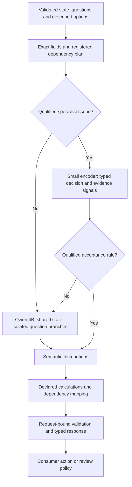

# A local decision model and engine for 16–32 GB Macs

Design proposal, reviewed 3 October 2026. Target: text decisions through OpenKind's
Choice, Noul and Score contract on an everyday Apple Silicon Mac. The user
specified 16–32 GB RAM. Workload prevalence and latency requirements remain
unspecified; the operating budgets below are proposed targets. This document
adds no measured 4B training result, Mac timing, promotion, or roadmap status.
The [experiment 35 implementation](../../research/local_decision_training/README.md)
provides a bounded training and reference-inference pilot, separate from native support.

**Recommendation.** Build around a quantized, post-trained Qwen3.5-4B decision
model. Preserve full interaction between evidence, question and options, but
evaluate the options together in one question branch. Add a distilled small
encoder only for workloads on which it earns useful coverage. Use deterministic
code for declared dependencies and calculations. Compare a learned option-conditioned
evidence reader against the finite-code control before adding recurrent reading.

This gives the product a concrete baseline while testing whether substantial
reasoning can be learned by a smaller deployment model. A dense-to-MoE conversion
or a cross-model hidden-state bridge has a weaker fit to the memory target.

**What the local evidence changes.** The following are reported findings from
[WHITEPAPER.md](WHITEPAPER.md), not results reproduced for this proposal.

| Evidence | Design consequence | Boundary |
|---|---|---|
| E42: selective indexing plus route composition (XR) reaches 95.40% field and 84.38% all-six correctness at 242.98 ms. Narrowly joint route/urgency (NJ) reaches 94.01% and 79.69% at 228.31 ms. | Retain selective readouts and deterministic rules; use an explicit joint source when dependent probabilities are required. | Qwen3.5-9B Q4, T4, 192 new authored policy cases. XR withholds an exact route vector; NJ supplies all six distributions. Neither establishes Mac cost or arbitrary-task quality. See §23.1. |
| E42: multi-catalogue host snapshots cut grouped latency about 54%, with zero paired probability drift. | Qualify exact catalogue reuse and account for retained host state. | About 170.6 MiB host RAM, 96 paired runs. This is catalogue-prefix caching, not a question-independent state-root result. See §23.3. |
| E30: post-trained 4B decision LoRA improves ContractNLI from 69.12% to 82.35%, while entailment and QASPER regress. E31/E32 replay treatments fail full retention too. | Keep the general model intact; qualify specialization by task and class. | A single broadly applied adapter is not a demonstrated general upgrade. See §§18.21–18.26. |
| E11: 2B LoRA reaches 91.56% against 95.00% for the selected 4B; tested ModernBERT arms reach 51.56% and 42.19%. | Test 2B as a cheaper replacement before assuming a sub-billion encoder will generalize. | Exploratory pilot, 56 source messages, easy constructed families; not a general architecture ranking. See §15. |
| E26 pooled-state shortcuts fail. Earlier B1/B2 token-level readers also fail complete quality/policy gates. | A custom reader must preserve evidence and test a materially different learning hypothesis. | Replacing one summary vector with cross-attention alone is not a new, untested remedy. See §§18.3–18.16. |
| Native MLX flat-field execution halves forward calls but is slower on both tested shapes. | Select execution plans by elapsed request time and memory. | Fewer calls do not establish less work. See §17.4. |
| E41/E42: separate resident native/JSON processes repair the tested history traces with zero drift across X, XR and NJ. | Give execution profiles explicit ownership; retain resident process isolation where mixed traffic requires it. | About 4–6% trace overhead, 12.10 GiB combined T4 memory. Same-process repair, cancellation, concurrency and Mac residency remain unqualified. See §§22.2, 23.5. |
| E42: all 23 XR eligibility errors confuse missing certification plus known failing points with undetermined eligibility. | Teach partial-information conjunctions and exceptions; missing evidence must not override a decisive fact. | A diagnosed policy-family error, not proof that synthetic counterfactuals fix the general model. See §23.2. |
| E43/E44 recover the encoder comparisons and expose numeric capping, chronological-order errors and majority collapse. | Report family/class distributions and whole-request correctness; retain a matched frozen parent. | Bounded classifier training and compact NLI specialization do not establish a general replacement or an accepted automation policy. See §24. |
| E43 repairs the targeted eligibility cases but damages retry decisions in the same requests. | Preserve atomic counterfactual units and compare individual fields with complete-request correctness. | A repaired skill is insufficient for promotion; new generated facts and held-out renderings need their own measurement. See §§24.2–24.4. |

The [Laya family](../families/laya.md) is a useful implementation starting point
for a specialist. Its existing MLX campaign reports 24.34 English and 56.37
multilingual decisions/s at 2.12/2.94 GB peak RSS on an M4 Max. These are
single-sample shape777 throughput records, not base-Mac latency or task quality.
The [campaign](../benchmarks/2026-09-28-laya-mlx-campaign/README.md) owns those
measurements. Laya's authors report 0.362 typed-decision accuracy for the base
English checkpoint versus 0.766 for the specialized checkpoint. Its shipped
probability space lacks learned OpenKind semantic-none behavior. Training,
coverage and probability semantics therefore need new qualification.
([Laya source](https://github.com/NandhaKishorM/laya))

**The proposed request path.** Initially, every semantic request uses Qwen.
Enable a fast specialist only after the complete routed system passes its gate.



Both neural paths consume the original admissible evidence. A specialist's
answer or summary must not replace the evidence supplied to the fallback.
The router selects which computation runs; it does not authorize actions.

**General model: one question branch with all options.** Start with the
post-trained [Qwen3.5-4B](https://huggingface.co/Qwen/Qwen3.5-4B) text backbone.
Its official configuration is a 32-layer hybrid of Gated DeltaNet and full
attention. Keep the pinned Base integration profile as a differential control.
These are different checkpoints; post-training, rendering, readout and
quantization each require a named profile.

The proposed computation is:

```text
static instructions → state tokens → complete immutable root
                                      ├─ question 1 + all its options → distribution 1
                                      ├─ question 2 + all its options → distribution 2
                                      └─ question Q + all its options → distribution Q
```

Each question sees its own options and the complete shared state. It cannot
read another question's continuation. Keep question catalogues out of this
shared root. A separately qualified schema-conditioned path may cache a fixed
catalogue, but changing that catalogue changes conditioning and cache identity.

The initial readout gathers verified answer-code rows from the vocabulary
projection and normalizes over the allowed outcomes. It needs no sampled
output token or full-vocabulary projection. Token identities must be checked
at the actual answer boundary. The tied input embedding remains resident;
omitting the output projection does not remove its weights.

Compare this against the existing candidate-conditioned scorer before training.
Then test one learned finite-code or option-pointer head under matched inputs
and training budget. A pointer head scores described options directly, avoiding
a fixed output vocabulary, but does not automatically eliminate position bias.
Both readouts still process all option descriptions. Neither makes computation
independent of candidate count.

**What CLEF changes.** [Cloudflare's announcement](https://blog.cloudflare.com/clef-decision-models/)
and [reviewed source](../RESEARCH.md#cloudflare-clef-and-linked-decision-models-reviewed-2026-10-01)
make an evidence-routing head a concrete comparator. CLEF-flash uses Qwen3.5-9B;
the larger CLEF declares Qwen3.8-27B. Their released helper performs one prefill
with caching disabled, retains all token representations, routes option queries
through evidence, and mixes field summaries across questions. This is learned
decision computation, not merely a faster prefill of our existing function.

The pinned flash head has width 1,024, two routing layers, four decoder layers,
16 heads and feedforward width 4,096. Its backbone states have width 4,096;
the selected 4B model uses width 2,560 and tied embeddings. Both have 32 hybrid
layers (24 DeltaNet, eight full attention), but flash head weights are not
dimensionally compatible with 4B. Treat its released settings as a comparator,
not a recovered training configuration. The
[training guide](../../research/local_decision_training/README.md#what-clef-justifies-changing)
records these pins and differences.

Cloudflare reports benchmark leadership on an internal Decision Index rerun,
with task-specific losses as well as wins. It does not establish universal
superiority to Jev, nor 4B performance on a Mac. Its full-schema per-field
softmax is not the explicit joint outcome distribution used by NJ.

First test a reader with each question isolated and all its options visible.
For a comparison against the last-position control, fix backbone, rendering,
training data and updates; retain full token memory only in the reader arm and
account for its memory and head cost. Cross-field mixing is a separately named
arm because it changes the information boundary. If the causal backbone has
already read the full schema, a mask in the head cannot restore isolation.
Do not transplant CLEF's ID fallback, silent truncation or winning-probability
confidence into OpenKind. The dossier owns the source and contract differences.

This changes roughly Q×K expensive candidate continuations into Q joint-option
continuations. It is a new model/readout experiment, not an equivalent execution
rewrite. Joint prompts can be longer, and local indexed-readout results were
mixed. Selection requires complete-decision quality, none behavior, code
remapping, option permutations and actual request cost.

The warning is concrete: E11's 2B finite-token LoRA arm reached 77.50%, versus
91.56% for its strongest 2B candidate-conditioned LoRA arm. Their training and
rendering differ, so this does not isolate the head as the cause. It does make
retaining the stronger candidate scorer a required control. If the joint-option
path loses useful quality, ship the qualified candidate scorer and its measured
reuse plan instead.

**What Strands Decider adds.** The [released Hobson v19 recipe](../RESEARCH.md#strands-decider-2b-hobson-v19-release-and-agent-interventions-reviewed-2026-10-01)
provides an inspectable 2B Base option-pointer comparator, rank-16 LoRA,
frozen-base/parent KL retention and human-rated answer-adequacy training.
The [pilot's optional HelpSteer2 ablation](../../research/local_decision_training/README.md#strands-decider-training-lessons)
tests only the new adequacy skill, groups response siblings by request and
retains the existing loss control. Keep readout, retention loss and data changes
separate: our specialization failures remain relevant even when another recipe
adds KL. Its later instruction-flip treatment fails its own retention guards.

Add paired question-sensitivity diagnostics where evidence/options stay fixed
but the correct answer changes with the question. Correctness on both siblings
matters; question responsiveness alone does not establish reliable reasoning.
Reject overlength inputs rather than copying its longest-sibling truncation,
which can change one question's evidence when another question is added.
Its custom pointer and PyTorch MPS path do not qualify a native 4B loader.

Choice training includes an explicit, meaningful `__none__` outcome and returns
one distribution over offered options plus none. Noul returns its binary
probability without a confidence field. Score returns an ordered level
distribution and its expectation. Review is a separate application decision.
Conditional probabilities from an existing Laya profile cannot be relabeled
as a distribution with learned semantic-none mass.

For the first bounded training pilot, admit at most 2,048 total prompt tokens,
Q≤8 and K≤16, with larger shapes as separate tests. These are experimental
bounds, not changes to the wire contract or claims about current supported
limits. A 4,096-token study remains a separate experiment. Reject an overlength
request or use an explicitly selected evidence-retrieval profile. Silent truncation
would repeat the evidence-visibility failures.
Retrieval can find supporting evidence, but a retrieval miss cannot establish
that the full document contains none. Preserve full-evidence evaluation or
report the scope limitation under that profile's contract.

**Transfer reasoning through supervision.** A model's useful reasoning is
distributed across its representations, learned transformations and inference
computation. There is no established Qwen component that can simply be copied
into ModernBERT to preserve the same function. Different tokenization, widths,
attention rules and hidden-state coordinates need learned alignment.

There are three evidence-backed mechanisms worth distinguishing:

| Mechanism | Evidence | Recommendation |
|---|---|---|
| Teach a student from verified teacher answers, rationales and distributions. | DeepSeek-R1 transfers reasoning behavior to smaller Qwen/Llama models; Distilling Step-by-Step uses rationale supervision for smaller task models. | First choice. Benchmark the deployed decision-only student, since R1 students still generate reasoning and do not prove one-pass equivalence. |
| Connect two live models through trained projection/cross-attention layers. | CALM demonstrates capability composition while retaining the constituent models. | Technically plausible, but both models still run. It is not a demonstrated memory or latency win for Qwen plus Laya. |
| Train continuous reasoning steps or recurrent depth. | Coconut, CODI and recurrent-depth work show useful latent computation on their tested tasks. | A bounded architecture experiment, with measured sequential cost and a strong ordinary-distillation control. |

Sources: [DeepSeek-R1](https://arxiv.org/abs/2501.12948),
[Distilling Step-by-Step](https://aclanthology.org/2023.findings-acl.507/),
[CALM](https://arxiv.org/abs/2401.02412),
[Coconut](https://arxiv.org/html/2412.06769v4),
[CODI](https://arxiv.org/html/2502.21074v3), and
[recurrent depth](https://arxiv.org/abs/2502.05171).

The teacher can be a larger Qwen model running offline, with reasoning enabled.
Deployment remains local and independent of the teacher. First establish teacher
quality on admissible development data. The existing adapted OpenKind models
have not passed the complete retention gate and should not automatically supply
training truth. Gold labels and verified calculations take precedence over a
teacher's fluent explanation.

Build supervision containing the original evidence, question, full option set,
correct outcome, source spans, and short intermediate relations where verifiable.
Train on counterfactual pairs: changed dates, negated conditions, removed evidence,
reversed relations, and omitted correct options. Split by source document,
template family and question family before teacher generation. Teacher text,
retrieval indexes and student inputs must exclude evaluation answers.

Retain a label cross-entropy control. Add teacher-distribution matching only when a
complete distribution exists over the same outcomes, with option mappings and
none semantics aligned. Generated rationales and repeated samples do not by
themselves supply calibrated target probabilities. Evidence-selection and
intermediate-relation supervision are separate ablations. No particular loss
weight or data mixture is established by the current record.

The [v4 pilot](../../research/local_decision_training/README.md) starts with
unsmoothed CE, rank-16 LoRA, 400 updates and a 2,048-token admission limit.
The [decision records](../../research/local_decision_training/DECISIONS.md)
connect the E30–E32 retention failures and E43/E44 diagnostics to each choice.
Keep the broad mixture as the control. A named data arm replaces half the rule
allocation with exact capping, chronology, decisive-known-fact and instruction-flip
examples. Split groups prevent leakage; atomic units keep pairs and triplets intact
after admission. Hold evaluation manifests and non-target source exposure fixed.

Optional presentation arms vary option order, code assignment or opaque keys by
training occurrence. Split, initialization, sampling and augmentation seeds are
separate inputs. After those controls are fixed, the optional six-arm loss sweep
isolates smoothing and Brier under matched budgets. Brier targets preserve original
probabilities; smoothing affects only CE. Select with unsmoothed development NLL
and retention guards; only the winner reaches calibration and the gate. A failed
gate retains its parent without another search.

Family/kind slices, predicted-class distributions, majority controls, paired and
complete-request correctness expose collateral damage. Group-bootstrap intervals
report uncertainty; sparse slices and current thresholds remain pilot screens.
Maximum probability and exported entropy confidence have separate risk/coverage
reports, without defining an action policy. Larger adapters, KL replay, RLCD and
exact-record training rewards remain separate experiments. The generated
multi-question diagnostics do not add a joint training objective.

TypeSafe's published datasets remain evaluation-only. The pilot's separate
[benchmark helper](../../research/local_decision_training/benchmark.py) opens
pinned test references only after export, without selection or refitting.
O*NET measures reference-distribution agreement; the four workflow datasets
require complete policy execution for official action scores. Fixed-input
question diagnostics do not establish those action scores. Report the none
schema adaptation, case sampling, token/outcome admission and failed-question
denominators before comparing with an external model. No TypeSafe labels may
enter training, development, calibration, the gate or sweep selection.
The optional 12,288-token benchmark panel probes longer contexts while recording
the 2,048-token training/export cap. It does not change the deployed contract or
establish long-context quality. The tokenizer-only source audit admitted zero
sampled invoice questions at 2,048 tokens, making this distinction necessary.

Rule groups include known-failure/missing-conjunct and known-success/missing-
disjunct pairs. The pilot records probability changes under reversed options
and opaque Choice-key renaming, mapped back to canonical outcomes. These checks
are descriptive; they do not establish parity or justify another checkpoint
search on the acceptance gate. Prompt-template/schema augmentation remains a
named follow-up with source/template-separated evaluation.

Compare a 2B Qwen student as a potential replacement for 4B, and a roughly
0.15–0.4B encoder as a specialist. Run the student without teacher evidence or
rationale at inference. Measure what transferred rather than assuming it.
The 2B control has a stronger local starting case for broad quality; the encoder
offers a larger potential latency reduction on narrow, recurring work.

**Specialization without general-model regression.** Preserve an unmodified
general Qwen profile. A task adapter can be selected for a registered task scope;
an encoder specialist can handle a frequent narrow workload. Neither is selected
solely by question ID. Scope includes the instruction, option descriptions,
language, source domain, context length and schema version.

An adapter changes intermediate representations. State prefills cannot be shared
between the unadapted model and an adapter that affects those computations.
Choose the adapter before prefill and key caches by adapter identity. A design
that adapts only question-side layers would need its own training and equivalence
study. Keeping all adapters on one frozen stem does not make that sharing valid
automatically.

Start routing with explicit scope checks and a held-out acceptance policy. Add a
learned error predictor only if it improves the routed result. Entropy, margin,
evidence coverage and disagreement are possible features, not proofs of safety.
Laya's confident errors and E40's incorrect high-confidence requests rule out a
universal “probability above 0.95 means accept” policy.

Measure the complete cascade on the subset each route actually receives. For a
simple sequential two-model request, expected time is:

```text
E[T] = E[T_specialist + T_router] + P(fallback) × E[T_general | fallback]
```

For illustration only, 30 ms upfront and a 300 ms fallback used on 20% of
requests gives 90 ms mean compute time. Those are invented scenario inputs,
not performance forecasts. In a multi-question request, one fallback question
can trigger the general-model prefill. Measure that request-level cost, queueing,
cache locality and tail latency; per-question acceptance rates are insufficient.
Enable a specialist only when saved fallback work exceeds its overhead at the
required quality. On mostly novel work, direct Qwen can be faster.

**Reasoning as bounded typed computation.** Register small computation graphs
for tasks with explicit rules: date differences, totals, eligibility/action
dependencies, and priority suffixes. The model selects evidence spans or predicts
semantic facts. Rust performs declared arithmetic and logical composition.
Facts carry source positions and extraction status so a wrong premise remains
visible. A single typed response may require several bounded neural decisions.

For example, extract the relevant cancellation date and identify which stated
deadline rule applies. Compute the date difference in code. If the evidence
cannot establish the date or rule, return an appropriate semantic result or
evaluation error under the task contract. A failed extraction must not acquire
certainty because the subsequent arithmetic was deterministic.

For a derived field `a = g(z)`, aggregate source probability mass over values
mapping to each outcome. If g uses several uncertain facts, exact derived
probabilities require their joint distribution or a justified conditional
factorization. Independent question execution does not imply statistical
independence. Do not multiply marginals silently or assign confidence 1.

Use registered plans, bounded fan-out and a deadline. Plan selection can itself
be a finite decision over allowed plans. Arbitrary generated programs and
unbounded recursive calls are outside this design. The [Von review](../RESEARCH.md)
provides related typed-computation prior art, with unresolved quality and
probability limitations.

**The later architecture experiment: recurrent evidence reading.** Test a small
pretrained encoder plus a recurrent query module that can reread token-level
evidence after a non-recurrent evidence-routing control has passed useful
quality gates. Neither reader is an initial shipping assumption.

```text
M = encoder(state)                         # retain token-level memory
z0 = encoder(question, described options)
zr+1 = reader(zr, M)                       # shared weights, isolated per question
p = typed_readout(zr, option positions)
```

An initial experiment could use a ModernBERT-sized encoder, a 2–4-layer reader,
and fixed recurrence budgets of 1, 2 and 4. Precompute the reader's keys/values
for M. Keep a small query/evidence workspace while retaining access to the full
memory. Reusing state encodings is valid only when the state encoder receives no
question-dependent input. Laya's current joint encoding cannot simply cache its
state tokens this way; this requires a new trained model and mask contract.

Training would combine verified final decisions with evidence and relation
targets from the teacher. Compare label-only supervision with those additions,
and compare recurrence with an equally timed non-recurrent reader. A training-only
rationale decoder is another explicit ablation. Start with fixed iteration
counts; train early stopping only after more iterations demonstrably help.

This differs from the failed B1/B2/E26 treatments through adapted token
representations, repaired complete inputs, stronger supervision and iterative
evidence access. Those differences are hypotheses to isolate, not explanations
already established for the prior failures. Changed-input and fixed-input
controls must distinguish evidence repair from an architecture gain.

Coconut's reported GSM8k result is 34.1% versus 42.9% for textual CoT, although
its search-oriented tasks favor latent reasoning. CODI reports matching explicit
CoT on GSM8k at GPT-2 scale with 3.1× compression. Crucially, CODI uses joint
teacher/student training with shared weights; its static separate-teacher
ablation is poor without an additional explicit-CoT objective. These results
justify an experiment, not a general Qwen-to-encoder hidden-state transplant.
([Coconut results](https://arxiv.org/html/2412.06769v4),
[CODI method and ablations](https://arxiv.org/html/2502.21074v3))

Latent steps are still sequential computation. A Coconut-style loop through
all Qwen layers can remain expensive even when it emits no words. Recurrent
depth demonstrates another viable mechanism, but its 3.5B proof of concept used
800 billion training tokens. The smaller reader proposed here is a different,
unvalidated attempt to limit that cost.
([Recurrent-depth paper](https://arxiv.org/abs/2502.05171))

**Why MoE is secondary on this hardware.** Qwen3.5-35B-A3B has 35B total and
3B active parameters. Ideal four-bit weight payload alone is about 17.5 GB
decimal, before scales, higher-precision tensors, state, scratch and macOS.
It exceeds the entire 16 GB target and consumes much of a 32 GB machine.
Activity sparsity saves arithmetic; it does not make inactive weights disappear.
Long prefills can touch many experts.

The local E36 comparison finds better
modern-MoE quality at roughly twice dense latency on an A100, with size and
quantization confounded. It is a quality challenger, not evidence of a local
speed win. ([Qwen model card](https://huggingface.co/Qwen/Qwen3.5-35B-A3B),
[WHITEPAPER.md §19](WHITEPAPER.md))

Sparse upcycling can initialize experts from dense weights, but those experts
need training and routing specialization. It increases capacity and stored
parameters rather than extracting a ready-made reasoning faculty. The original
work reports substantial continued-training cost. Keep this as a later capacity
experiment. Request-level specialists and small task adapters fit the immediate
budget better, subject to their own routing tests.
([Sparse Upcycling](https://arxiv.org/abs/2212.05055))

**Memory and latency budgets.** The following are design targets for bounded
requests, not predictions or measured Mac results.

| Deployment | Initial model choice | Proposed service peak budget | Quality challenger |
|---|---|---:|---|
| 16 GB Mac | 4B weight-quantized general model; at most one useful resident encoder | 7 GB, including both models, state and scratch | 2B student as a replacement if quality survives |
| 32 GB Mac | Same model for a comparable fast profile | 10 GB | 9B Q4 as a replacement general model, measured separately |

The 4.206B text reference has an ideal four-bit payload near 2.1 GB decimal;
this is not its artifact size or process memory. E40's actual 9B Q4 GGUF is
6.17 GB, illustrating the danger of using nominal parameter arithmetic as a
deployment estimate. Measure peak process footprint, Metal/MLX allocations,
cache/scratch and system memory pressure. Require no sustained swapping during
the qualification trace. On a base Mac, M4 Max throughput is not a substitute
for measurements.

For a first performance target, use a resident-model, cold-state request with
1,024 state tokens, four independent questions and eight short described options
per question. Aim for p50 below one second and p95 below two seconds on the
chosen base Mac. Measure short specialist requests separately, aiming for
sub-100 ms p50 through 512 total tokens. These targets may fail. Report the
quality/latency frontier rather than cutting evidence to obtain a passing time.
Long-document and multi-step requests receive separate budgets; 4,096 tokens
cannot inherit the 1,024-token timing target.

**Engine work that supports this design.** Build on the existing native Rust
and MLX boundaries. The linked files establish existing seams, not completed
support for the proposed composite engine.

| Existing seam | Proposed responsibility |
|---|---|
| [DecisionEngine](../../crates/openkind-engine/src/engine.rs) | A composite adapter that routes bounded subrequests and produces one request-valid response. |
| [ModelExecutionProfile](../../crates/openkind-engine/src/profile.rs) | Bind checkpoint, readout, renderer, probability space, quantization, calibration and permitted execution plans. |
| [BranchableState](../../crates/openkind-runtime/src/branch/state.rs) | Exact immutable roots, independently mutable continuation lanes, positions and tensor-byte accounting. |
| [MlxRuntime](../../crates/openkind-backends/src/qwen35/mlx/runtime.rs) | Retain the serialized process-wide MLX entry point; batch work within that ownership model. |
| [Native finite-logit family](../../crates/openkind-backends/src/families/decoder_logit_qwen35/model.rs) | Reuse the mechanism of verified output-row selection, with a new profile and renderer for a useful trained artifact. Existing profiles do not load experiment 35's unmerged adapter or CLEF's head. |
| [Benchmark methodology](../BENCHMARKS.md) | Paired complete-request comparisons, stage attribution, quality and memory evidence. |

Experiment 35's `train.py:decide` is the executable reference for its exported
prompt, finite readout and calibration. It admits all questions before any
forward pass, rejects overlength evidence, requires described Choice none,
keeps opaque question IDs out of prompts, and uses serial independent prefills.
It returns entropy-based Choice/Score confidence and no Noul confidence.
Frozen evaluation verifies and loads the bundled trainer, tokenizer, adapter and
contract. Synthetic replay vectors record the rendered inputs, logits, mappings,
probabilities and typed answers needed to start later parity work. The helper
supplies neither a wire adapter nor a shared hybrid-state cache. The native
Rust reference remains unchanged until selected weights, renderer vectors,
probability fixtures and conversion gates exist. A faster untrained head would
not answer the quality question.

Priority implementation choices:

1. Use quantized weight kernels without expanding whole weights to FP32 per
   request. Qualify accumulation, normalization and recurrent-state arithmetic
   independently. Existing BF16 failures do not forbid a new quantized model,
   but they do forbid calling it equivalent without evidence.
2. Reuse full hybrid state: attention KV, DeltaNet recurrence, convolution state
   and positions. Share immutable attention prefixes where possible; materialize
   independently mutable recurrent state for active lanes. A block attention
   mask cannot isolate DeltaNet recurrence by itself.
3. Bound active branches and reuse scratch. At the historical FP32 layout,
   recurrent state alone is 48 MiB per lane; K-way fan-out has a real memory
   cost. Account for every retained lane and all live models before admission.
4. Keep repeated-full and nested plans. Choose from qualified plans using
   measured state length, Q, K, suffix lengths, padding, locality and memory.
   No universal batching or cache threshold follows from the CUDA studies.
5. Gather only required output rows, perform readout on device, and transfer
   final distributions once. Profile before adding custom Metal kernels.
6. Cache exact computation with model/adapter/tokenizer/renderer/arithmetic
   identity and tenant boundaries. Laya and Qwen do not share hidden-state
   caches. Persistent summaries and approximate semantic-cache hits are not
   interchangeable with exact-prefix reuse.
7. Keep rendering/tokenization, prefill, fork/copy, continuation, readout, device
   synchronization, queueing and serialization visible in performance records.
   Test mixed profiles, cancellations, eviction, unequal lengths and request
   history, not only immediate repeated inputs.

**Experiments that decide whether to continue.** Use new admissible training
and development inputs after the documented source-repair prerequisites.
Preserve historical failed results and closed final partitions. Run one model
hypothesis and one frozen-profile systems study at a time.

| Order | Comparison | Evidence needed to continue |
|---|---|---|
| 1 | Matched 4B candidate scorer versus finite-code, pointer and isolated evidence-routing readouts, with Base/post-trained controls. Compare cross-field mixing separately. | Useful complete decisions, per-class retention, none recall/false-none, proper scores, order/key sensitivity and end-to-end Mac cost. Hold training/rendering fixed for attribution. |
| 2 | Selected useful 4B readout in weight formats and qualified repeated/shared plans. | New-profile quality plus same-profile execution parity, history stability, peak memory and cold/warm request timings. |
| 3 | Verified-teacher supervision versus labels alone for a 2B replacement or one encoder specialist. | Same held-out source/question families, useful risk/coverage and a measured resource benefit. Select the student family from workload needs before the run. |
| 4 | General-only versus the complete specialist cascade. | Route-conditioned errors, request-level fallback frequency, full probability semantics, queue-inclusive p95 and memory. Reject the cascade if routing overhead or mistakes erase the gain. |
| 5 | Useful non-recurrent reader versus recurrence at equal latency, with an ordinary distilled encoder control. | Gains on unseen multi-step, evidence-position and counterfactual tasks, with retained ordinary-task quality. Drop recurrence if extra compute is the only advantage. |

Use accuracy, class recall, NLL/Brier, semantic-none behavior, complete-request
correctness and risk/coverage together. Split and bootstrap by independent
source groups. Fit calibration and routing on separate development partitions;
evaluate them on untouched groups. Zero errors on a tiny accepted subset is
insufficient. As a sizing illustration, zero errors among roughly 300 independent
accepted units gives an approximate 95% upper error bound of 1%; correlated
questions do not supply 300 independent units.

For engineering selection, propose a 1 percentage-point noninferiority margin
against the stronger matched baseline on each core workload, plus separately
declared entailment, none and probability-score guards. Require useful coverage
and at least a 20% end-to-end latency reduction for added cascade complexity.
These are starting design criteria, not existing promotion rules or a
safety-critical error budget. Set the actual application costs and acceptance
limits before evaluation. Existing same-model parity tolerances remain unchanged.

The first concrete build should therefore be the bounded joint-option Qwen
profile and its Mac benchmark. Distill frequent, validated decisions after a
useful teacher exists. Test isolated evidence routing before funding recurrent
depth, with ordinary distillation retained as a control.

**Review provenance.** This proposal uses the working-tree versions of
[WORKING_PAPER.md](WORKING_PAPER.md), [WHITEPAPER.md](WHITEPAPER.md),
[RESEARCH.md](../RESEARCH.md), and [laya.md](../families/laya.md), plus the
linked primary papers and model sources. Whitepaper version: 0.8.12; working
paper revision: 0.9.3. CLEF sources were checked on 1 October 2026; earlier
sources retain the 29 September review. The v4 trainer/reference helper has an
offline validation suite; it adds no 4B training or target-Mac evidence.
No raw-result re-audit was performed. Numerical targets and new architectures
remain proposals; E41–E44 values are attributed to the canonical papers.
