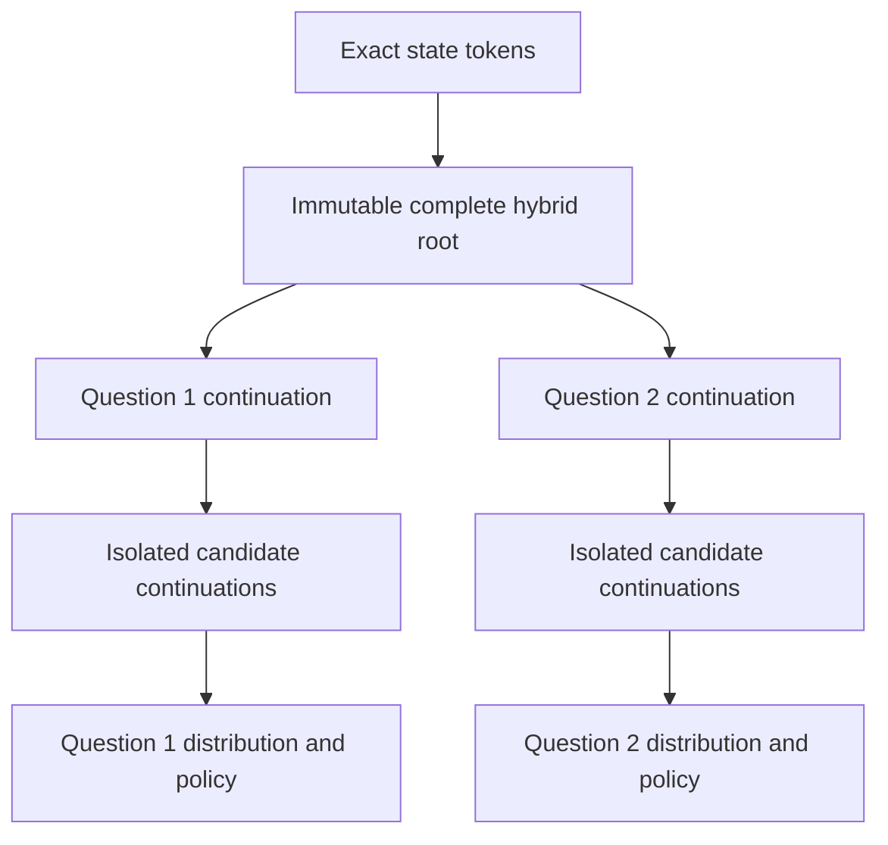

# OpenKind: Confirmed Lessons for Fast, Accurate Decision Inference

**Working paper · Revision 0.6 · 27 September 2026, America/Chicago**

**Purpose:** the short evidence summary of [WHITEPAPER.md](WHITEPAPER.md).
It records what worked, what failed, and what those results justify retaining.
[ARCHITECTURE.md](ARCHITECTURE.md) describes the current Rust codebase; a Colab
result does not become an implemented backend merely by appearing here.

**Evidence cutoff:** completed readout/history run `20260927T192845_426758Z`,
plus the earlier serving, training, CPU and MLX records below. “Confirmed” means
observed within the stated test, not independently replicated, generally
calibrated or production-promoted.

## 1. Main finding

Two improvements now have bounded evidence: **derive dependent action in code**,
and **reuse the static instruction/catalogue prefix**. On the dense 4B follow-up,
the timed host rule improves field accuracy by **4.08 points Q4 / 4.95 BF16**,
reduces median request time by **3.06% / 3.59%**, and removes eligibility/action
contradictions. Static-prefix caching passes all **960 paired comparisons**,
with 1.24–2.75× cold/warm request ratios across eight cells.

The limitations are equally clear. Indexed answers are not uniformly better;
code remapping changes answers in every tested case. BF16 reduces history drift
but does not eliminate it. JSON remains more accurate. These results do not
establish a general Jev replacement or update the Rust backend. The latest
experiment is **dense Qwen3.5-4B**; the earlier modern MoE remains a separate
quality challenger. [Whitepaper §20; E39; V8]

## 2. Computation and reuse that have been verified

The Rust integration reference remains frozen Qwen3.5-4B-Base, state-first,
profile `a047d6802c3f06f085b8`, with candidate-conditioned features and
score-summary rejection. Native CPU probability parity reaches maximum
Δp **4.5869×10⁻⁶**, with no answer or policy changes on its frozen fixtures.
Pinned-base MLX FP32 full, nested and variable-length vectorized parity also
pass their recorded fixtures. These are implementation results, not new
semantic-quality claims. [Whitepaper §§15–17]

*The implemented reference topology. The reusable state includes attention KV,
DeltaNet recurrence, convolution state, position and execution identity. It is
not a state-only pooled prediction head.*

| Verified result | What it supports |
|---|---|
| Phase 3A synthetic L=1,024/Q=4/K=4: repeated-full 9,448.1 ms; shared cold 1,101.2 ms; shared warm 516.5 ms | Reuse benefits workloads dominated by common state. Short semantic Q=4 sharing was instead 10.7% slower. |
| Native GGUF, one context/six fields: Q4 natural 109.90 → 55.21 ms; indexed 129.97 → 47.34 ms | 1.991× / 2.745× from 315 / 508 static-prefix tokens; all 96 exposed cases tested twice. |
| BF16, one context: natural 77.89 → 44.52 ms; indexed 92.80 → 40.49 ms | 1.750× / 2.292×; separate precision profiles. |
| Four-context requests, both precisions/readouts | 1.236–1.541×; every local cold/warm pair exact. Batch-to-batch equivalence is a separate question. |
| vLLM dense, 529-token prefix, Q=4, cold-staged: 478.44 → 248.95 ms | One optimized cache-boundary cell qualifies at Δp 4.37×10⁻⁸; neighboring shapes do not inherit that qualification. |
| FP16-KV snapshot storage: 115 → 83 MiB at measured 1,024-token prefix | Bounded 27.83% hybrid-root storage saving; not total-model memory or a proven latency improvement. |

The native cache reuses **instructions and the full field catalogue**, not
arbitrary dynamic user state. All eight E39 cells cover the full exposed
96-case panel: cold/warm accuracy matches, maximum Δp is zero and no fields
change. This does not repair serial/batch or whole-session history failures.
The five-field host-rule arm was **not tested with warm reuse**; its gain cannot
be combined with cache timings as an already-measured system. [§20.4]

**Accounting correction:** all 960 “prime” calls were already cache hits.
Disabling lookup still rebuilds and stores a prefix in this engine. The warm
request savings qualify, but prime timing and prime-plus-warm totals do not
measure cold-start setup or amortization. A fresh-cache test remains needed.
[Whitepaper §§9, 16, 19.3, 20.4; E39; V8]

## 3. Latest quality and speed results

### Modern Qwen3.5 serving

On the A100/vLLM comparison, each panel has 288 questions from 96 states.
Times include one answer-code token and localhost HTTP. Quantization differs,
so this is a system-profile comparison, not an isolated dense-versus-MoE test.

| Profile | SNLI accuracy / p50 | Authored accuracy / p50 | Authored accepted; wrong |
|---|---:|---:|---:|
| Qwen3.5-4B BF16 | 75.35% / 63.10 ms | 75.69% / 63.40 ms | 170; 4 |
| Qwen3.5-35B-A3B GPTQ INT4 | 84.72% / 126.32 ms | 92.71% / 126.73 ms | 254; 1 |

The modern MoE improves accuracy by **9.38 / 17.01 points**, at about twice
the dense latency. Both authored policies pass their recorded audit; both SNLI
policies retain zero coverage. Public SNLI and shared authored templates do
not establish production generalization. Option rotations change 8/24 dense
and 3/24 MoE answers. [Whitepaper §19.2; E36]

### Completed native readout and host-rule comparison

E39 holds the dense checkpoint family, backend, facts and cases fixed within
each precision. It uses 96 exposed authored cases × two repeats × six fields;
the repeats do not double the independent case count. Prompt/output formats
differ. Times include the request path, excluding model loading. These arms
share an interleaved process history; replication with fresh isolation remains
open given the separate history failures.

| Arm | Q4 accuracy / p50 ms | BF16 accuracy / p50 ms |
|---|---:|---:|
| Natural labels | 78.47% / 111.13 | 78.56% / 79.97 |
| Integer indexes | 78.04% / 131.18 | 81.68% / 94.89 |
| Nonoverlapping aliases | 83.25% / 119.95 | 82.90% / 88.97 |
| Natural, five fields + host action rule | **82.55% / 107.73** | **83.51% / 77.09** |
| Indexed, five fields + host action rule | 80.64% / 126.63 | 81.86% / 91.32 |
| Generated compact JSON | 90.45% / 494.99 | 88.89% / 578.76 |

**Dependent fields:** the newly timed natural-derived arm removes 55/192 Q4
and 60/192 BF16 contradictions. Paired case-bootstrap accuracy gains are
+4.08 points [2.17, 6.08] and +4.95 [3.21, 6.77]. Action probabilities follow
the eligibility distribution through the declared rule; they are not set to
confidence 1. Eligibility errors can still produce wrong actions. Removing a
field changes the prompt, and NLL worsens slightly. E38's earlier **78.30% →
82.99%** was offline replay; it remains separate from these timed results.

**Readout:** indexes improve ordinary-closed and action decisions but regress
integer/Boolean fields and are about 18–19% slower uncached. Overall indexed
accuracy changes are −0.43 points Q4 and +3.13 BF16, with both 95% intervals
crossing zero. NLL improves, but calibration is unproven. Aliases improve this
panel by 4.77/4.34 points, yet semantic remapping changes at least one field on
**12/12 cases in each of the four precision/readout cells**. Neither codes nor
aliases solve general semantic invariance. [Whitepaper §§20.2–20.3]

**History:** all 1,152 immediate pre/post anchor repeats are exact. Three JSON-interleaved
Q4 anchor episodes fail; BF16 anchors pass, but one BF16 companion context exceeds
Δp=0.005. End-of-session versus fresh-reset probes fail **24/24 Q4 and 7/24 BF16**,
with two Q4 field changes and one BF16 route change. Initial fresh-process and
fresh-reset outputs match exactly. This supports process-history dependence;
the specific state/kernel cause remains unisolated. The BF16 answer flip occurs
at Δp=0.004696, showing why probability tolerance alone is insufficient.
[Whitepaper §20.5; E39; V8]

## 4. Training, evidence and acceptance lessons retained

| Finding | Verified evidence and limit |
|---|---|
| Evidence must survive serialization/tokenization | QASPER annotation-string visibility rises 12/119 → 79/119 from 1,024 to 4,096 tokens. Visibility is not semantic sufficiency. |
| More context can help while rejection worsens | On a fixed ContractNLI subset whose evidence becomes visible, J1 improves 17/32 → 30/32; correct none decisions fall 65/96 → 53/96, leaving total accuracy nearly unchanged. |
| Decision LoRA specializes, but does not preserve the full task | Matched BF16 J1 → J3: ContractNLI 141/204 → 168/204, entailment 81/84 → 70/84, QASPER 37/46 → 34/46. |
| Better replay learning is not retained document competence | Source-label replay raises SNLI 125/192 → 159/192 and 131/192 → 166/192 over parent KL, but worsens ContractNLI/QASPER NLL and Brier. All guarded replay selections retain frozen parents. |
| Semantic none and review are different | Strong candidate ranking can coexist with failed none recall. Zero coverage has undefined accepted error; it is not zero-error automation. |
| Calibration needs its own gate | Native eligibility temperature scaling worsens test NLL 0.27056 → 0.41902. A positive temperature cannot change the chosen class or fix logical contradictions. |

Natural-document gate counts are small and exposed: 204 ContractNLI questions
from 12 contracts and 46 QASPER questions from 12 papers, including only five
QASPER none cases in the later gate. Historical labels, audit quarantines,
checkpoint selections and protected final remain unchanged. [Whitepaper
§§18.14–18.26, 19.7]

## 5. Discounted approaches and unsupported claims

“Discounted” means the tested form failed its purpose or the stated inference
is unsupported. It does not mean every related architecture is disproved.

| Approach or claim | Recorded disposition |
|---|---|
| A cheap frozen pooled-prefill vector is enough | All three tested root/question/candidate-pooled arms fail the non-final gate and accept zero requests. Richer learned readers remain untested. |
| More MoE sparsity automatically yields useful speed and memory | Late-block skipping saves 1.3169× time but fails decision utility; allocation stays about 7.823 GiB. No weight streaming was tested. |
| Few experts per token imply few resident/request-wide experts | One legacy probe touches an average 59.875/60 experts per layer. The separate physical-removal memory claim lacks recovered raw evidence. |
| Router FP32 alone repairs MoE parity | Exact routing ties disappear, but routing differences and output failures persist. |
| Native batching is an interchangeable optimization | About 202 → 107 ms on 12 cases, but only 1/12 batched cases meets Δp≤0.005. Answers match on that panel; probability equivalence does not. |
| Removing padding fixes the native drift | Unpadded maximum Δp is 0.03877 versus padded 0.03036; neither qualifies. |
| Immediate repeats or local cache parity prove history stability | E39 passes immediate repeats and local cache pairs, yet session-end/reset maximum Δp reaches 0.09785 Q4 / 0.01104 BF16, with answer changes. |
| Indexes/aliases universally repair the reader | Mixed field effects; every tested semantic-remapping case changes at least one answer. |
| BF16 fixes history, or low-bit weights are always faster | BF16 still has one reset-comparison answer change; native BF16 is faster here but uses more device memory. |
| Fewer forwards necessarily run faster on Mac | The FP32 flat-field port halves forward counts but is 6.0–12.1% slower at Q2/K2 and 64.3–64.5% slower at Q8/K4. Candidate pooling also loses on tested shapes. |
| BF16, TF32 or low-bit state is automatically equivalent | Tested profiles fail distinct probability gates; all four low-bit cache codecs fail complete equivalence. Preserve the narrower FP32/FP16-storage positive results. |
| A complete tree probability vector is calibrated correctness | Native tree probabilities describe a constrained token policy; greedy modes return no full vector. Normalization is not calibration. |
| Removing generation removes vocabulary weights | The tied vocabulary matrix has zero marginal removable parameters under output-projection removal. Compute savings are not weight-memory savings. |
| These tests reproduce TypeSafe RLCD or a general Jev replacement | Neither is established. Completed experiments and bounded wins are not release promotion. |

## 6. What the evidence supports retaining

Retain the immutable Rust reference and complete-state isolation. The external
native study supports explicit deterministic dependencies and static-prefix
reuse under exact model, renderer, mapping, arithmetic and shape identities.
It does not yet measure their combined warm five-field path or qualify a Rust
port. Keep probability, answer, policy, accuracy, latency and memory gates
separate. At 24 reserved sequences, observed device use is **6.074 GiB Q4 versus
11.232 GiB BF16** after startup; these are residency snapshots, not request peaks.

PrivateMode supplies the indexed-option method and the need to retrieve every
option's probability. E39 tests that idea locally; it does not inherit the
external study's accuracy or speed. The [readout/history Colab](https://colab.research.google.com/drive/110Ej_FjTxxIb2DrNiBWM6jC7l6ui1g3h)
is now completed. The next supported priorities are a minimal history/reset
reproduction, genuinely cold prefix accounting, a measured composition-plus-
cache arm, and fresh task families with readouts fixed before evaluation.
Those are proposed tests. Training must still preserve document evidence and
competence; no model, calibration, scheduler or service default is promoted.
[Whitepaper §20.6; E39; V8]

## Evidence map

Full methods, inherited audit limits, immutable model identities and source
hashes live in the whitepaper. The source IDs below are shared with its register.

- **Training and audits:** Whitepaper E14–E32, §§18.1–18.26.
- **CPU/MLX and cache storage:** E5–E7, E12–E13, RUST1–RUST11, RUSTM1–RUSTM2; §§7–10, 16–17.
- **Legacy MoE/prefill:** [E34 follow-up](https://drive.google.com/drive/folders/1gXwnF1sXhR5Yh4-7R2izDQ9TJXDl_Lf1) and [E35 three-arm study](https://drive.google.com/drive/folders/14FsOosgKt9oJKK-Y8yPuKtkuaDClBgC3); §19.1.
- **Modern Qwen:** [E36](https://drive.google.com/drive/folders/1LIKE7JSmEcO2fvrhf8Qx4_ZJfv-heGwD); §19.2.
- **vLLM cache boundaries:** [E37](https://drive.google.com/drive/folders/15Uk86JTaBI4H_EPDyvsSCKLMiZVz1RPG); §19.3.
- **Native decisions/cache:** [E38](https://drive.google.com/drive/folders/1NRnRKB6dXHuojcpJ-f77FhywM3-ZV_Hj), [raw summary](https://drive.google.com/file/d/1GI2p9SXrTfHGA70Wfs_658_dQQoXZs4u/view); §§19.4–19.7 and saved-output review V7.
- **Readout/history follow-up:** [E39 run](https://drive.google.com/drive/folders/1N8fq_wSct874PWi-VPwuGWAKiYL39xUM), [archive](https://drive.google.com/file/d/1i-36AIKjpctxa-9GTpMSs40A3QyTJale/view), [summary](https://drive.google.com/file/d/1Z8QPnomGPByh5JiggdObP7D_CgcEi3zB/view); §20 and independent saved-output reconciliation V8.
- **External method:** [PrivateMode article](https://www.privatemode.ai/blog/system-one-from-glm-flash), [implementation](https://github.com/edgelesssys/privatemode-decisions), and [pinned native fork](https://github.com/thecodacus/llama.cpp/tree/ad129b08d9f134cd298d1f8a85efc52b1b66e18e/tools/parallel-decision). External claims remain attributed; local results control local conclusions.
