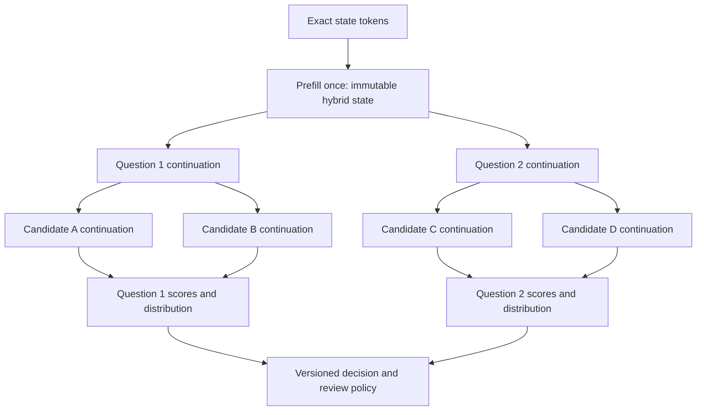
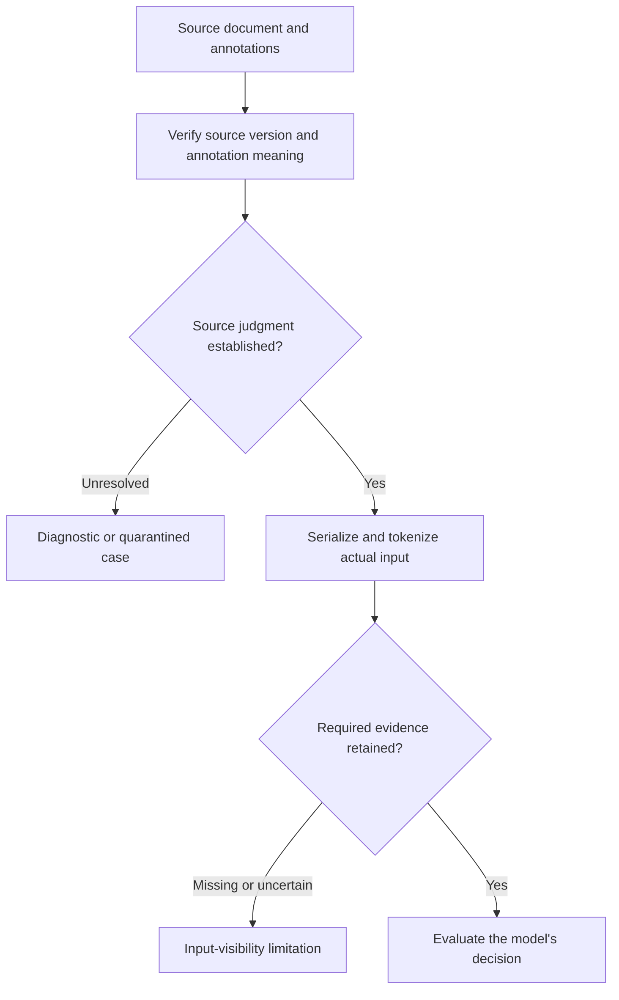

# OpenKind: Confirmed Results for Shared-State Decision Inference

**Working paper · Revision 0.4 · 27 September 2026, America/Chicago**

**Model-evidence cutoff:** completed MoE follow-up `20260927T003918_481825Z` and all three arms of `20260927T015527_929864Z`, finalized 27 September 2026 at 03:06:39 UTC. The latter run is `EXPLORATORY_COMPLETE`; all 26 checksum entries match. **Systems addendum:** pinned Qwen3.5 FP32 MLX flat-field and candidate-pooling diagnostics [15–16].

## Abstract

OpenKind has demonstrated decision inference without answer generation, isolated reuse of a complete Qwen continuation state, and substantial speedups on some shared-state workloads. A Rust port of flat shared-prefix field batching reduced MLX forward calls but lost latency to nested batching on the tested Qwen3.5 shapes. OpenKind has not yet demonstrated a model that satisfies the complete natural-document accuracy, rejection, and retention requirements. Decision-specific adaptation improves ContractNLI accuracy but damages supported entailment and QASPER behavior. Neither tested replay treatment resolves that trade-off. This paper records the measured results and the engineering requirements they support. The completed comparison favors the dense Qwen control: 80.73%/87.50% accuracy on the selected SNLI/authored panels at 49–53 ms, versus native MoE 57.29%/33.33% at about 1.8 seconds. These are system-profile results on an L4, not an isolated architectural comparison. No arm qualifies its acceptance policy or a cache path; FP32 routing does not repair the MoE failures. PrivateMode independently reports useful decisions from constrained option logits. Together these findings support the readout, while leaving calibrated automation, numerical equivalence and retained document competence as the immediate problems.

## 1. Scope and method

“Jev-style” denotes this project's target: typed decisions and probability distributions for several questions over shared evidence, without generating a prose answer. It does not assert equivalence to Jev's private architecture, training procedure, accuracy, or latency.

This revision synthesizes the prior model studies and a separate Rust/MLX systems experiment; it does not fit or evaluate a new model. All six final-panel counts, calibrated NLL/Brier scores and median timings in the completed prefill study were recomputed from saved predictions. Final item IDs, labels and options match across the three arms; state IDs do not cross dataset partitions [9]. The preceding MoE follow-up has 22 checked artifact hashes [8]. External work is explicitly attributed in §5; the supplied commentary is not itself experimental evidence. The latest training reports and class/SNLI tables were checked directly in Drive; Phase 3A timing aggregates were recomputed from its saved summary. Earlier cache, numerical, audit, and native-backend results retain their recorded scope in the supplied whitepaper [1–6]. The new MLX comparison is backed by checked-in paired-run JSON and formal parity reports [15–16]. “Confirmed” means observed in those tests, including negative results; it does not mean independently replicated or production-qualified.

The recent natural-document calibration gate contains **204 ContractNLI questions from 12 contracts and 46 QASPER questions from 12 papers**. It was already exposed during research. Questions from one document are correlated. QASPER has only **five semantic-none cases** in this gate, and unresolved source/annotation limitations remain. The SNLI panel contains **192 examples** and is an exposed regression diagnostic. None is fresh release confirmation [2–5].

## 2. What computation is established

Two decision readouts have run successfully: a learned scorer on candidate-conditioned hidden states, and direct scoring of the offered answer-code vocabulary rows. Both avoid answer-token generation. They are distinct model profiles; the later joint-option LoRA results do not validate the earlier branch scorer's semantic quality [1–5].

The joint-option readout computes $p_i=\exp(z_i/T)/\sum_{j\in A}\exp(z_j/T)$ over the verified answer-code set $A$. This is conditional on the offered outcomes; it does not establish calibrated correctness. Supplying an answer prefix fixes the readout position. Reusing a state prefix instead saves earlier computation and has a separate equivalence requirement. A state-only pooled vector is a third, different design.

The frozen Qwen3.5-4B-Base integration profile, `a047d6802c3f06f085b8`, supports the following execution topology [6]:

*Figure 1. Tested state → question → candidate branching. Each branch owns isolated mutable continuation state; no question consumes a sibling's continuation. This depicts the integration reference, not the later joint-option training graph.*

The reusable object includes **attention KV, recurrent DeltaNet state, convolution state, position, and execution identity**. Copying only KV is insufficient. Native CPU fixtures reproduce probabilities with maximum difference **4.5869 × 10⁻⁶**, with zero selected-answer or policy changes. Pinned-base MLX FP32 full, nested, and unequal-length vectorized parity also pass their recorded fixtures. The flat-field and candidate-pooling native compute comparisons are negative; complete request-path performance and accelerated-service qualification remain open [1, §§16–17; 15–16].

Prefill reuse does not establish that a pooled prefill vector is a sufficient decision representation. All three tested pooled-root arms—root only, root plus question, and root plus question/candidate—failed the non-final gate and accepted **zero requests**. Richer representations were not ruled out by this probe [1, §18.16].

## 3. Accuracy depends on evidence access and retention

### 3.1 The evidence must survive the input pipeline

The visibility preparation found all recorded QASPER annotation strings inside the state prefix for **12/119** annotated questions at 1,024 tokens and **79/119** at 4,096. String presence is a diagnostic, not proof of semantic sufficiency. The audit also found annotation and serialization problems; proposed corrections have not silently become gold labels [1, §§18.15, 18.20].

*Figure 2. Distinctions established by the evidence audits. Missing evidence is not automatically a semantic-none label; retained annotation strings do not independently establish answerability.*

In the FP32 frozen comparison, increasing J1's state-prefix cap from 1,024 to 4,096 improved a fixed ContractNLI subset whose annotations became fully visible from **17/32 to 30/32 correct**. Meanwhile, correct none decisions fell **65/96 → 53/96**, leaving aggregate accuracy nearly unchanged: **141/204 → 142/204**. Extra context adds more than the evidence span, so this is not an isolated causal estimate of evidence access. It establishes why visibility and rejection need separate measurements [1, §18.20; 2].

### 3.2 Adaptation gains have not preserved the full task

J0 is frozen Base; J1 is frozen post-trained Qwen3.5-4B. J2/J3 add decision LoRA. J4/J5 start fresh from their corresponding frozen parent and add parent-distribution KL replay; J6/J7 instead use source-label cross-entropy on the same replay schedules. These are separate fits, not sequentially stacked adapters. The original pilot used rank-16, alpha-32 adapters and 120 updates; J2/J3 selected update 80 [3–5].

| Profile | ContractNLI correct / 204 | Entailed correct / 84 | QASPER correct / 46 | SNLI correct / 192 |
|---|---:|---:|---:|---:|
| J0: frozen Base | 116 | 81 | 40 | 117 |
| J1: frozen post-trained | 141 | 81 | 37 | 132 |
| J2: decision LoRA, locked80 | 166 | 73 | 35 | 136 |
| J3: decision LoRA, locked80 | 168 | 70 | 34 | 141 |
| J4: parent-KL replay, fixed80 | 164 | 74 | 36 | 125 |
| J5: parent-KL replay, fixed80 | 166 | 69 | 35 | 131 |
| J6: source-label replay, fixed80 | 162 | 70 | 29 | 159 |
| J7: source-label replay, fixed80 | 165 | 69 | 35 | 166 |

*Table 1. Raw decisions under matched BF16 execution; natural-document state-prefix cap 4,096. Fixed80 replay rows are diagnostic snapshots. The guarded J4–J7 selections all retain update zero. FP32 results in §3.1 are a separate comparison [3–5].*

J3 raises ContractNLI accuracy **69.12% → 82.35%**, with contradiction recall **8/24 → 19/24** and none recall **52/96 → 79/96**. Supported entailment falls **81/84 → 70/84**, and QASPER falls **37/46 → 34/46**. Aggregate improvement therefore does not establish retained decision competence [3,5].

Source-label replay improves SNLI over parent KL: **125/192 → 159/192** and **131/192 → 166/192**, gains of **17.71 and 18.23 percentage points**. Yet both source-label models worsen NLL and Brier on both natural-document sources relative to their KL comparator. J6 detects all **5/5** QASPER none cases while incorrectly rejecting **17/41** answerable cases. Short-premise learning and document-task preservation are distinct outcomes. The mechanism behind the recurring supported-entailment loss remains unisolated [5].

### 3.3 Rejection and automation require their own evaluation

Semantic none means no offered answer is supported. Application review is a separate action. Good conditional candidate ranking can coexist with poor none decisions. In the exploratory option-logit audit, ContractNLI candidate ranking reached **130/148** on answerable questions, while none recall was **0/124** [1, §18.17].

Probability improvements also do not guarantee useful automation. Under the pilot's error cost 1 and review cost 0.10, J2's QASPER policy costs exactly **0.10000 per question**, equal to review-all; J3 costs **0.11304**. Neither is a strict improvement there. Policy coverage, accepted error, and cost must accompany accuracy. Temperature scaling also worsened the earlier matched NLI test's NLL **0.3345 → 0.3392**; calibration needs a separate acceptance check [1, §4.4; 3].

## 4. Speed is conditional on workload and numerical behavior

### 4.1 Shared state can help greatly, but has a crossover

Phase 3A used strict FP32 Qwen3.5-4B-Base on an **A100-SXM4-80GB**. The table shows measured request medians; the first row is the median across three semantic-case medians. Synthetic rows measure execution mechanics, not long-document decision accuracy. Here L is state-token length, Q is question count, and K is candidates per question [6].

| Workload | Repeated full | Batched sharing, cold | Batched sharing, warm |
|---|---:|---:|---:|
| Short semantic cases, Q=4 | 869.3 ms | 1,058.4 ms | 962.4 ms |
| Synthetic L=64, Q=4, K=4 | 1,375.4 ms | 597.9 ms | 514.9 ms |
| Synthetic L=1,024, Q=4, K=4 | 9,448.1 ms | 1,101.2 ms | 516.5 ms |
| Synthetic L=1,024, Q=16, K=2 | 18,928.6 ms | 2,506.3 ms | 1,922.0 ms |

*Table 2. Cold includes state prefill; warm reuses an existing root. These are in-process measurements, not queue-inclusive service latency or Mac forecasts.*

Warm sharing is **10.7% slower** for the short semantic Q=4 cases. At synthetic L=1,024/Q=4/K=4 it is **18.29× faster**; cold sharing is **8.58× faster**. At L=1,024/Q=16/K=2, batched-cold peak allocation rises **16.42 → 18.67 GiB**. The supported engineering conclusion is workload-aware scheduling with memory admission, not unconditional caching or batching [6].

The separate M4 Max CPU record reports **1.294×–2.018×** speedups for nested sequential execution across five warm workloads. That is CPU evidence; it does not establish an MLX speedup. Earlier exact-prefix persistent-cache traces saved **13.91%** and **11.88%** of total time across 32-request grouped and shuffled traces, compared with within-request sharing already enabled [1, §§9.7, 17.3].

The later Rust/MLX comparison held the **pinned Qwen3.5-4B-Base FP32 `ReferenceOps` profile** fixed on a 36-GiB M4 Max. A diagnostic port of the Python shared-prefix field schedule flattened each question plus candidate suffix into a lane from one immutable state root; the existing `nested_batched` runner reused each question state. Both used the same score-summary readout. Each strategy ran in a fresh process, once in each order; the first sample in each process was excluded before taking its warm median. Q2/K2 used three retained samples per process, Q8/K4 two. The timed region included prefill, continuations and readout, but excluded model load, tokenization, validation, HTTP and queueing [15].

| Shape | Nested batched warm medians | Flat port warm medians | Flat change across paired orders |
|---|---:|---:|---:|
| Q2/K2 | 1.342 / 1.268 s | 1.422 / 1.421 s | 6.0% / 12.1% slower |
| Q8/K4 | 5.005 / 5.005 s | 8.222 / 8.232 s | 64.3% / 64.5% slower |

Flat execution cut physical forwards **4 → 2** at Q2/K2 and **10 → 5** at Q8/K4, but repeated question tokens per candidate and raised padding from **0 → 2** and **14 → 104** token slots. Maximum paired probability differences were `2.71 × 10⁻⁶` and `8.08 × 10⁻⁷`, with unchanged selections and policy actions under the fixed `0.98` threshold. Formal pinned full and nested MLX parity gates passed separately at `0.005` tolerance. A prior same-position cross-question candidate-pooling diagnostic was also slower than current batching by **1.5%** at Q2/K2 and **7.8%** at Q8/K4 [15–16]. These are native compute results on repeated frozen token workloads, not full-request latency, semantic accuracy, or a general no-batching result. They support retaining the current scheduler and testing any next execution graph on complete matched requests before promotion.

### 4.2 Precision and memory are parts of the decision contract

On expanded 2E's 128 episodes, strict-FP32 full-batch-four execution had maximum probability drift **0.00000928**, with no class or policy changes. BF16 full-batch-four drift reached **0.110223**, with class changes in **14 episodes** and policy changes in **seven**. This establishes execution disagreement, not universal semantic superiority of FP32 [1, §7.3].

The 2F FP16-KV storage variant passed all **32/32** sampled FP32 codec gates; all four tested low-bit codecs failed the complete gate. For a 42-token prefix, FP16-KV storage saved only **2.45%** of the complete hybrid root; for the measured 1,024-token prefix it reduced root storage **115 → 83 MiB (27.83%)**. KV savings are neither total-model savings nor proof of lower request latency [1, §9].

Removing the output projection's use also does not remove its tied input-embedding weights: the measured **635,699,200** vocabulary weights have **zero marginal removable parameters** under that change. Avoiding answer generation saves computation; making the backbone smaller requires another intervention [1, §4.2].

### 4.3 MoE reductions save time without establishing useful decision quality

The completed follow-up uses **Qwen1.5-MoE-A2.7B-Chat**, NF4 weights, BF16 compute and eager attention on an **NVIDIA L4**. It tests 96 authored questions from 32 states, balanced over yes/no/unknown; unknown is the explicit insufficient-evidence outcome for this task, not application review [8].

| Arm | Correct / 96 | Unknown correct / 32 | Accepted; wrong | p50 | Peak allocation |
|---|---:|---:|---:|---:|---:|
| Native | 36 (37.50%) | 0 | 14; 9 | 2,022.49 ms | 7.8229 GiB |
| Skip last six MoE blocks | 40 (41.67%) | 2 | 8; 3 | 1,535.78 ms | 7.8228 GiB |

Skipping is **1.3169× faster**, with effectively unchanged allocation, but the research gate fails. Native predicts yes on 89/96 questions. Accepted error is 64.29% and 37.50%, respectively. Fitted temperatures of 10.13 and 13.53 soften probabilities without repairing these errors. Neither policy beats review-all at cost 0.10: observed costs are 0.17917 and 0.12292 per question [8].

Split-prefill equivalence passes only **4/8** native probes and **2/8** NF4/FP32-linear-reference probes. Maximum probability differences are **0.119915** and **0.155268**, with one answer flip in each mode. Repetition, full-input cache-on checks, branch independence and root immutability pass their recorded controls. The FP32-linear control retains quantized weights and other lower-precision operations; it is not full-model FP32. The cause remains unresolved, and no cache speedup is accepted [8].

A single instrumented full-input probe executes **1,437 expert calls**, averaging **59.875/60 experts per layer**. The earlier routing-fit panel similarly averaged 59.33/60 [7–8]. Four active experts per token therefore did not mean a small request-wide expert working set. No experiment streams expert weights. The later physical-removal memory table remains user-reported without its raw artifacts; it is not promoted into confirmed memory evidence. Old route-change percentages are also excluded: their observer reconstructed top-k from a separate top-(k+1) call rather than recording the model's actual selection.

### 4.4 The completed comparison favors the dense control, with two gates still open

Run `20260927T015527_929864Z` completed all three arms without recorded execution errors. **Qwen3-4B-Instruct-2507** uses BF16/SDPA without weight quantization; **Qwen1.5-MoE-A2.7B-Chat** uses NF4/BF16/eager, with native or FP32 router linear operations. All chose the concise prompt on development data. Each arm sees the same 192 SNLI questions/64 states and 96 authored questions/32 states. Model generation, tokenizer, architecture, quantization and attention implementation differ: this is a system comparison, not a causal test of dense versus MoE [9].

| Profile | Panel | Correct | Unknown correct | Calibrated NLL | Scalar p50 |
|---|---|---:|---:|---:|---:|
| Dense Qwen3 4B | SNLI | 155/192 (80.73%) | 55/64 | 0.5694 | 49.28 ms |
| Dense Qwen3 4B | Synthetic | 84/96 (87.50%) | 26/32 | 0.3317 | 52.74 ms |
| Qwen1.5 MoE, native | SNLI | 110/192 (57.29%) | 18/64 | 0.8963 | 1,781.62 ms |
| Qwen1.5 MoE, native | Synthetic | 32/96 (33.33%) | 2/32 | 1.0936 | 1,802.03 ms |
| Qwen1.5 MoE, FP32 router | SNLI | 109/192 (56.77%) | 19/64 | 0.9077 | 1,788.45 ms |
| Qwen1.5 MoE, FP32 router | Synthetic | 33/96 (34.38%) | 3/32 | 1.0937 | 1,811.44 ms |

The native MoE profile's scalar median is **36.15× the dense median on SNLI and 34.17× on synthetic** in this runtime. Initial CUDA allocation is **7.4924 GiB dense versus 7.7919 GiB MoE**; these are loaded-runtime allocations, not isolated weight sizes or request peaks. This favors dense Qwen as the next research control, without establishing a serving-engine ceiling or general dense-over-MoE result. Public SNLI is a conditioned balanced subset and may overlap pretraining; authored fixtures do not establish production generalization [9].

Calibration reduces dense raw NLL **3.1676 → 0.5694** and **1.2915 → 0.3317**. Dense false-unknown is **28/128** answerable SNLI cases and **0/64** synthetic cases. All six policies select the review-all sentinel because no development threshold satisfies the rule; the independent audits therefore qualify no automatic acceptance. Active coverage is **zero**, and accepted error is undefined. FP32 routing changes ten SNLI answers for a net loss of one correct answer, and three synthetic answers for a net gain of one: it is not a useful quality repair here [9].

The policy rule requires ≥30 accepted source states and a one-sided 95% upper bound ≤10% on states containing any wrong accepted answer. Each source has only 32 policy-development states. A **post-hoc development-only diagnosis**, recomputed from the checkpoint, finds the dense model's largest zero-error threshold regions contain **11 questions from 10 states** on SNLI and **31 questions from 23 states** on synthetic. Neither reaches the required state count. This supports a better-powered, separately registered policy study; it neither changes the locked policy nor qualifies those thresholds on final data [9].

| Profile | Variant | Passing groups / 8 | Maximum raw Δp | Groups with an answer change |
|---|---|---:|---:|---:|
| Dense Qwen3 4B | Full batch | 6 | 0.032107 | 0 |
| Dense Qwen3 4B | Sequential prefix | 7 | 0.010099 | 0 |
| Dense Qwen3 4B | Batched prefix | 6 | 0.019341 | 0 |
| Qwen1.5 MoE, native | Full batch | 0 | 0.125998 | 1 |
| Qwen1.5 MoE, native | Sequential prefix | 0 | 0.134924 | 2 |
| Qwen1.5 MoE, native | Batched prefix | 0 | 0.110286 | 3 |
| Qwen1.5 MoE, FP32 router | Full batch | 0 | 0.109553 | 1 |
| Qwen1.5 MoE, FP32 router | Sequential prefix | 0 | 0.145594 | 1 |
| Qwen1.5 MoE, FP32 router | Batched prefix | 0 | 0.099736 | 0 |

Each group contains three questions. A passing mode must satisfy **maximum raw Δp ≤0.005 and identical decisions across all eight groups**. Every mode fails. Repetition, root immutability and branch-storage checks pass their sampled controls. Consequently the full latency sweeps, final cache comparisons and LRU traces are **not run**; their false/unqualified status must not be presented as additional failed measurements. No cold/warm cache speedup exists in this run. Dense failures preserve tested answers but exceed the probability tolerance; MoE variants also change answers [9].

The corrected observer records actual selected expert IDs and leaves probabilities unchanged on its parity probe. On one **115-token input over 24 layers**, full-versus-split expert sets differ at **136/1,512 prefix token-layer positions** and **100/1,248 suffix positions** under native routing. With FP32 routing the corresponding counts are **109/1,512** and **101/1,248**. Observed exact boundary ties fall **158 → 0**, but routing differences and failed output parity persist. Router FP32 alone is therefore insufficient; these repeated positions are not independent examples or proof of a unique numerical cause [9].

Cyclic option-order checks change **0/24** dense decisions and **9/24** in each MoE arm. Probability drift also occurs in the dense profile, so a MoE-router-only explanation cannot account for every failure. The next bounded experiment should diagnose dense execution precision and acceptance, while preserving document-retention requirements. No model or cache path is promoted [9].

## 5. What PrivateMode corroborates—and what it does not

PrivateMode's GLM-5.3-Flash implementation reads specified answer-index token log probabilities after a prefilled answer prefix, then normalizes over the options. It needs no task fine-tune [10–11]. This corroborates OpenKind's joint-option interface; it does not validate our checkpoints, training, or shared-state runtime.

| External observation | Relationship to OpenKind |
|---|---|
| On 28 common text datasets, PrivateMode reports a median gap of 0.7 percentage points in Jev's favor; paired Wilcoxon p=0.64 [10,12]. | Retain a frozen joint-option baseline. Failure to detect a difference is not a statistical equivalence proof or a guarantee on our document tasks. |
| TREC changes from 6 to 42 labels: GLM accuracy 91.2% → 79.6%; Jev 92.1% → 85.6% [14]. | Test option count and descriptions alongside state length. Finer labels also change semantic difficulty; do not attribute the change solely to K. |
| Identical hosted requests change up to 3.5% of answers [10]. | Consistent with execution sensitivity in §§4.2–4.4, but not evidence of the same cause. Preserve our stricter, profile-specific parity gate. |
| The methodology flags ambiguous Banking77 label pairs and warns that model agreement can share errors [13]. | Matches the need for source/annotation audits in §3.1. Consensus is an audit lead, never permission to rewrite gold or assert a universal accuracy ceiling. |

Their list-price comparison is about **€62 versus €16 per million decisions**; geographic latency ordering reverses between Germany and the US [12]. Neither establishes FLOPs, local speed, or an expert-streaming advantage. Their repository describes confidence as distribution concentration, not a correctness guarantee [11]. Our zero-coverage dense result and poorly transferring MoE policy show why calibration and acceptance must be tested separately.

**Engineering inference:** preserve the frozen joint-option control, improve task retention and qualify exact-prefix execution before introducing another neural head or expert-streaming architecture. PrivateMode's answer prefilling does not itself demonstrate reusable KV state. In our joint-option graph, K options occupy one question suffix; Q questions can create Q branches. There are not automatically Q×K candidate lanes to amortize expert I/O.

## 6. Requirements supported by these results

These are engineering consequences of the observations, not newly demonstrated remedies.

| To obtain… | Required next action | Evidence |
|---|---|---|
| Accurate decisions | Preserve source-to-input provenance; measure visibility, per-class errors, and task retention. Diagnose supported-to-none and supported-to-contradiction errors before another bounded adaptation. | §3 |
| Useful probabilities | Keep calibration and review policy separate from semantic none; select on development and report coverage, accepted error, NLL/Brier, and cost by source. | §3.3 |
| Fast requests | Resolve the dense BF16 execution disagreement on fixed development probes; then compare full batching, cold/warm sharing and real cache-hit traces against the fastest qualified uncached path. Port the accepted profile to Mac. | §§4.1, 4.4 |
| Reliable reuse | Bind exact tokens, position, complete hybrid state, and model/runtime identity; retain root isolation, memory admission, and probability/decision parity checks. | §§2, 4.2 |
| Lower memory | Measure weights, hybrid state, scratch, and process memory separately. Qualify any smaller or quantized model against the accepted quality point. | §4.2 |

No reviewed result establishes a generally capable Jev replacement, a successful pooled-prefill model, or a streaming-MoE advantage. The next work is a bounded numerical/cache diagnosis plus policy and document-retention qualification. Streaming remains a conditional memory experiment: measure actual expert bytes, reuse, transfer stalls and complete latency before asserting a benefit. Preserve the frozen integration reference and all failed gates.

## References and reproducibility

1. **Supplied evidence archive:** `WHITEPAPER(4).md`, v0.8.5, 26 September 2026; cited sections retain their original experiment and audit boundaries. SHA-256: `eef41a351cf91e621614d2f8f8b6c55a59cb5ab1f81e24326bb48a241cd98966`. Legacy results above were read from this archive, not rerun.
2. **Frozen comparison:** `m1_m21_joint_option_v032_s17_fp32`, session `20260925T174531_575346Z`. [Results](https://drive.google.com/file/d/14QNUaQbTQtlnZctqDFneDilsjYyrA5Zb/view). Visibility-stratum counts: archive §18.20.
3. **Decision-LoRA:** `m22_v041_s17_bf16_6b295d46b7436a52`. [Results](https://drive.google.com/file/d/1Ov6794Pey5bkXrW8W73acGy2EylFhEQQ/view).
4. **Parent-KL replay:** `retention_v050_s17_bf16_a69ba45a76e74b63`. [Results](https://drive.google.com/file/d/1YHm5PSVb6GTC3kNwLKboooJq-TQKlDMZ/view).
5. **Source-label replay:** `source_label_v060_s17_bf16_dbb5e724b5452f23`. [Results](https://drive.google.com/file/d/1YX6xJU9X2mQS9c8KfQ45JnwaQD7xOzIq/view), [class counts](https://drive.google.com/file/d/1HwZ1hzdFuM2gLsp-CZosQSSUFC08pqzW/view), [SNLI results](https://drive.google.com/file/d/1DuEPUFyF-LDxJII5P3O8aLHAeCXVNnxI/view). These retain the earlier locked controls.
6. **Phase 3A systems reference:** run `20260920T024056Z`. [Summary and timings](https://drive.google.com/file/d/1qXohe2YORrp3pCHHjFJ-fwSOIbLiKoXm/view), [runtime identity](https://drive.google.com/file/d/1qOrftZoKsxmtrwwfR7iibM5RzcyuYadZ/view). Profile `a047d6802c3f06f085b8`; bundle SHA-256 `4d9ffdee0aea5c71c666d0feae372cffe79a05934aedee2245012e3a53c23332`.

7. **Initial MoE review:** [inspected run `20260926T224132_613995Z`](https://drive.google.com/drive/folders/1344_xljzgYaHEWJTUVEe7k3_2DXoM3Fi), [evidence review](https://drive.google.com/file/d/1BakLhcj4Xb6uLF1QC5V51ihflVSURtzs/view). The distinct pasted physical-removal run was not recovered.
8. **Completed MoE follow-up:** [run `20260927T003918_481825Z`](https://drive.google.com/drive/folders/1gXwnF1sXhR5Yh4-7R2izDQ9TJXDl_Lf1), especially `manifest.json`, `summary.json`, `final_predictions.json`, `cache_numerics.json`, `expert_batch_shapes.csv` and `SHA256SUMS`. Model revision `ec052fda178e241c7c443468d2fa1db6618996be`; fresh data SHA-256 `59fabd2b2ae55553e136b2d636b645466591ac5ad5fc422f06ecdac7fcb4818d`. Old route-change observation code was also inspected.
9. **Completed three-arm prefill study:** [run `20260927T015527_929864Z`](https://drive.google.com/drive/folders/14FsOosgKt9oJKK-Y8yPuKtkuaDClBgC3), [final summary](https://drive.google.com/file/d/1x6WPopdMqgma4PLUVNPYLP3S819oHmpo/view), [dense arm](https://drive.google.com/file/d/1B_xMTsp1S4VLDCjY5JzSzyOxM71Mgpkn/view), [native MoE](https://drive.google.com/file/d/1RnEU6QnAgrTPHwDFQSA2GOUfHTKOay5Z/view), [FP32-router MoE](https://drive.google.com/file/d/1IdQLpiukvtV0FuCSJTPVyyJVnLv4pDg7/view), [checkpoint](https://drive.google.com/file/d/1cVevE0d8OdltBKME60GlDSgT3r-eGWkJ/view). All 26 `SHA256SUMS` entries verified. Final summary SHA-256 `43cdf8d418733cecc8d9459802fffbfbf214f3fe94a4724260ce82f9b43d4399`; dense-arm hash remains `f566f3d999209efa150bd885e7a9387092db730b13d05289fde402130e37d4f8`. Model revisions: dense `cdbee75f17c01a7cc42f958dc650907174af0554`, MoE `ec052fda178e241c7c443468d2fa1db6618996be`. The completion manifest supersedes the earlier running snapshot. Policy-development threshold diagnostics are retrospective analysis of saved predictions, not a new run or revised selection.
10. Hötter, J. and Rosenmüller, M. **[Turn GLM-5.3-Flash into a Jev-like System One model](https://www.privatemode.ai/blog/system-one-from-glm-flash)**. PrivateMode / Edgeless Systems, 24 September 2026. Read 27 September UTC. Vendor-authored external results, not independently rerun here.
11. Edgeless Systems. **[privatemode-decisions](https://github.com/edgelesssys/privatemode-decisions)**, README. Token-specific log-probability readout, confidence semantics and explicit none-option requirement; live source read 27 September UTC.
12. Edgeless Systems. **[privatemode-decisions-benchmark](https://github.com/edgelesssys/privatemode-decisions-benchmark)**, README. Comparison scope, repeated runs, separate latency probes and dated list-price accounting. The 28-dataset Germany medians and four-dataset geographic probe are different populations.
13. Edgeless Systems. **[Benchmark methodology](https://github.com/edgelesssys/privatemode-decisions-benchmark/blob/main/METHODOLOGY.md)**. Label-audit cautions, source scope and reproducibility. Some planning prose differs from the completed suite; completed result tables control numerical claims.
14. Edgeless Systems. **[Completed suite results](https://github.com/edgelesssys/privatemode-decisions-benchmark/blob/main/results/suite.md)**. TREC coarse/fine values are separate task granularities.
15. **Rust flat-field Qwen3.5 MLX diagnostic:** [paired fresh-process runs and formal parity reports](../benchmarks/2026-09-27-python-flat-field/README.md), commit `78b9e0cc4ed8e66fe04407b626eac29a358bfadd`, profile `a047d6802c3f06f085b8`, pinned revision `1001bb4d826a52d1f399e183466143f4da7b741b`. The Q8/K4 load shape repeats frozen suffixes. The source record owns exact timings, memory peaks, method and checksums.
16. **Rust candidate-pooling Qwen3.5 MLX diagnostic:** [paired stage replay and full-request baseline](../benchmarks/2026-09-27-candidate-pooling/README.md). The stage replay rejects cross-question candidate pooling on the tested shapes; its separate full-request baseline does not establish a stable strategy ratio.
