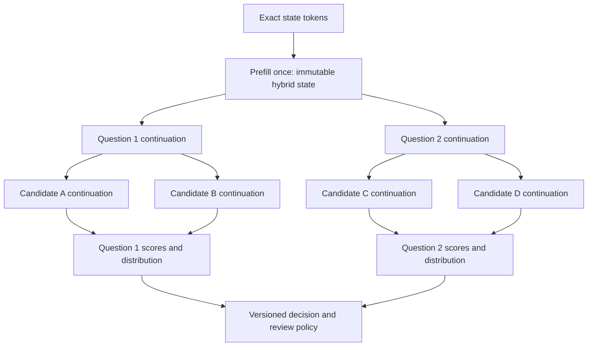
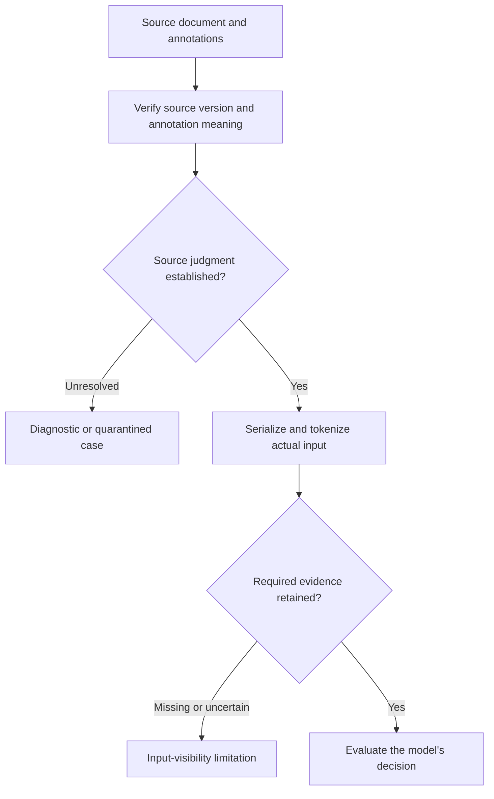

# OpenKind: Confirmed Results for Shared-State Decision Inference

**Working paper · 26 September 2026 · Evidence through source-label replay v0.6.0**

## Abstract

OpenKind has demonstrated decision inference without answer generation, isolated reuse of a complete Qwen continuation state, and substantial speedups on some shared-state workloads. It has not yet demonstrated a model that satisfies the complete natural-document accuracy, rejection, and retention requirements. Decision-specific adaptation improves ContractNLI accuracy but damages supported entailment and QASPER behavior. Neither tested replay treatment resolves that trade-off. This paper records the measured results and the engineering requirements they support. The practical direction is to preserve the working execution reference, repair and measure evidence visibility, diagnose retention failures, and optimize complete request cost at an accepted quality level.

## 1. Scope and method

“Jev-style” denotes this project's target: typed decisions and probability distributions for several questions over shared evidence, without generating a prose answer. It does not assert equivalence to Jev's private architecture, training procedure, accuracy, or latency.

This is a synthesis of completed experiments, not a new model run. The latest training reports and class/SNLI tables were checked directly in Drive; Phase 3A timing aggregates were recomputed from its saved summary. Earlier cache, numerical, audit, and native-backend results retain their recorded scope in the supplied whitepaper [1–6]. “Confirmed” means observed in those tests, including negative results; it does not mean independently replicated or production-qualified.

The recent natural-document calibration gate contains **204 ContractNLI questions from 12 contracts and 46 QASPER questions from 12 papers**. It was already exposed during research. Questions from one document are correlated. QASPER has only **five semantic-none cases** in this gate, and unresolved source/annotation limitations remain. The SNLI panel contains **192 examples** and is an exposed regression diagnostic. None is fresh release confirmation [2–5].

## 2. What computation is established

Two decision readouts have run successfully: a learned scorer on candidate-conditioned hidden states, and direct scoring of the offered answer-code vocabulary rows. Both avoid answer-token generation. They are distinct model profiles; the later joint-option LoRA results do not validate the earlier branch scorer's semantic quality [1–5].

The frozen Qwen3.5-4B-Base integration profile, `a047d6802c3f06f085b8`, supports the following execution topology [6]:

*Figure 1. Tested state → question → candidate branching. Each branch owns isolated mutable continuation state; no question consumes a sibling's continuation. This depicts the integration reference, not the later joint-option training graph.*

The reusable object includes **attention KV, recurrent DeltaNet state, convolution state, position, and execution identity**. Copying only KV is insufficient. Native CPU fixtures reproduce probabilities with maximum difference **4.5869 × 10⁻⁶**, with zero selected-answer or policy changes. Pinned-base MLX FP32 full, nested, and unequal-length vectorized parity also pass their recorded fixtures; matched MLX performance and accelerated-service qualification remain open [1, §§16–17].

Prefill reuse does not establish that a pooled prefill vector is a sufficient decision representation. All three tested pooled-root arms—root only, root plus question, and root plus question/candidate—failed the non-final gate and accepted **zero requests**. Richer representations were not ruled out by this probe [1, §18.16].

## 3. Accuracy depends on evidence access and retention

### 3.1 The evidence must survive the input pipeline

The visibility preparation found all recorded QASPER annotation strings inside the state prefix for **12/119** annotated questions at 1,024 tokens and **79/119** at 4,096. String presence is a diagnostic, not proof of semantic sufficiency. The audit also found annotation and serialization problems; proposed corrections have not silently become gold labels [1, §§18.15, 18.20].

*Figure 2. Distinctions established by the evidence audits. Missing evidence is not automatically a semantic-none label; retained annotation strings do not independently establish answerability.*

In the FP32 frozen comparison, increasing J1's state-prefix cap from 1,024 to 4,096 improved a fixed ContractNLI subset whose annotations became fully visible from **17/32 to 30/32 correct**. Meanwhile, correct none decisions fell **65/96 → 53/96**, leaving aggregate accuracy nearly unchanged: **141/204 → 142/204**. Extra context adds more than the evidence span, so this is not an isolated causal estimate of evidence access. It establishes why visibility and rejection need separate measurements [1, §18.20; 2].

### 3.2 Adaptation gains have not preserved the full task

J0 is frozen Base; J1 is frozen post-trained Qwen3.5-4B. J2/J3 add decision LoRA. J4/J5 start fresh from their corresponding frozen parent and add parent-distribution KL replay; J6/J7 instead use source-label cross-entropy on the same replay schedules. These are separate fits, not sequentially stacked adapters. The original pilot used rank-16, alpha-32 adapters and 120 updates; J2/J3 selected update 80 [3–5].

| Profile | ContractNLI correct / 204 | Entailed correct / 84 | QASPER correct / 46 | SNLI correct / 192 |
|---|---:|---:|---:|---:|
| J0: frozen Base | 116 | 81 | 40 | 117 |
| J1: frozen post-trained | 141 | 81 | 37 | 132 |
| J2: decision LoRA, locked80 | 166 | 73 | 35 | 136 |
| J3: decision LoRA, locked80 | 168 | 70 | 34 | 141 |
| J4: parent-KL replay, fixed80 | 164 | 74 | 36 | 125 |
| J5: parent-KL replay, fixed80 | 166 | 69 | 35 | 131 |
| J6: source-label replay, fixed80 | 162 | 70 | 29 | 159 |
| J7: source-label replay, fixed80 | 165 | 69 | 35 | 166 |

*Table 1. Raw decisions under matched BF16 execution; natural-document state-prefix cap 4,096. Fixed80 replay rows are diagnostic snapshots. The guarded J4–J7 selections all retain update zero. FP32 results in §3.1 are a separate comparison [3–5].*

J3 raises ContractNLI accuracy **69.12% → 82.35%**, with contradiction recall **8/24 → 19/24** and none recall **52/96 → 79/96**. Supported entailment falls **81/84 → 70/84**, and QASPER falls **37/46 → 34/46**. Aggregate improvement therefore does not establish retained decision competence [3,5].

Source-label replay improves SNLI over parent KL: **125/192 → 159/192** and **131/192 → 166/192**, gains of **17.71 and 18.23 percentage points**. Yet both source-label models worsen NLL and Brier on both natural-document sources relative to their KL comparator. J6 detects all **5/5** QASPER none cases while incorrectly rejecting **17/41** answerable cases. Short-premise learning and document-task preservation are distinct outcomes. The mechanism behind the recurring supported-entailment loss remains unisolated [5].

### 3.3 Rejection and automation require their own evaluation

Semantic none means no offered answer is supported. Application review is a separate action. Good conditional candidate ranking can coexist with poor none decisions. In the exploratory option-logit audit, ContractNLI candidate ranking reached **130/148** on answerable questions, while none recall was **0/124** [1, §18.17].

Probability improvements also do not guarantee useful automation. Under the pilot's error cost 1 and review cost 0.10, J2's QASPER policy costs exactly **0.10000 per question**, equal to review-all; J3 costs **0.11304**. Neither is a strict improvement there. Policy coverage, accepted error, and cost must accompany accuracy. Temperature scaling also worsened the earlier matched NLI test's NLL **0.3345 → 0.3392**; calibration needs a separate acceptance check [1, §4.4; 3].

## 4. Speed is conditional on workload and numerical behavior

### 4.1 Shared state can help greatly, but has a crossover

Phase 3A used strict FP32 Qwen3.5-4B-Base on an **A100-SXM4-80GB**. The table shows measured request medians; the first row is the median across three semantic-case medians. Synthetic rows measure execution mechanics, not long-document decision accuracy. Here L is state-token length, Q is question count, and K is candidates per question [6].

| Workload | Repeated full | Batched sharing, cold | Batched sharing, warm |
|---|---:|---:|---:|
| Short semantic cases, Q=4 | 869.3 ms | 1,058.4 ms | 962.4 ms |
| Synthetic L=64, Q=4, K=4 | 1,375.4 ms | 597.9 ms | 514.9 ms |
| Synthetic L=1,024, Q=4, K=4 | 9,448.1 ms | 1,101.2 ms | 516.5 ms |
| Synthetic L=1,024, Q=16, K=2 | 18,928.6 ms | 2,506.3 ms | 1,922.0 ms |

*Table 2. Cold includes state prefill; warm reuses an existing root. These are in-process measurements, not queue-inclusive service latency or Mac forecasts.*

Warm sharing is **10.7% slower** for the short semantic Q=4 cases. At synthetic L=1,024/Q=4/K=4 it is **18.29× faster**; cold sharing is **8.58× faster**. At L=1,024/Q=16/K=2, batched-cold peak allocation rises **16.42 → 18.67 GiB**. The supported engineering conclusion is workload-aware scheduling with memory admission, not unconditional caching or batching [6].

The separate M4 Max CPU record reports **1.294×–2.018×** speedups for nested sequential execution across five warm workloads. That is CPU evidence; it does not establish an MLX speedup. Earlier exact-prefix persistent-cache traces saved **13.91%** and **11.88%** of total time across 32-request grouped and shuffled traces, compared with within-request sharing already enabled [1, §§9.7, 17.3].

### 4.2 Precision and memory are parts of the decision contract

On expanded 2E's 128 episodes, strict-FP32 full-batch-four execution had maximum probability drift **0.00000928**, with no class or policy changes. BF16 full-batch-four drift reached **0.110223**, with class changes in **14 episodes** and policy changes in **seven**. This establishes execution disagreement, not universal semantic superiority of FP32 [1, §7.3].

The 2F FP16-KV storage variant passed all **32/32** sampled FP32 codec gates; all four tested low-bit codecs failed the complete gate. For a 42-token prefix, FP16-KV storage saved only **2.45%** of the complete hybrid root; for the measured 1,024-token prefix it reduced root storage **115 → 83 MiB (27.83%)**. KV savings are neither total-model savings nor proof of lower request latency [1, §9].

Removing the output projection's use also does not remove its tied input-embedding weights: the measured **635,699,200** vocabulary weights have **zero marginal removable parameters** under that change. Avoiding answer generation saves computation; making the backbone smaller requires another intervention [1, §4.2].

## 5. Requirements supported by these results

These are engineering consequences of the observations, not newly demonstrated remedies.

| To obtain… | Required next action | Evidence |
|---|---|---|
| Accurate decisions | Preserve source-to-input provenance; measure visibility, per-class errors, and task retention. Diagnose supported-to-none and supported-to-contradiction errors before another bounded adaptation. | §3 |
| Useful probabilities | Keep calibration and review policy separate from semantic none; select on development and report coverage, accepted error, NLL/Brier, and cost by source. | §3.3 |
| Fast requests | Profile repeated-full, sequential sharing, and vectorized sharing on the actual Mac, including prefill, branching, suffix work, synchronization, and serialization. | §4.1 |
| Reliable reuse | Bind exact tokens, position, complete hybrid state, and model/runtime identity; retain root isolation, memory admission, and probability/decision parity checks. | §§2, 4.2 |
| Lower memory | Measure weights, hybrid state, scratch, and process memory separately. Qualify any smaller or quantized model against the accepted quality point. | §4.2 |

No reviewed result yet establishes a generally capable Jev replacement, a successful pooled-prefill decision model, an accepted smaller-model replacement, or a streaming-MoE advantage. Streaming experts was not evaluated in these experiments. The immediate model question is retention on supported document judgments; the immediate systems question is the MLX execution crossover. Their experiments can remain separate while the frozen integration reference stays intact.

## References and reproducibility

1. **Supplied evidence archive:** `WHITEPAPER(4).md`, v0.8.5, 26 September 2026; cited sections retain their original experiment and audit boundaries. SHA-256: `eef41a351cf91e621614d2f8f8b6c55a59cb5ab1f81e24326bb48a241cd98966`. Legacy results above were read from this archive, not rerun.
2. **Frozen comparison:** `m1_m21_joint_option_v032_s17_fp32`, session `20260925T174531_575346Z`. [Results](https://drive.google.com/file/d/14QNUaQbTQtlnZctqDFneDilsjYyrA5Zb/view). Visibility-stratum counts: archive §18.20.
3. **Decision-LoRA:** `m22_v041_s17_bf16_6b295d46b7436a52`. [Results](https://drive.google.com/file/d/1Ov6794Pey5bkXrW8W73acGy2EylFhEQQ/view).
4. **Parent-KL replay:** `retention_v050_s17_bf16_a69ba45a76e74b63`. [Results](https://drive.google.com/file/d/1YHm5PSVb6GTC3kNwLKboooJq-TQKlDMZ/view).
5. **Source-label replay:** `source_label_v060_s17_bf16_dbb5e724b5452f23`. [Results](https://drive.google.com/file/d/1YX6xJU9X2mQS9c8KfQ45JnwaQD7xOzIq/view), [class counts](https://drive.google.com/file/d/1HwZ1hzdFuM2gLsp-CZosQSSUFC08pqzW/view), [SNLI results](https://drive.google.com/file/d/1DuEPUFyF-LDxJII5P3O8aLHAeCXVNnxI/view). These retain the earlier locked controls.
6. **Phase 3A systems reference:** run `20260920T024056Z`. [Summary and timings](https://drive.google.com/file/d/1qXohe2YORrp3pCHHjFJ-fwSOIbLiKoXm/view), [runtime identity](https://drive.google.com/file/d/1qOrftZoKsxmtrwwfR7iibM5RzcyuYadZ/view). Profile `a047d6802c3f06f085b8`; bundle SHA-256 `4d9ffdee0aea5c71c666d0feae372cffe79a05934aedee2245012e3a53c23332`.
